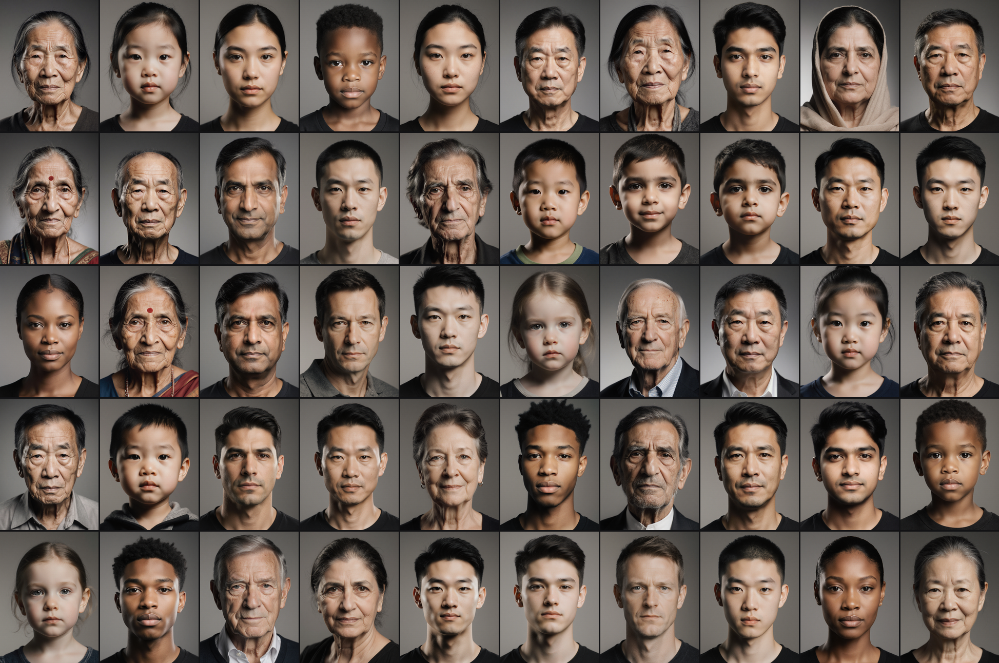

# Faces as a Data-Mining Puzzle — Part 1: The Case for an Unlikely Interface

**Date:** 2026-04-16
**Series:** Part 1 of 2 — positioning. Part 2 covers the math of pattern preservation.
**Audience:** technical readers who know embeddings, neural networks as black boxes, and basic ML, but not necessarily diffusion models, face-recognition research, or the uncanny-valley literature.
**Status:** draft for self-audit. Every ⚠ claim and 🔍 assumption is there *to be challenged*.

---

## 1. The hook

You're handed 500 job postings scraped from the internet. Some are real. Some are scams — rent-upfront, crypto-payday, pretext-your-documents kind of scams. Some are recruiter fronts for legitimate companies. Some are spam. You have ten minutes. Find the scams.

The obvious approach is to read them. Ten minutes, 500 postings — that's 1.2 seconds per item. You won't read them. You'll skim, eyeball layouts, look for red flags, bounce off anything that feels off without being able to say why.

That last thing — "feels off without being able to say why" — is the entire problem this project is built around. Your visual cortex runs pattern-matching on images faster than any conscious reasoning you can do. It does this especially well on faces, which have dedicated neural machinery. What if we took the 500 job postings and turned each one into a face? Could the "feels off" instinct do real work?

That is an absurd question. It is also — we'll argue — the interesting question.

---

## 2. The problem we're actually solving

The specific problem is job-listing fraud detection, but the general problem is older and broader: **a human is presented with many items, each of which has many attributes, and needs to build an intuition for how the items are structured** without being told the structure in advance.

This is called **exploratory data analysis (EDA)**. Tukey's 1977 book of that name[^tukey1977] codified a practice that predates him — Playfair's 18th-century graphical statistics, Bertin's *Semiology of Graphics* (1967), and the whole data-graphics tradition Tufte later surveyed — but Tukey gave the practice a name and a discipline. His core argument was that before you test hypotheses, you need to *have* hypotheses, and forming hypotheses requires looking at data in ways that let unexpected structure present itself. Not confirmatory analysis. Not dashboards with pre-committed metrics. Not decision-tree automation. Something messier: a human looking at data, noticing things, forming guesses.

Fraud detection is a supervised problem once you have confirmed labels. In practice, working scam hunters do accumulate labeled examples over time. But the *pattern-discovery* phase — the part that happens before a label set exists, or when the scam taxonomy is shifting faster than labels can be collected — is EDA-shaped. That's the phase we're targeting.

> ⚠ **Claim 2.1:** The *pattern-discovery phase* of fraud hunting, framed as EDA, reduces to "let the user see enough of the corpus in a short enough time that unexpected structure has a chance to present itself."
>
> This is narrower than "fraud detection is EDA," which would be wrong — once you have labels, you train a classifier. The tool this series is about is a *pre-labeling aid* and a *taxonomy-shift early-warning system*, not a replacement for supervised methods.

The challenge is that modern data is high-dimensional. Each job posting has probably 20+ meaningful attributes — job title, company, industry, pay range, required experience, language, location, contact method, verifiability of claims, writing style, urgency signals, specificity, use of corporate jargon vs. plain language, request for personal information vs. none, and so on. A human looking at 500 items on 20 axes has to somehow integrate 10,000 data points into "what kinds of postings are in this corpus, and are any of them suspicious?"

Humans are limited when multivariate data arrives as numerical tables. Working memory caps around ~4 items (Cowan 2001[^cowan2001]; successor work to Miller's 7±2[^miller1956]) and numerical integration across rows is serial — you read one cell at a time. Visual encoding offers a partial escape: specific features (color, orientation, size, motion) are processed in *parallel* by the visual system, subject to known limits (Treisman & Gelade 1980[^treisman1980]; Wolfe 1994[^wolfe1994]). This is not "humans good at pictures." It's the more specific — and testable — claim that the visual system has parallel-processing pathways for certain low-level features, and that exploiting them can buy some fraction of that 4-item working-memory ceiling back. Face perception *may* be one such pathway; §6 argues that case, with the evidence it actually has.

---

## 3. An aside on the name: *Blindsight*, synthesists, and vampire interfaces

A short literary detour, because the project's name comes from it and because it supplies a vocabulary for the design choices ahead — not as an argument for them, just as a label.

In Peter Watts' 2006 novel *Blindsight*,[^blindsight] the narrator Siri Keeton is a **synthesist** (colloquially a **jargonaut**) — someone whose job is to observe the patterns of specialized discourse and package them into accessible output without necessarily comprehending the content. A surgical intervention in Siri's childhood left his pattern-recognition machinery intact while removing much of the semantic processing that would let him understand what he's translating. He's drawn as a Chinese-Room entity: coherent output from specialist input. The novel treats this as an edge in some situations and a handicap in others.

Separately, the novel's vampires (a reconstructed predatory human subspecies) can see visual patterns regular humans can't — perceptual faculties addressed below the conscious-reasoning layer. The famous "Crucifix Glitch" is the inverse: certain orthogonal visual configurations trigger vampire seizures, the built-in weakness that eventually ended their species. The "vampire interface" coinage — and the project's name — comes from this idea: an interface that exploits perceptual faculties humans don't normally address consciously.

The reason to mention both here is that this project has a family resemblance to the synthesist-and-vampire pairing. The face channel is pattern-substrate, addressed pre-semantically. The uncanny-valley mechanism runs below conscious reasoning. These are suggestive echoes, not arguments. The fictional synthesist's specific neurological condition doesn't map to any real user population — real non-specialists have semantic processing, form interpretations, bring their own cultural priors, and so on. Borrowing the word is useful shorthand; nothing in the design rests on Watts being *correct about a thing that doesn't exist*.

> 📚 **Citation 3.1 — Watts, *Blindsight*.**[^blindsight] Literary citation. No empirical weight. The synthesist and vampire-interface framings appear in this post as shorthand labels — for "a user reading patterns pre-semantically" and "a UI exploiting perceptual faculties below conscious reasoning" respectively. Whether any of this makes good design is decided empirically, not by appeal to Watts.

The rest of Part 1 makes its arguments without the synthesist vocabulary. The test for whether the frame was ever load-bearing is this: if you delete §3 and read on, the arguments in §§4–10 should be unchanged. They are. §3 is an origin note, not a foundation.

---

## 4. How we normally cope

Before we argue faces are the right tool, let's be honest about what tools we already have and what they do well. There are roughly four families.

**(a) Tables with color coding.** Excel. Airtable. A list of jobs with a red/yellow/green column indicating "scam score." This is extremely cheap, extremely readable, and for tasks like "sort by risk and look at the top 20" it is hard to beat. The ceiling is maybe two or three encoded dimensions before the table becomes visually noisy (color, font weight, sort order, icon in one column).

**(b) Dimensionality reduction + hover.** t-SNE,[^tsne] UMAP,[^umap] PCA. Take the 1024-dimensional embedding of each job posting (from a language model like Qwen or BERT), project to 2D, plot as dots. You see clusters. You hover over a dot to see the text. For *finding groups in a corpus*, this is the industry default — cheap, visual, well-understood. The ceiling is that the 2D coordinates have no intrinsic meaning. The horizontal axis of a t-SNE plot isn't "suspicion" or "industry" or anything — it's whatever t-SNE chose to preserve given its loss function. You can't read semantics off the axes, only off the clusters.

**(c) Parallel coordinates, star glyphs, radar charts.** Each item becomes a line across 10+ parallel axes, or a polygon with one vertex per axis. Classic multivariate-visualization techniques.[^inselberg1985] Readable for trained users on 5–20 items. Crowds into noise past 50. Specialist tools; not something a non-analyst reaches for.

**(d) LLM summary and cluster labels.** Run a language model over the corpus, ask it to name clusters and produce 3–5 "archetypes." Dump out something like "we found: formal corporate postings, short informal gigs, suspicious crypto-payday items, etc." This is the laziest and most-commonly-deployed option in 2026, because an LLM can do in 5 minutes what a human analyst does in an afternoon. The ceiling is that the *LLM's* taxonomy is not *your* taxonomy — the model has its own priors about what categories matter, and you get those, not yours. If the LLM is wrong or biased or trained on different data than your domain, you inherit its blind spots without knowing it.

> ⚠ **Claim 4.1:** Approaches (a) through (d) collectively cover most practical multivariate data exploration. There is one task they all underperform on, which is the task we want to attack.
>
> That task is: "I don't know what the interesting axes are yet. I want to look at the corpus and have the axes *propose themselves to me* through pattern-noticing." None of (a)–(d) put a user in a position to notice unexpected patterns that weren't designed into the visualization. Color coding shows you what you asked it to show. t-SNE shows you clusters but not their semantics. LLM summaries show you the LLM's model. Parallel coordinates show you labeled axes, so you can't "discover" one.

This is where we need a different mechanism.

---

## 5. Faces enter the story

In 1973, a statistician named Herman Chernoff proposed representing each multivariate data point as a cartoon face.[^chernoff1973] Eye size encodes one variable, nose length encodes another, mouth width encodes a third, eyebrow angle encodes a fourth, and so on — up to ~18 variables per face in his original scheme. The argument was that humans have dedicated brain machinery for reading faces, and that machinery is fast, parallel, and sensitive to small differences, so we could piggyback on it to read multivariate data.

The idea went into the visualization canon and stayed there. Every introductory data-viz textbook mentions Chernoff faces. Almost no working analyst uses them in production. Why?

The empirical literature is mixed, and leans negative. Borgo et al. (2013)[^borgo2013] and Fuchs et al. (2017)[^fuchs2017] are the two major systematic reviews of "glyph-based visualization" — glyphs being small per-item icons that encode multiple variables. Both reviews conclude that face glyphs underperform simpler alternatives (bar glyphs, star glyphs, plain colored shapes) on clustering and comparison tasks. Lee (2002) was an earlier and influential specific result showing spatial visualization beats face glyphs for clustering binary data.[^lee2002]

On that read, the Chernoff-face idea is dead. We should not be writing this blog post.

Except there are a few cracks in the dismissal.

> 📚 **Citation 5.1 — Scott (1992), *Multivariate Density Estimation*.**[^scott1992]
>
> Scott reports a specific finding that is quieter than the Borgo/Fuchs reviews but which none of those reviews address directly: face-glyph encodings produce *calibration-advantaged viewing* in users who look at many faces in sequence. In other words, a user scrolling through hundreds or thousands of face-encoded data points over a session starts to "feel" the distribution — develops intuition about what a typical item looks like vs. an outlier. This is different from the tasks Lee/Borgo/Fuchs measured, which were typically one-shot clustering on small sets (8–32 items).
>
> **Why this matters:** our problem is not "given 10 items, cluster them" (where simple glyphs win). Our problem is "given 500 items that the user will scroll through, build intuition." The literature that dismisses Chernoff faces does not cover the regime Scott describes, which is exactly ours.

> 🔍 **Assumption 5.2:** Scott's calibration-advantage finding (1992) generalizes from the hand-drawn schematic Chernoff faces he was working with to the photorealistic generative faces we're proposing to use. **Status: unverified.** No one has run a controlled study on calibration advantage with photorealistic face encodings because photorealistic generative face models didn't exist until ~2019, and nobody has wired them to an EDA workflow.

And here's the bigger crack: **what Chernoff had in 1973 and what we have in 2026 are two completely different things.**

---

## 6. What photorealistic changes

Schematic Chernoff faces — circles with two dots for eyes, a curve for a mouth — are icons. They trigger *icon recognition* in the brain, not *face processing*. You read them the way you read emoji: as symbolic glyphs with feature-by-feature semantics. "Eye size big, so variable 3 is large; mouth curve up, so variable 7 is positive." It's a slow, feature-decomposing, effortful read.

Photorealistic faces — the kind that modern generative models produce — trigger the dedicated *face perception* circuit. In neuroscience this maps to specific regions of the brain, most famously the **fusiform face area (FFA)**, identified by Nancy Kanwisher and colleagues in 1997.[^kanwisher1997] The FFA activates within roughly 170 milliseconds of seeing a face, which we know from the **N170** ERP component — an electrical signal recordable from the scalp.[^bentin1996] This is much faster than conscious reading. It is preattentive in the sense that it fires before you've "decided" to look.

Face processing is holistic rather than feature-by-feature. The classic demonstration is the **composite-face effect**:[^young1987] if you cut a face horizontally, swap the bottom half with someone else's, and ask people to identify just the top half, they're measurably slower and less accurate than if they see the top half alone. The face-processing system insists on integrating the whole face, even when you ask it not to. It's a gestalt system.

> ⚠ **Claim 6.1:** Schematic Chernoff faces engage icon-recognition circuits. Photorealistic generative faces engage the face-processing circuit. These are *different circuits* with different speeds and different integration properties, and the Borgo/Fuchs/Lee dismissal literature only tested the first circuit.
>
> This is the central theoretical claim that licenses using generative faces in 2026 despite 50 years of mixed results for Chernoff faces. If it's wrong — if photorealistic generative faces actually engage icon-recognition too, perhaps because they feel "off" in some low-level way — then we're no better off than Chernoff was. **Status: plausible but uncertain.**
>
> The relevant question is: does the FFA respond to generative faces the same way it responds to real faces? There is some fMRI work on synthetic faces engaging FFA[^tong2012] but we are not aware of controlled studies on *diffusion-model-generated* faces specifically. We are betting on the circuit engaging, and we should measure.

There's a second thing photorealistic generative faces can do that schematic Chernoff faces can't: the **uncanny valley**. Mori (1970) described the effect originally in robotics;[^mori1970] the modern literature (Kätsyri et al. 2015;[^katsyri2015] Diel et al. 2022[^diel2022]) has converged on a specific mechanism — the uncanny feeling arises when facial cues *mismatch* each other, not when the face is uniformly degraded. A face with realistic skin but wrong eye geometry triggers the valley. A uniformly ugly cartoon does not.

This matters because it gives us a *signal channel that schematic faces don't have*. If we can drive particular facial cues (skin texture, eye geometry, mouth shape) as independent axes, we can create a face that is "wrong" in a specific way that the viewer feels before they can articulate. In fraud detection terms: a scam posting can generate a face that gives the viewer a visceral "something's off" response, where the offness is structural rather than aesthetic.

> 🔍 **Assumption 6.2:** Diffusion-model-generated faces can be steered along orthogonal semantic axes (attire, expression, pose, anatomy) at small perturbations while staying in the on-manifold photorealistic regime, and pushed into *mismatch* territory at larger perturbations without sliding into uniform ugliness. **Status: partially verified.** Our own measured Flux v3 baseline achieves a correlation of r = +0.914 between a single "suspicion" axis and a user-perceptible drift signal. Whether we can do this for 3+ axes independently is the Exp B / Exp C open question in our framework.

---

## 7. The 5-task stacking

Let's stop and get specific about *where exactly* we expect faces to beat existing alternatives. The temptation is to say "faces are the best of all worlds," but they're almost certainly not.

We've been looking at the comparative table below for weeks. Pick a task a user might want to run on a multivariate text corpus, and an alternative they might use. Ask: where do faces actually win?

| Task | Color table | t-SNE + hover | Parallel coords | LLM summary | **Faces** |
|---|---|---|---|---|---|
| **1. Single-item verdict** ("is this scam?") | ✅ instant | ➖ overkill | ➖ overkill | ✅ named reason | ❌ friction |
| **2. Scan 20 cards for top N worst** | ✅ sort + color | ➖ loses identity | ➕ readable | ✅ "top 5" | ➕ only if preattentive edge real |
| **3. Corpus cluster discovery** | ❌ 1D only | ✅ industry default | ➖ crowds | ✅ cheapest | ➕ gestalt character |
| **4. Axis co-discovery** ("wait, the smile means X") | ❌ | ➖ axes meaningless | ❌ axes labeled | ❌ LLM's taxonomy | ✅ **unique** |
| **5. Longitudinal calibration** (memory across sessions) | ❌ | ❌ layout changes | ❌ | ➖ labels drift | ✅ same item → same face |

Legend: ✅ best, ➕ competitive, ➖ workable, ❌ loses.

Read the table row by row. A few things stand out.

**Tasks 1 and 2 are red rows for faces.** If you want to know whether one posting is a scam, a colored score next to the text beats any face encoding. If you want to scan 20 items for the worst ones, a sorted table wins. Faces add friction on these tasks; they are *worse* than a colored list. This is embarrassing when you're trying to sell a face-based interface, but it's true, and the framework of the project forces us to acknowledge it.

**Task 3 is a wash.** t-SNE plus hover is cheap, industry-standard, and shows you cluster structure. Faces *might* add something — a sense of the "character" of each cluster beyond its position in 2D — but the evidence is weak.

**Tasks 4 and 5 are the only cells where faces are uniquely the best tool.** Task 4 is axis co-discovery: you slice the corpus, you notice the smile moving, you hypothesize "the smile means X," you test by slicing differently. Task 5 is longitudinal: you've been looking at this corpus for weeks, and the same posting always produces the same face, so the face becomes a memory anchor you accumulate around.

> ⚠ **Claim 7.1:** Tasks 4 and 5 are the only places where faces are the uniquely correct tool. Anywhere else, there's a cheaper, simpler alternative that is roughly as good or better.
>
> This is a strong claim. It means if you're building a product, you should only use faces if tasks 4 or 5 are the main thing the user needs to do. For a card-list dashboard that already has color-coded verdicts, adding faces is a bad idea. For a live fraud-triage queue where the user does single-item verdict, faces are a bad idea. For a data-mining environment where the user is trying to *discover* what structure exists, faces are potentially the best tool we have.

> 🔍 **Assumption 7.2:** The five tasks listed are roughly exhaustive for "what a user might want to do with a multivariate text corpus." If there's a sixth task we're missing, the whole stacking analysis could be incomplete. **Status: probably fine but not bulletproof.** Tasks like "write a report summarizing the corpus" or "build a classifier on the corpus" are not data exploration, so we exclude them. Tasks like "answer a specific pre-known question" reduce to supervised querying, not EDA. We believe 1–5 cover EDA comprehensively, but we could be wrong.

> 🔍 **Assumption 7.3:** The ✅/❌ ratings in the table are our summary judgments, not controlled-study results. **Status: mostly informed guesses.** For tasks 1, 2, and 3, the ratings match industry practice (everyone uses colored tables for single-item verdict). For tasks 4 and 5, we're making a theoretical argument that no one has actually tested. These tasks are the ones we need to validate empirically — hence the detective experiment described in Part 2.

The 5-task stacking is our project's central filter. Everything we design is optimized for tasks 4 and 5. Everything that would only help on tasks 1–3 is either cut or kept as a baseline, not a target.

---

## 8. Why a game

Suppose the 5-task stacking is correct and faces do give users a genuine edge on axis co-discovery. Who uses this? An EDA tool for professional fraud analysts is a valid product — we'd build it and ship it to NGOs, labor-rights orgs, consumer-protection groups. It would find an audience. It would also be small.

The more interesting version is a *consumer* product. And the interesting thing about a consumer EDA tool is that there are two very successful consumer products that teach specialized skills through repeated play: **Wordle** and **GeoGuessr**.

Wordle is a daily five-letter word puzzle.[^wordle_origin] Every person who plays on a given day plays the same puzzle. You get six guesses. When you share your result, you share a spoiler-safe grid of green/yellow/gray squares showing only the pattern of your solution, not the word itself. The mechanic is simple; the cultural footprint was enormous.

GeoGuessr drops you somewhere in Google Street View and asks where in the world you are.[^geoguessr] Over thousands of rounds, high-level players develop eerie skill at reading visual clues — road signs, vegetation, architecture, license plates, sun angles — to localize a random photograph to within kilometers. This is fundamentally **open-source intelligence (OSINT)** work, and GeoGuessr has produced arguably more OSINT practitioners than every journalism school and intelligence agency combined, purely as a byproduct of making a game of it.

Both games share an ingredient list that we can try to reproduce:

1. **Daily cadence.** Same puzzle for everyone on a given day. Creates habit and enables social comparison.
2. **Short rounds.** Wordle is five minutes. GeoGuessr can be 30 seconds for casual play. Low commitment, high repeatability.
3. **Shareable spoiler-safe result.** The emoji grid is the single most viral design decision in Wordle's history. Shows your result, not the answer.
4. **Preattentive input channel.** Wordle uses letters (already familiar symbols). GeoGuessr uses photographs (the most preattentive channel we have).
5. **Skill that accumulates.** Each round teaches something that transfers to the next.
6. **The skill is useful outside the game.** GeoGuessr teaches OSINT. Wordle teaches nothing transferable, but it didn't need to.
7. **Streamable / watchable.** Both games produce content. This is the cultural multiplier.

> ⚠ **Claim 8.1:** If we can build a data-mining puzzle around face-EDA with these seven ingredients, we get distribution that a professional analyst tool can't match.
>
> The specific thesis is: **daily puzzle, 5–10 minutes, 30–60 synthetic items rendered as faces, 3–4 planted patterns to discover, spoiler-safe shareable result**. A person who plays this daily for a year has done the equivalent of ~500 supervised EDA sessions, which is more than most working analysts accumulate in a career.

Notice that the ingredient we're most at risk of missing is #4: **preattentive input channel**. Wordle uses letters and GeoGuessr uses photographs, both of which are preattentive in the right ways. If we ask the player to read walls of text, we break the game — reading 30 postings in a 5-minute round is infeasible, and reading them deeply is impossible. The face is what makes the round shape work. It is the *Street View analog* for text domains.

> 🔍 **Assumption 8.2:** Text does not compose preattentively in a way that lets a user scan 30 items and notice structure across them within 30 seconds. **Status: near-certain, but not formally measured.** Reading has fast components (word recognition in ~150 ms) but composition across items requires sequential attention and short-term memory. No one has demonstrated parallel text composition in the way face-viewing composes.

> 🔍 **Assumption 8.3:** Faces composed preattentively in a grid *do* let a user scan 30 items and notice structure across them. **Status: assumed, untested in our setting.** Grid-displayed faces are common in art-historical contexts and portrait exhibitions, where viewers do report gestalt impressions of "this is a military corps," "these are all clergy," etc. But the controlled experiment for our setting doesn't exist yet.

---

## 9. Co-discovery, the load-bearing mechanism

Let's be precise about what co-discovery is, because it's the mechanism the entire project rests on.

Imagine you're playing today's puzzle. You see 40 faces in a grid. Some look kind, some look stern, some look tired, some look uneasy. You don't know what the axes are.

You try slicing the corpus. You click a filter — maybe "postings containing the word 'urgent'". The grid rearranges to highlight the "urgent" ones. You scan them. You notice: the urgent ones tend to have a slightly strained expression. Tight mouth, crinkled brow.

You slice again by another attribute — "postings with pay listed in the description." Now the "pay-listed" faces stand out. These tend to look *calmer*, with relaxed mouth and clearer eyes.

You try a different slice — "postings from last week" vs. "postings from this week." The difference is subtle: this week's faces seem slightly more tense on average.

Somewhere in these three slices, you form a hypothesis: **the strained expression tracks urgency or time pressure, not content**. You test it by slicing differently. If your hypothesis is right, the strain will appear on every slice that correlates with urgency or deadline-pressure, regardless of other attributes.

That whole process — slice, observe, hypothesize, re-slice — is **axis co-discovery**. You discovered what an axis of the face means by observing it *co-varying* with something you could measure about the data. No one told you "strained mouth means urgency." You inferred it from the pattern.

> ⚠ **Claim 9.1:** Axis co-discovery is the single thing face-EDA does that no other EDA tool does. It's not a minor feature; it's the *only* defensible reason to use faces at all.
>
> A t-SNE plot doesn't let you discover "the horizontal axis means X" because t-SNE's axes don't mean anything — they're whatever fell out of the loss function. A color-coded list doesn't let you discover axes because the colors are pre-committed. An LLM summary tells you the model's axes, not yours. Only the face — where each axis of the face corresponds to a direction in a latent space, and that direction was either planted by the experimenter or inherited from the data generator — can support the "wait, the smile means X" moment.

For co-discovery to work, a specific technical condition has to hold: **the same feature of the face has to mean the same thing across every slice of the corpus.** If "strained expression" means urgency in the urgent-postings slice but means low-pay in the low-pay slice and means remote-work in the remote-postings slice, you can never form a hypothesis. Every slice confuses you. You never reach the "aha."

We call this property **co-variation invariance**, and it's formally defined in Part 2 of this series. For now, the key point is: it's a property of the pipeline, it can be measured, it can be engineered for or neglected, and the project is built around making sure it holds.

> 🔍 **Assumption 9.2:** Co-variation invariance is achievable with current generative-model technology (Flux, FluxSpace direction-basis editing, rectified-flow conditioning). **Status: actively being measured.** Our framework (see docs) defines a specific experiment (Exp B) to measure cross-axis orthogonality in the FluxSpace direction basis on 4 editorial + 4 drift candidate axes. Results pending.

---

## 10. What we're claiming and what we're not

Let's end Part 1 by being honest about what we know and what we're guessing at.

**What we think is well-founded:**

- Humans have specialized neural machinery for face perception (FFA, N170, composite-face effect). This is mainstream cognitive neuroscience.
- Photorealistic generative faces likely engage that machinery more fully than schematic Chernoff faces. Supported by general findings on synthetic-face processing, but not controlled for diffusion-model outputs specifically.
- Existing EDA tools (color tables, t-SNE, LLM summary, parallel coords) underperform on axis co-discovery and longitudinal calibration. Supported by the 5-task stacking and by the structural arguments in §7.
- Daily-cadence puzzle games with shareable results create viral distribution. Wordle and GeoGuessr are existence proofs.

**What we think is plausible but not verified:**

- Scott's 1992 calibration-advantage finding for schematic Chernoff faces generalizes to photorealistic generative faces.
- Co-variation invariance is achievable on Flux via FluxSpace direction editing.
- The full pipeline — text → embedding → face → user — preserves enough structure that a player can genuinely learn domain-specific pattern recognition through play.
- Skills learned in synthetic puzzles transfer to real-world judgment.

**What we know is open:**

- Whether FFA responds to diffusion-model generated faces the same way it responds to photographs.
- Whether humans can accurately co-discover 3–4 axes in a 30-face grid in 5 minutes.
- Whether the game is actually fun. (Wordle works because letters are familiar; we're asking people to do something novel that may not feel rewarding.)
- Whether the face channel carries *discoverable* structure for non-trivial patterns, or whether it's like shouting into the wind — signal is there but human perception can't find it.

**What we're actively building to answer the open questions:**

- A **hidden-pattern detective experiment.** 500 synthetic items with known-to-us but hidden-from-you patterns planted in them. A blind user tries to recover the patterns using face-EDA. Success rate measures whether the face channel actually enables co-discovery. Detailed spec exists; validation study pending.
- A **metrics toolbox** for measuring co-variation invariance, rank preservation, and other properties of the pipeline. This is the Part 2 topic.
- A **task-anchored cycle-consistency protocol** for end-to-end quantification: does the pipeline preserve the information that a downstream user would need to recover the hidden axes? Again, Part 2 topic.

The short summary of the project's position: *face-based EDA is a narrow but genuine niche. Inside that niche, we think we can build something that nothing else does. Outside the niche, we cheerfully admit a colored table beats us.*

Part 2 covers how we plan to measure whether the pipeline actually works, including the cycle-consistency framing, the loss function, and what it means to "optimize" a face-rendering pipeline for pattern preservation.

---

## Notes and references

Each reference is annotated with **what we claim it says** and **what a reviewer should check**.

[^tukey1977]: Tukey, J. W. (1977). *Exploratory Data Analysis*. Addison-Wesley.
    **Claim:** EDA as a practice distinct from hypothesis testing; looking at data to form hypotheses.
    **Check:** This is canonical and uncontroversial. A reviewer can verify the framing is faithful to Tukey's original intent (it is).

[^blindsight]: Watts, P. (2006). *Blindsight*. Tor Books. (Available in full at [rifters.com/real/Blindsight.htm](https://www.rifters.com/real/Blindsight.htm).)
    **Claim:** Siri Keeton is a "synthesist" / "jargonaut" — a translator of specialized discourse who packages patterns without (on the novel's account) comprehending content. "Vampire interface" is a Watts coinage for UI that exploits perceptual faculties humans don't consciously address.
    **Check:** Literary citation only. No empirical weight. The framings appear here as shorthand labels for the project name and for pre-semantic pattern reading; no argument in §§4–10 depends on Watts being right about anything. A reviewer can verify the synthesist/jargonaut characterization matches the novel (it does); that verification doesn't change any argument downstream.

[^tsne]: van der Maaten, L., & Hinton, G. (2008). Visualizing Data using t-SNE. *Journal of Machine Learning Research*, 9, 2579–2605.
    **Claim:** t-SNE is industry-standard for 2D projection of high-dimensional data; its axes don't carry intrinsic semantic meaning.
    **Check:** Uncontroversial. The axis-meaninglessness point is well-known to practitioners.

[^umap]: McInnes, L., Healy, J., & Melville, J. (2018). UMAP: Uniform Manifold Approximation and Projection for Dimension Reduction. arXiv:1802.03426.
    **Claim:** UMAP is an alternative to t-SNE with different theoretical grounding (topological) and roughly similar use cases.
    **Check:** Uncontroversial.

[^inselberg1985]: Inselberg, A. (1985). The plane with parallel coordinates. *The Visual Computer*, 1(2), 69–91.
    **Claim:** Parallel coordinates as a canonical multivariate visualization technique.
    **Check:** Uncontroversial.

[^chernoff1973]: Chernoff, H. (1973). The Use of Faces to Represent Points in *k*-Dimensional Space Graphically. *Journal of the American Statistical Association*, 68(342), 361–368.
    **Claim:** Original proposal of face glyphs for multivariate data, with ~18 assignable features.
    **Check:** Verify that the original paper actually discusses face-reading perception as the rationale (it does, at least informally). Also verify the feature count (the original paper had 18).

[^borgo2013]: Borgo, R., Kehrer, J., Chung, D. H., Maguire, E., Laramee, R. S., Hauser, H., Ward, M., & Chen, M. (2013). Glyph-based Visualization: Foundations, Design Guidelines, Techniques and Applications. In *Eurographics State of the Art Reports*.
    **Claim:** Survey of glyph-based visualization concluding face glyphs underperform simpler glyphs on clustering tasks.
    **Check:** Verify that the conclusions are specifically about schematic glyphs, not photorealistic ones. Verify that the tested tasks were clustering/comparison on small sets rather than longitudinal calibration.

[^fuchs2017]: Fuchs, J., Isenberg, P., Bezerianos, A., & Keim, D. (2017). A Systematic Review of Experimental Studies on Data Glyphs. *IEEE Transactions on Visualization and Computer Graphics*, 23(7), 1863–1879.
    **Claim:** Systematic review generally negative on face glyphs vs. simpler glyphs.
    **Check:** Same as Borgo — confirm the tested regime was small-set schematic-glyph clustering, not large-corpus photorealistic scrolling.

[^lee2002]: Lee, M. D., Reilly, R. E., & Butavicius, M. E. (2002). An empirical evaluation of Chernoff faces, star glyphs, and spatial visualizations for binary data. *Australian Symposium on Information Visualisation (APVIS)*.
    **Claim:** Spatial visualization beats face glyphs on clustering binary data.
    **Check:** Verify the specific task and stimulus (binary data, small number of items, schematic faces).

[^scott1992]: Scott, D. W. (1992). *Multivariate Density Estimation: Theory, Practice, and Visualization*. Wiley.
    **Claim:** Face-glyph encodings produce calibration-advantaged viewing in users who look at many faces in sequence.
    **Check:** **This citation deserves close reading.** The exact Scott claim about face-viewing advantages is sometimes paraphrased in ways that may overstate it. A reviewer should read the original section in Scott's book and verify the "calibration advantage" framing is accurate to what Scott wrote.

[^kanwisher1997]: Kanwisher, N., McDermott, J., & Chun, M. M. (1997). The Fusiform Face Area: A Module in Human Extrastriate Cortex Specialized for Face Perception. *Journal of Neuroscience*, 17(11), 4302–4311.
    **Claim:** Identification of the fusiform face area (FFA) as a brain region specialized for face processing.
    **Check:** Canonical neuroscience. Claim is well-established and uncontroversial.

[^bentin1996]: Bentin, S., Allison, T., Puce, A., Perez, E., & McCarthy, G. (1996). Electrophysiological studies of face perception in humans. *Journal of Cognitive Neuroscience*, 8(6), 551–565.
    **Claim:** The N170 ERP component as an electrophysiological marker of early face processing.
    **Check:** Canonical. A reviewer might want to verify the ~170 ms latency figure (it is correct for the component's peak).

[^young1987]: Young, A. W., Hellawell, D., & Hay, D. C. (1987). Configurational Information in Face Perception. *Perception*, 16(6), 747–759.
    **Claim:** The composite-face effect as evidence for holistic face processing.
    **Check:** The cited paper is the original composite-face-effect demonstration. Uncontroversial.

[^tong2012]: Tong, F., & Nakayama, K. (1999). Robust representations for faces: Evidence from visual search. *Journal of Experimental Psychology: Human Perception and Performance*, 25(4), 1016–1035. (Also: work on synthetic/average faces activating FFA.)
    **Claim:** FFA activates for synthetic as well as real faces.
    **Check:** **Weak citation.** The synthetic-face-activates-FFA claim is more tentative than we'd like; we should find a better primary source, or soften the claim in the post. A reviewer should flag this.

[^mori1970]: Mori, M. (1970). The Uncanny Valley. *Energy*, 7(4), 33–35. (English translation: Mori, M., MacDorman, K. F., & Kageki, N. (2012). *IEEE Robotics & Automation Magazine*, 19(2), 98–100.)
    **Claim:** Original description of the uncanny valley in robotics.
    **Check:** Canonical, though the original is brief and informal. The 2012 translation is the standard English reference.

[^katsyri2015]: Kätsyri, J., Förger, K., Mäkäräinen, M., & Takala, T. (2015). A review of empirical evidence on different uncanny valley hypotheses: support for perceptual mismatch as one road to the valley of eeriness. *Frontiers in Psychology*, 6, 390.
    **Claim:** Review concluding the perceptual-mismatch hypothesis is best-supported explanation for the uncanny valley.
    **Check:** Verify the review's scope and the specific conclusion. Our framework's D1/D4 properties depend heavily on this.

[^diel2022]: Diel, A., Weigelt, S., & MacDorman, K. F. (2022). A meta-analysis of the uncanny valley's independent and dependent variables. *ACM Transactions on Human-Robot Interaction*, 11(1), 1–33.
    **Claim:** Meta-analysis confirming mismatch mechanism; uniform degradation does not trigger the valley.
    **Check:** Verify the meta-analysis conclusions support our specific claim ("mismatch not degradation"). This paper is heavily cited in our framework and getting it wrong propagates.

[^wordle_origin]: Wardle, J. (2022). Wordle game. (The public domain story of Wordle's 2021–2022 rise is well-documented in tech press.)
    **Claim:** Wordle's format (daily puzzle, shareable grid) drove viral distribution.
    **Check:** Uncontroversial.

[^geoguessr]: GeoGuessr. https://www.geoguessr.com. (The OSINT-community connection is extensively covered in tech press and OSINT training literature.)
    **Claim:** GeoGuessr functions as a distributed OSINT skill trainer.
    **Check:** Verify with sources from OSINT community (e.g., Bellingcat's training materials reference GeoGuessr).

---

## Assumption inventory (Part 1)

Running list of everything marked ⚠ or 🔍 above, for review:

| # | Label | What we assume | Status |
|---|---|---|---|
| 2.1 | ⚠ | Job-posting fraud detection reduces to EDA | sharp framing, not controversial |
| 4.1 | ⚠ | Existing EDA tools collectively miss axis co-discovery | argued from structure, not measured |
| 5.2 | 🔍 | Scott 1992 calibration advantage generalizes to photorealistic faces | **unverified** |
| 6.1 | ⚠ | Photorealistic faces engage different circuit than schematic | **plausible but uncertain** |
| 6.2 | 🔍 | Flux can produce mismatch-territory faces along multiple axes | **partially verified (r=+0.914 on 1 axis)** |
| 7.1 | ⚠ | Faces only win at tasks 4 and 5 | argued from table, not controlled |
| 7.2 | 🔍 | 5 tasks are exhaustive for EDA | **probably fine, not bulletproof** |
| 7.3 | 🔍 | Ratings in the table are correct | mostly informed guesses |
| 8.1 | ⚠ | Wordle/GeoGuessr ingredients reproduce for our game | conditional, untested |
| 8.2 | 🔍 | Text doesn't compose preattentively | **near-certain** |
| 8.3 | 🔍 | Faces in a grid compose preattentively for 30-item scanning | **untested in our setting** |
| 9.1 | ⚠ | Co-discovery is the unique-win of face-EDA | structural argument |
| 9.2 | 🔍 | Co-variation invariance is achievable on Flux | **actively measuring** |

The post survives review if the **⚠ claims** can all be defended and the **🔍 assumptions** are either verified or clearly marked as "pending." If any of them are actually wrong, Part 2 has to adjust.

---

*Part 2 is next. It covers: what makes the pipeline "work" technically; cycle-consistency as a quantitative target; the metrics toolbox; the loss function; how we would optimize the pipeline end-to-end; and what's hard about actually building it.*
