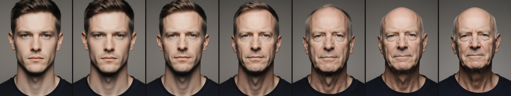

# Faces as a Data-Mining Puzzle — Part 2: The Math of Pattern Preservation

**Date:** 2026-04-16
**Series:** Part 2 of 2. [Part 1 here](2026-04-16-part-1-faces-as-data-mining.md) covered positioning — why faces, why a game, why co-discovery. This post covers the math: how we know when a built pipeline actually preserves the patterns a player would need to discover.
**Audience:** same as Part 1 — CS seniors, technical PMs, data scientists. Neural networks are black boxes; linear algebra and basic probability are fine; diffusion-model specifics are unpacked as they come up.
**Status:** draft for self-audit. Every ⚠ claim and 🔍 assumption is there *to be challenged*.



---

## 1. Recap and the question Part 2 actually answers

Part 1 argued that a face-based data-mining puzzle has a narrow but real niche: axis co-discovery and longitudinal calibration, two tasks where current EDA tools (color tables, t-SNE, LLM summaries, parallel coordinates) underperform. The argument was positional. If you buy Part 1, you think the *idea* is interesting.

This post is about engineering. Suppose we build the thing — a pipeline that takes a text item, passes it through a text embedding, projects that embedding into a generative model's conditioning space, generates a face, and displays the face to a user who tries to recover the hidden pattern. **How do we know when the pipeline is actually working?**

The intuitive answer is "ask a human." That's fine for the final validation — we're going to run users on the hidden-pattern detective experiment described in the project's framework[^framework] — but it's a bad signal to optimize against during development. Humans are slow, expensive, inconsistent, and don't return gradients. We need a mathematical target that a machine can evaluate on every change we make, and that correlates with the human outcome we ultimately care about.

That mathematical target is what this post is about. The short version: **end-to-end supervised prediction of the planted pattern through a frozen generator, with a diagnostic metric panel that localizes any failure to a specific link, plus a second data channel — off-manifold drift — that carries the uncanny-valley "something is off" signal separately from attribute-axis recovery.** An earlier draft called the first channel "task-anchored cycle consistency" and elided the second channel entirely; the adversarial review correctly flagged both. This post uses the honest framing. The long version has these parts: the supervised training target (§3), the pipeline link-by-link (§4), the manifold vocabulary and the two-channel structure (§5), the diagnostic metrics (§6), the training losses per tier alongside the four-term diagnostic panel (§7), and the training method (§8) — plus the question of what to do when ground truth doesn't exist (§9 Stage 7).

> ⚠ **Claim 1.1:** A machine-evaluable target that correlates with "humans can co-discover the planted patterns" is feasible to construct for this pipeline.
>
> This is the central engineering bet of Part 2. If the target we construct doesn't correlate with human recovery — if we can max it out while humans still can't find the patterns, or vice versa — then the target is wrong and we're optimizing the wrong thing. **Status: the correlation is an empirical question we plan to measure in the detective experiment.** None of the individual metrics in §6 have been validated against human co-discovery outcomes yet; the published literature validates them against related outcomes (face verification, embedding alignment, preference-learning), which may or may not transfer.

---

## 2. What "working" means, quantitatively

Part 1 posed the user's task loosely: scan a grid of faces, slice the corpus, notice that a feature moves, hypothesize what it means, confirm or reject. Call this process **pattern recovery**. It has a success rate — did the user correctly name the hidden axes planted by the experiment designer?

Rewriting for engineering, pattern recovery requires three things to hold simultaneously:

1. **The source data actually contains the patterns.** The qwen-1024 embedding of the text item has to *encode* the axis variations. If it doesn't, nothing downstream can recover them. This is the information-bottleneck ceiling — `I(Z; Y) ≤ I(X; Y)` in Tishby's formulation[^ib]. No map from X to Z can manufacture class-discriminative information about Y that X did not already carry.
2. **The face-generation pipeline preserves those patterns into perceptual space.** A face encoder run on the generated image has to still distinguish axis levels. If the generator smears or homogenizes the axes, the pattern is destroyed even though the source carried it.
3. **Human perception can read the distinguishable patterns.** If the face encoder distinguishes axis levels but the distinctions are below human perceptual threshold — differences a convolutional net picks up that humans can't see — the pipeline "works" by machine measure but fails the actual task.

The machine-evaluable target handles (1) and (2). Condition (3) requires human measurement, which is the detective experiment.

> 🔍 **Assumption 2.1:** Conditions (1) and (2) are decoupled from (3) *enough that optimizing (1) and (2) moves the needle on (3)*. **Status: uncertain, and the adversarial review correctly noted an earlier draft understated the gap.** FaRL and CLIP-lineage encoders are trained on **caption-aligned** signal — image-text pairs where the text describes the image — which is close to but not identical to human perceptual similarity. DreamSim (NeurIPS 2023) is the one face-adjacent model explicitly trained on human triplet judgments and is an alternative readout if caption-alignment turns out to be the wrong proxy for detective-style pattern recovery. The gap between "what a caption-aligned encoder sees" and "what a human sees" is a real risk to the whole "machine target correlates with human outcome" story in Claim 1.1; ensemble Ψ (FaRL + DINOv2 + DreamSim + ArcFace) and explicitly comparing machine recovery to human recovery in the detective experiment is the best hedge. Choosing one caption-aligned encoder and assuming it approximates human perception would be the failure mode.

Given (1) and (2) as the engineering targets, the pattern-recovery task reduces to: **does the pipeline preserve, from source space to perceptual space, the information that distinguishes items along the planted axes?** That's a property of the pipeline, not of any one user. It can be measured without recruiting humans. It can be optimized.

---

## 3. The training target: end-to-end supervised prediction through a frozen generator

Here's the simplest useful target we can write, stated honestly.

Take an item with a known pattern assignment `D` — in the detective puzzle, a tuple like `(axis₁, axis₂, axis₃, signature-cluster-flag)`. Run it through the full pipeline and try to recover `D`:

```
D  ≡  pattern assignment of a text item
      ↓
text  →  qwen(1024-d)  →  projection P  →  Flux conditioning  →  Flux (frozen)
       →  face image  →  face encoder Ψ  →  embedding  →  readout R  →  D̂
```

Compute the cross-entropy `ℒ(D, D̂)`. If `D̂ ≈ D` across many items, the pipeline preserves pattern-distinguishing information end-to-end. If `D̂` gets a specific axis wrong systematically, we've localized the leak *somewhere* between text and readout — which link, we'll figure out in §6 via the diagnostic metric panel.

`CE(D, D̂)` plays two different roles depending on how we train, and §7 spells the distinction out carefully. In the headline training regime (§9 Stage 4), `CE(D, D̂)` trains only the readout `R` — `P` is fit separately by regression onto hand-authored conditioning. In the escalation regime (§9 Stage 5 onward), `CE(D, D̂)` is one term in a four-term end-to-end loss that backprops through Flux to update `P + R` jointly. Same scalar, two roles; this post used to blur them and no longer does.

This is **supervised learning with a frozen middle.** Earlier drafts of this post framed it as "task-anchored cycle consistency" and cited CycleGAN[^cyclegan] as the organizing idea. That was terminology inflation and I'm walking it back. A real cycle-consistency setup has two learned maps (forward and inverse), two losses (one per direction), and is useful precisely because it works on *unpaired* data. We have paired data (text ↔ known pattern label), one learned forward path (`P + R` with a frozen generator and a frozen face encoder in between), and one loss. That's transfer learning with a learned readout on top of a frozen pipeline. Importing CycleGAN's name would have imported citation-prestige the math doesn't earn.

The reason the honest framing still has teeth is the **frozen middle**. Three of the five links (qwen, Flux, Ψ) are frozen and out of our control. If the pipeline can't recover `D` even from the pattern-labeled items in our training set, the bottleneck is structural: it lies in one of the frozen links, not in `P` or `R`. Which is exactly the diagnostic we want. The metric panel in §6 localizes the leak per-link; the staged buildout in §9 tests each link independently before training the combined system.

> ⚠ **Claim 3.1:** End-to-end cross-entropy `CE(D, D̂)` is a well-posed supervised target for the detective puzzle: the loss is minimized only when every link in the pipeline preserves pattern-relevant information, and failures localize cleanly to the diagnostic metrics in §6.
>
> This is the narrower and more defensible claim. It replaces an earlier draft's claim about "task-anchored cycle consistency being strictly more informative than embedding-level cycle consistency," which was dressing up standard supervised training with comparison-prestige from an unrelated literature. The supervised target has real merits — localization of failure, tractable gradient-based optimization, stable loss shape — that stand without borrowed vocabulary.

> 🔍 **Assumption 3.2:** The frozen middle is frozen in the sense that matters for our analysis. **Status: obvious for qwen and Ψ, nuanced for Flux.** Flux is architecturally frozen but has multiple conditioning injection surfaces (T5-XXL text embeddings, CLIP-L text embedding, pooled CLIP vector, guidance vector). The choice of which surface `P` feeds into is itself a structural decision that changes the gradient path, the expressivity ceiling, and the failure modes. §4 and §8 treat this; here we are naming it as a commitment, not a detail.

The one genuine cycle construction in this project is the **degenerate-cycle residual** metric in §6 — fit a linear back-map `g: face-embedding → qwen` and evaluate `‖q − g(Φ(q))‖` on held-out items. That measurement *is* a round-trip, it's a real diagnostic, and we use it as one metric among several. It doesn't make the whole training target a cycle in the CycleGAN sense; it's one tool in the diagnostic panel.

---

## 4. The pipeline, link by link

Five links between input and output. Each one needs to either preserve or be trained to preserve pattern information.

**Link 1 — Text to qwen embedding.** `qwen3-embedding:0.6b` takes a string and returns a 1024-dimensional vector. This is frozen infrastructure (same model used throughout the project). We assume it encodes the patterns; we can verify by training a linear probe directly on qwen vectors to predict the planted axis labels. High probe accuracy means qwen carries the patterns; low accuracy means the whole project is blocked because upstream has no signal.

**Link 2 — Qwen to Flux conditioning (the projection `P`).** This is the one link we control. Flux.1-dev doesn't have a single conditioning input; it has **four** injection surfaces that all matter for generation, and the choice of which `P` feeds into is itself a structural decision:

1. **T5-XXL text embeddings** — per-token tensors from Google's T5-XXL encoder, consumed by Flux's joint-attention layers. Dominant surface for fine-grained semantic control. Large tensor (~512 tokens × 4096 dims).
2. **CLIP-L text embedding** — per-token tensors from CLIP-ViT-L/14 text encoder, consumed by parallel attention. Redundant with T5 in many cases but provides a second anchor.
3. **Pooled CLIP vector** — a single 768-d vector summarizing the CLIP text embedding, used as a coarse conditioning signal.
4. **Guidance vector** — a learned embedding that controls the classifier-free-guidance-like mechanism in Flux's distilled sampler.

`P` can target any of these. Our default is to replace (or augment) the T5-XXL per-token embeddings, since that's where most semantic control lives — but targeting the CLIP surface, the pooled vector, or adding a conditioning offset to the guidance vector are all plausible alternative designs. Each gives different gradients through Flux and different expressivity ceilings. The synthesis memo[^synthesis] flags "which injection surface do we target" as open question #3. The claim that `P` is "a single map `qwen → Flux conditioning`" is a simplification; reality is a choice of target surface plus a map to that surface.

**Link 3 — Flux conditioning to face image.** Flux.1-dev is a rectified-flow transformer[^flux] — a generative model that produces an image through ~50 steps of iterative denoising guided by the conditioning input. This is the hard link. Flux is frozen (we don't retrain the 12B-parameter model), but we *would* like gradients to flow through it so we can train `P` end-to-end. Getting gradients through 50 steps of iterative generation is the engineering problem §8 addresses.

There is also a **second control mechanism** inside Flux that matters for the project: the **FluxSpace direction basis** (Dalva et al., arXiv:2412.09611[^fluxspace]). FluxSpace decomposes the joint-attention outputs of Flux's MM-DiT (Multimodal Diffusion Transformer) blocks along direction vectors derived from prompt pairs. Given two prompts — say `("office worker", "warehouse worker")` — FluxSpace extracts the difference in attention outputs and uses that difference as an **edit direction**. Adding `λ · direction` to the joint-attention output steers generation along the implied axis at test time, without retraining Flux. The paper reports working edits for ~20 attributes (eyeglasses, age, smile, gender, etc.) with approximate orthogonality between axes and composability up to several simultaneous edits.

This is load-bearing for co-discovery. The framework[^framework]'s central question "can Flux be steered along multiple orthogonal axes at once" is exactly what FluxSpace claims to do. If the claim holds, FluxSpace gives us the **substrate** for the planted axes in the detective puzzle: each planted axis is a prompt-pair-derived direction, the puzzle's 3–4 axes are 3–4 directions composed with independent `λ` coefficients, and `P`'s job reduces to "emit the right `λ` coefficients given a qwen vector." That's a much cleaner learning problem than "emit the whole conditioning from scratch."

> 🔍 **Assumption 4.2:** FluxSpace direction-basis edits compose orthogonally enough to support 3–4 simultaneous axes on our detective corpus. **Status: plausible from the FluxSpace paper's published demos but not tested on our corpus or axes.** The paper's pairwise-cosine numbers are favorable but not zero; small non-orthogonalities accumulate when composing many axes. The framework's Exp B is specifically designed to measure orthogonality on 4+4 candidate axes on our 543-job corpus. Until Exp B runs, the FluxSpace-as-substrate assumption is a plausible plan, not a measured fact.

> 📚 **Citation 4.3 — FluxSpace** (Dalva et al., arXiv:2412.09611[^fluxspace]). **Claim:** training-free attribute editing on frozen Flux via prompt-pair direction extraction in joint-attention output space; published demos cover ~20 face attributes with approximate orthogonality. **Check:** (a) verify that the direction extraction is training-free (no auxiliary model fine-tuning); (b) verify orthogonality claims — the paper reports pairwise cosines, which is the right measurement; (c) note that the paper's evaluation is CLIP-I and DINO content-preservation, NOT ArcFace-style identity similarity, so any framework property tied to identity leakage requires our own measurement. The paper's strongest claim is *approximate* orthogonality; it's not a formal disentanglement result.

**Link 4 — Face image to perceptual embedding (the face encoder `Ψ`).** A frozen model that reads the generated face and produces a fixed-dimensional embedding. The obvious candidate is ArcFace IR101, which is what the project's v3 baseline used. Recent research (summarized in a companion synthesis[^synthesis]) argues this is the wrong choice — ArcFace is trained with identity-invariant margin losses that *actively discard* expression, attire, gaze, and other attribute variation. For the detective puzzle we care about attribute axes, so ArcFace throws away exactly the signal we need.

A better choice per the synthesis is **FaRL-B/16**[^farl] — a CLIP-ViT fine-tuned on 20M face-text pairs — with optional ensembling against DINOv2-L/14[^dinov2] for complementary signal. ArcFace can stay as an auxiliary feature for identity-locked signatures. This is a framework-level decision that has to be measured, not assumed.

> 🔍 **Assumption 4.1:** Swapping ArcFace → FaRL as the primary face encoder improves attribute-axis recovery in our pipeline. **Status: supported by published linear-probe benchmarks on CelebA (FaRL +0.5 mAcc over vanilla CLIP, consistent across training-data budgets); not tested on our specific hidden-axis recovery task.** The minimal experiment is cheap — a few minutes of GPU time running 8 candidate encoders on 500 existing v3 faces — and should happen before any larger commitment.

**Link 5 — Embedding to predicted pattern (the readout `R`).** A small head — linear probe or shallow MLP — that maps the face-encoder's output to a prediction of the planted pattern. This is learned jointly with `P` in principle, though in practice it's often useful to train `R` first (with `P` frozen as the identity or a pretrained projection) to establish a ceiling for what the pipeline *could* achieve with perfect `P`.

Every link except Link 3 is either frozen-and-evaluated or a small learnable component trained by standard backprop. Link 3 is the engineering problem.

---

## 5. Manifolds, off-manifold drift, and the second channel

Before the metrics section, two pieces of vocabulary that Part 1 used loosely and the post so far has been assuming you'd pick up from context.

### 5.1 What we mean by "manifold"

Informally: a **manifold** is the subset of a high-dimensional space where natural data actually lives. The 1024-dimensional qwen embedding space can hold any vector in ℝ^1024, but real text embeds to a thin, curved subset — a small fraction of the total volume, with its own local structure. Face images of real people live on a similar thin subset of pixel-space: most 256×256 RGB grids look like noise, not faces. The manifold hypothesis — a mainstream assumption in modern ML, not a controversial claim[^bengio2013] — is that the data manifold has much lower effective dimension than the ambient space, and machine learning is in large part the business of mapping between manifolds.

This matters here for two reasons.

First, several of the metrics in §6 (k-NN overlap, trustworthiness/continuity, Gromov-Wasserstein) are **manifold-alignment measures**. They don't care about absolute coordinates; they care about whether local neighborhoods and global geometry transfer through a mapping. When we ask "does the pipeline preserve pattern structure," we're asking about properties of the learned map between manifolds, not about coordinate-level reconstruction.

Second, there's a region of ambient space that is *not* on the manifold — "off-manifold points." For images, this is where implausible or broken face geometries live: melting features, too-many-eyes, subtle anatomical impossibilities, skin that looks wrong in a way you can't locate. Generative models trained on faces won't usually produce these, *unless we steer them into off-manifold territory on purpose.* That steering is the second data channel.

> 🔍 **Assumption 5.1:** The data manifolds for our purposes (qwen-embedded scam-posting text, ArcFace/FaRL-embedded face images) are well-defined enough in practice that manifold-alignment metrics are meaningful even without an explicit topology. **Status: pragmatic assumption shared by the whole representation-learning field.** The measurements in §6 are computed on finite-sample approximations — k-nearest-neighbor graphs, empirical pairwise distances, sampled Gromov-Wasserstein — and treat the data as if it lies on a manifold regardless of whether the mathematical object exists. This is the same assumption t-SNE/UMAP/modern deep-learning empirics all rest on; it's not new risk introduced by this project.

### 5.2 The second channel: off-manifold drift as uncanny-valley signal

Part 1 argued that the face is a preattentive pattern-recognition substrate and mentioned the uncanny valley in passing. The mechanism we skimmed in Part 1 is load-bearing enough to deserve its own name here.

The relevant empirical claim is from Kätsyri et al. (2015) and the Diel et al. (2022) meta-analysis[^katsyri][^diel]: the uncanny valley is triggered by **perceptual mismatch between facial cues**, not by uniform degradation. A face with realistic skin but wrong eye geometry, or a photographic-quality portrait with a subtly impossible lighting-to-anatomy relationship, produces the "something is off" response. A uniformly ugly cartoon does not. In manifold language: the valley is a region near the natural-face manifold but not on it — *plausibly close, structurally off.* Deep off-manifold isn't uncanny either (cartoon, abstract art); you have to be near enough to trip the face-processing circuit and far enough to trip its mismatch detector.

This gives the project two independent channels through the face:

- **Channel A (pattern preservation).** The attribute-axis channel we've been discussing — FluxSpace-style direction edits that move the face *along* interpretable axes while staying on-manifold. This channel recovers planted axes and supports co-discovery. It is what §§3, 4, 6, 7 are about.
- **Channel B (off-manifold drift).** A scalar or low-dim control that pushes the face *off* the natural-face manifold by a calibrated amount. Controlled off-manifold-ness registers perceptually as "something is wrong here" without the viewer being able to say what. This channel is how the framework's `sus_level → denoising_strength` knob turns a suspicion score into a visceral aversive signal without needing any labeled attribute axis.

Both channels can coexist in the same face. A posting can simultaneously register as "construction-industry + high-urgency archetype" (Channel A, on-manifold attribute axes) and "off-manifold by 0.34" (Channel B, drift from anchor). The viewer gets a category reading *and* a visceral "this one is off" reading, pre-articulately, from the same image.

> ⚠ **Claim 5.2:** The off-manifold-drift-as-uncanny-valley-signal channel is a real, distinct data pathway in this pipeline — not a special case of pattern preservation. Attempting to train the two channels with one objective conflates them and loses the visceral aversive response.
>
> **Status: supported by Kätsyri/Diel for the perceptual mechanism, and by the project's measured v3 Flux baseline (`r(d_anchor, sus_level) = +0.914` on 543 jobs) for the empirical existence of the channel.** The framework's D1 property (off-manifold reach) and the existing denoising-strength-as-drift mechanism are already the control surface for this channel. Part 2's earlier draft elided the channel entirely by focusing only on attribute-axis recovery; the adversarial review's "Part 2 is narrower than the project actually is" observation points here.

> 🔍 **Assumption 5.3:** The two channels (pattern preservation and off-manifold drift) can be engineered independently, i.e., a face can have calibrated attribute-axis signal AND calibrated off-manifold drift without the two interfering. **Status: untested for the multi-axis case.** v3 Flux achieves Channel B without any Channel A (no attribute axes defined). FluxSpace-based editing achieves Channel A without the Channel B drift mechanism plugged in. Combining them cleanly is open work — likely straightforward if FluxSpace edits preserve on-manifold-ness (which they should by construction, since the edits are trained on real faces), but this needs measurement.

### 5.3 What the two-channel framing changes downstream

Two small consequences for the rest of the post:

- The **training losses and diagnostic panel** in §7 are all about Channel A (pattern preservation). Channel B has its own control — the denoising-strength knob — which doesn't need a loss term at training time because it's parameter-free at inference. The two channels are combined at the Flux-sampling step, not at the training-objective step.
- The **failure modes** in §10 get a new category (Channel B specific: the off-manifold drift either triggers uniform "ugly" instead of mismatched "wrong," or it leaks across items that weren't supposed to be drifted). The framework-level D4 property (collateral leakage) names this precisely.

---

## 6. The metrics toolbox

Pattern-recovery accuracy `D̂ vs. D` is the final score, but it's a single number that hides a lot. For *diagnosis* — to localize where in the pipeline a failure originates — we want a battery of per-property metrics. Each measures a *different* way the pipeline might preserve or fail to preserve structure. These metrics are always used as measurements, never as training losses; the training losses are in §7 and depend on which tier from §8 we run.

This list draws from a research memo on manifold-alignment metrics[^metrics], applied to our cross-modal (text ↔ face) setting. The adaptation has caveats — the source memo is about two text encoders on the same face domain; ours is one text encoder and one face encoder on the same text domain — flagged inline.

| Property we care about | Canonical metric | Why | Tool |
|---|---|---|---|
| Local neighborhood preservation | k-NN overlap (Jaccard) at k ∈ {5, 10, 20} between qwen-space and face-space distance matrices | If qwen-neighbors are also face-neighbors, local structure survived | `sklearn.neighbors` |
| Neighborhood-error decomposition | Trustworthiness and continuity at k ∈ {10, 20} | Splits rank errors into *false* neighbors (the map invented) vs. *torn* neighbors (the map lost). Pareto-incompatible, so we learn which way the pipeline leans | `sklearn.manifold.trustworthiness` |
| Global geometry preservation | Linear + RBF CKA (Centered Kernel Alignment) between Gram matrices | Measures relational similarity in a way that's invariant to invertible linear reparameterization | ~50 LOC standard formula[^cka] |
| Distribution alignment (coordinate-free) | Gromov-Wasserstein distance | One scalar, basis-free, robust to dimension mismatch (1024 vs. 512). Heavier to compute than the others but principled | `POT` library[^pot] |
| Pipeline invertibility (degenerate form) | Linear back-map cycle residual — fit `g: face-space → qwen-space` by least-squares on a train split, evaluate residual on held-out | Our degenerate substitute for true cycle consistency since we don't have a trained inverse. If a trivial linear inverse is enough to recover qwen vectors, information loss is small | `numpy.linalg.lstsq` |
| Task-level proxy | Face-verification ROC-AUC on pairs labeled by cluster or axis membership | The closest published analogue to our task is "can a face encoder tell paired faces apart by some attribute" | `sklearn.metrics` |
| Cluster separability (framework P4 Fisher) | Fisher ratio `tr(S_B) / tr(S_W)` on face embeddings, computed over several *eval-time* groupings (qwen k-means clusters, sus-level bins, platform, role label) | Similar-job faces should cluster in face space — this is the "cluster membership" signal the scam-hunter user needs. No training labels required; groupings are imposed at evaluation. **This is the axis the Tier 1 vs Tier 2+ decision hinges on** — the framework scoring memo identifies P4 Fisher as the only axis where Tier 2+ could beat Tier 1[^scoring] | `numpy` (10 LOC) |

Each metric answers a slightly different question. No single one is dispositive.

> ⚠ **Claim 6.1:** The seven metrics above form a useful diagnostic panel for our pipeline — each measures a property that the next one doesn't, so seeing the full battery of numbers tells us *how* the pipeline is failing when it fails, not just *that* it's failing.
>
> The claim is that the metrics are *non-redundant*. A pipeline might have high k-NN overlap (local structure good) and low CKA (global structure bad), or high cycle residual (information loss) and high ROC-AUC (task still works because only the relevant information survived). These combinations are diagnostically different and suggest different fixes. **Status: the diagnostic power is argued from structure, not measured on our data.** The framework commits to running the full panel on the 543-job v3 baseline as "Exp E" before making further architecture commitments.

> 🔍 **Assumption 6.2:** These metrics, individually well-validated in their source literatures, transfer to our cross-modal setting (text embedding ↔ face embedding of generated faces) without losing their diagnostic interpretation. **Status: partially supported.** CKA and GW are explicitly developed for cross-representational comparison; k-NN overlap is encoder-agnostic. Cycle residual requires a trained inverse, which we approximate with a cheap linear back-map — this is a weaker substitute than the true cycle and may give different failure modes. The metric we're most uncertain about is the linear cycle residual; a large residual could mean real information loss *or* forward-map nonlinearity that a linear inverse can't undo.

One important note about the cycle-residual metric. The published cycle-consistency literature (§3) assumes two trained maps. We have one (`qwen → Flux → face`) and no inverse. Training a full inverse is expensive and possibly circular. So we fit a **linear back-map on a train split** as a diagnostic — not a production artifact. A small linear-cycle residual is strong evidence the pipeline is well-behaved. A large one is *weaker* evidence: it could be genuine information loss or it could mean the forward map is nonlinear in a way a linear inverse can't capture. The fix for ambiguous cases is to compare linear-cycle and MLP-cycle residuals; dramatic improvement with an MLP localizes the issue to the inverse, not the forward map.

---

## 7. Losses: what we minimize (per tier), what we measure (always)

Earlier drafts of this post called the four-term panel below "the loss function." That was a conflation. Part 2 uses two different things called "loss" and they live in different parts of the pipeline:

- **Training losses** — the specific scalar we hand to Adam to update `P` and/or `R`. Which scalar this is *depends on which tier from §8 we're running.* Tier 1 (the default, headline path) trains on a pair of losses that do not appear in any of the four terms below. Tier 2+ (escalation) trains on the four-term form below, backpropagated through Flux.
- **The diagnostic panel** — the four-term form below, evaluated as a *measurement* on a held-out batch. This is a static property of the pipeline, computed regardless of which tier trained it. The four terms stay useful as measurements even when they are not in the gradient path.

Both roles matter. The training losses tell Adam which direction to move. The diagnostic panel tells us, after training, in what shape the pipeline actually ended up. Earlier drafts collapsed the two and implied we always train on all four terms with Flux gradients. In the headline tier, we train on neither of the four terms.

This section is now structured around that split.

### 7.1 Tier 1 training losses: two independent supervised fits

When we run the headline path — §9 Stages 3–4, hand-written conditioning + regression-fit `P` — **Adam never sees the four-term panel**. Tier 1 factors into two supervised fits with no Flux gradients anywhere:

**`P` trained by MSE regression onto hand-authored conditioning:**

```
ℒ_P  =  Σᵢ ‖ P(qwen_i) − c_hand(axis_i) ‖²
```

where `c_hand(axis_i)` is the Flux conditioning we hand-authored for axis level `i` (§9 Stage 3). Closed-form under linear `P`, small-MLP Adam under nonlinear `P`. Flux is never in the gradient path — it was only consulted offline to verify `c_hand` produces the intended axis by eye.

**`R` trained by cross-entropy on pre-rendered faces:**

```
ℒ_R  =  CE(D, R(Ψ(x)))        where x = Flux(P(qwen)) is rendered once and frozen
```

`R` backprops through itself and through the frozen encoder `Ψ`, never through Flux. The two fits can run sequentially (`P` first, render corpus, then `R`) or interleaved with re-rendering after each `P` update.

That's the full Tier 1 training specification. Neither `ℒ_P` nor `ℒ_R` is in the four-term panel. The four-term panel is purely diagnostic when Tier 1 runs.

### 7.2 Tier 2+ training loss: the four-term panel, backpropagated through Flux

When Tier 1 plateaus and we escalate (§9 Stages 5–6, DRaFT-1 / Adjoint Matching / Flow-GRPO), the training loss is the full four-term form below. **Every term requires gradients through Flux to update `P`** — each one is a function of `Ψ(Flux(P(qwen)))` or of `R(Ψ(Flux(P(qwen))))`, so there is no path from `P` to the loss without differentiating the sampler. That is the engineering cost §8 debates.

```
ℒ  =  λ_task · CE(D, D̂)
   +  λ_align · InfoNCE(qwen, Ψ(Flux(P(qwen))))
   +  λ_collapse · VICReg(Ψ(Flux(P(qwen))))
   +  λ_struct · SoftRankSpearman(D_qwen, D_face)
```

Sensible starting weights from the self-supervised literature: `λ_align ≈ λ_collapse ≈ λ_struct ≈ 1.0`; `λ_task ≈ 1.0` when labels exist, 0 otherwise. All four `λ`s are hyperparameters to tune.

The four terms, one by one:

**Term 1 — `CE(D, D̂)`.** Cross-entropy on pattern prediction. In Tier 2+, this is the supervised end-to-end term: the gradient pulls on `P` through Flux → Ψ → R → D̂. (In Tier 1 the same-named scalar is `ℒ_R` — but it only trains `R`, because `P` isn't in the gradient path without Flux backprop.) When we say "the pipeline has a supervised target" across tiers, we mean cross-entropy — but the *training role* of that target differs by tier, and that's the distinction §§7.1–7.2 make explicit.

**Term 2 — InfoNCE** (van den Oord et al. 2018[^infonce]). A contrastive loss that pulls paired qwen and face embeddings together while pushing apart unpaired ones. Concretely: for a batch of `N` items, compute all `N × N` similarities between qwen vectors and face embeddings, apply softmax, and maximize the diagonal. InfoNCE has a specific and rather strong theoretical property that makes it particularly apt here.

> 📚 **Citation 7.1 — Daunhawer et al. ICLR 2023, "Identifiability Results for Multimodal Contrastive Learning."**[^daunhawer] What this paper claims: under a content-style independence assumption, multimodal contrastive learning (two encoders, paired positive samples) **provably and identifiably recovers the shared content block** between the two modalities. What this means in our setting: InfoNCE applied to `(qwen_vector, face_embedding)` pairs provably recovers the part of qwen information that Flux + Ψ preserves as "shared content." Not a mutual-information lower bound; a structural recovery result. **Check:** verify the content-style assumption fits our setup. Daunhawer's assumption is that each modality has independent modality-specific "style" plus shared "content"; in our case, qwen's style is text-specific (word choice, phrasing), face-embedding's style is face-specific (lighting, background), and the "content" is the underlying pattern we planted. This is plausibly a reasonable fit but is not explicitly verified against Daunhawer's assumptions.

**Term 3 — VICReg** (Bardes et al. ICLR 2022[^vicreg]). Three sub-losses enforcing variance (features don't collapse to a constant), invariance (paired views are close), and covariance (features are decorrelated). VICReg is applied to face embeddings only — it prevents the readout from discovering a trivial solution where all faces map to a narrow region.

**Term 4 — Soft-rank structure preservation** (differentiable Spearman correlation on vectorized pairwise distance matrices). For a batch of `N` items, compute the `N × N` pairwise distance matrices in qwen space and face-embedding space, flatten the upper triangles, and maximize their Spearman correlation via a differentiable soft-rank relaxation. This term directly enforces that items close in qwen space are close in face space and vice versa, which is the structural property that co-variation invariance (Part 1 §9) requires. It is not subsumed by InfoNCE — InfoNCE cares about paired *identity* (which qwen matches which face), not paired *distance* (which pairs are close vs. far). The synthesis memo[^synthesis] recommends this as the fourth canonical term and I originally dropped it to simplify the presentation — a dropping the adversarial review correctly flagged as motivated narrowing.

### 7.3 The four-term panel as diagnostic, across every tier

Regardless of which tier trained the pipeline, the four terms above can be *evaluated* as scalars on a held-out batch, and that's useful:

- `CE(D, D̂)` on held-out items — end-to-end recovery accuracy.
- `InfoNCE` on held-out pairs — paired qwen/face-embedding alignment quality.
- `VICReg` on held-out face embeddings — collapse / rank-deficiency check on the perceptual side.
- `SoftRankSpearman` on held-out pairwise distances — rank-ordered structure survival.

In Tier 1 these numbers tell us whether the MSE-fit `P` produced a pipeline whose geometric properties are good enough without end-to-end training. In Tier 2+ these numbers tell us whether the Adam-stationary point Adam landed at has the properties we expected from minimizing the same four terms. Same measurement, different interpretive role.

The diagnostic panel is thus *always live*. What changes between tiers is whether the terms also appear in the gradient path. The metrics in §6 (k-NN overlap, trustworthiness, CKA, Gromov-Wasserstein, cycle residual, ROC-AUC, Fisher ratio) are likewise always diagnostic and never training losses, but they answer finer-grained questions than the four-term panel. In particular, **Fisher ratio over eval-time groupings is the metric on which Tier 1 and Tier 2+ most plausibly differ** — the four-term panel can look healthy while cluster separability is weak, so running Fisher alongside the four terms is how Stage 0 decides whether Tier 1 is sufficient or escalation is warranted. An earlier version of this post folded clustering into the four-term panel and then dropped it; separating "Fisher as diagnostic" from "Fisher as training loss" is the correct decomposition, and the scoring memo[^scoring] foregrounds this split.

### 7.4 The unlabeled regime: what the three-term form buys and doesn't

On real corpora without planted axes (§9 Stage 7), there is no `D` to supervise against. Tier 1 isn't applicable either — without labels there is nothing to hand-author conditioning *for.* The training loss in Stage 7 is therefore the **three-term form** of the above, with `λ_task = 0`, trained end-to-end via Tier 2+ methods (DRaFT-1 / Adjoint Matching / Flow-GRPO):

```
ℒ_unlabeled  =  λ_align · InfoNCE(qwen, Ψ(Flux(P(qwen))))
             +  λ_collapse · VICReg(Ψ(Flux(P(qwen))))
             +  λ_struct · SoftRankSpearman(D_qwen, D_face)
```

> ⚠ **Claim 7.2 (revised):** The three-term unlabeled loss (`InfoNCE + VICReg + SoftRankSpearman`) is well-defined without labels and is differentiable via Tier 2+ methods — but this is *not* graceful degradation in general. It can fail in a specific and predictable way. Daunhawer's identifiability result recovers the **shared content block** between qwen and face space. On the planted-axis detective corpus, the shared content *is* the planted axes, by construction. On real scam/labor corpora, the shared content is whatever dominates in both modalities — topic, work-type, formatting — not necessarily the suspicion signal that the project ultimately cares about. The unlabeled loss will train a pipeline that preserves *some* structure; whether that structure is the structure a downstream user would find interesting is a separate and not-automatic question.
>
> Earlier drafts of this post claimed "graceful degradation from labeled to unlabeled regime." The reviewer correctly called that out as overclaiming. The honest statement is: the **structural** terms are well-defined without labels and do real work — but *which* structure they preserve is determined by what the two modalities actually share, and that's an empirical question per-domain.

> 🔍 **Assumption 7.3:** On real corpora where suspicion/fraud signal is subordinate to topic/format/work-type in the shared-content block, a **task-specific anchor** — even a weak, heuristic one — is probably necessary. Options: (a) use weak labels inferable from text patterns (urgency keywords, pay-range anomalies, etc.) as `λ_task > 0` even in the "unlabeled" regime, which puts us back in Tier 2+ supervised-ish training; (b) subtract known nuisance dimensions (work-type cluster mean) from qwen before the loss; (c) use the detective-experiment pipeline to precondition `P` on planted axes before transferring to real data. **Status: all three are options not yet tested; the synthesis memo flags this as an open question for arbitrary-domain deployment.**

### 7.5 What we're *not* using

The Information Bottleneck (`min I(X; Z) − β I(Z; Y)`) is asymmetric and requires labels to be meaningful, so it degenerates in the unlabeled regime. Invariant Risk Minimization (IRM) needs environment splits we don't have. MINE-style direct mutual-information estimation is known-unstable in practice. These are checked and rejected, not ignored.

---

## 8. How to train `P`: three tiers, headline not where you'd guess

Per §7, which loss we minimize depends on which tier we commit to. Both candidate losses are scalar functions of `P` and/or `R`, both differentiable in their own tier, and both eventually hand Adam a gradient. What differs is whether Flux is in the gradient path. In Tier 1 (§7.1), Flux is not — we minimize `ℒ_P` (MSE onto hand-authored conditioning) and `ℒ_R` (CE on pre-rendered faces) independently, and Link 3 never enters backprop. In Tier 2+ (§7.2), Flux is — we minimize the four-term end-to-end loss, and Link 3's 50-step rectified-flow sampler becomes the engineering problem this section addresses. The **first question to ask is whether we need Tier 2+ at all.**

Before spending engineering cost on gradients through Flux, worth being explicit about what "optimal" would even mean here. The natural framing — *Adam finds the best projection and readout for the data* — quietly assumes three things that don't hold in full strength for this pipeline[^northstar]:

1. **The loss captures what we actually want.** `L` is always a proxy. Our true objective is "a human reader recovers the planted patterns," which is not differentiable and not observable per-sample. Every term in §7 is a surrogate. Adam optimises the surrogate; the gap between surrogate and truth is a separate empirical quantity we measure via the detective experiment, not a quantity `L` makes small.
2. **The gradient we use is the gradient of the true loss.** DRaFT-1 backprops through one denoising step of 50; the gradient is a *biased estimator* of the population gradient. Adjoint Matching is exact on the ODE but higher variance. Flow-GRPO side-steps differentiability entirely with stochastic rollouts. Every option hands Adam a gradient that differs from the true gradient; the convergence point is a stationary point of the estimator, not the truth.
3. **The optimum is unique.** For a linear projection of this size plus an invariance-rich downstream stack (Flux is invariant to several reparameterisations of its conditioning, and contrastive-learning identifiability (Daunhawer et al. 2023[^daunhawer]) recovers only a shared-content *subspace*), many `(P, R)` give equivalent downstream behaviour. Adam lands at one of them, semi-arbitrarily.

The honest North Star is therefore **"Adam-stationary under this specific `L`, evaluated against the detective experiment,"** not **"the Adam-optimal face representation."** The former is a reachable engineering milestone. The latter is a category error this post should not pretend to deliver. Framework-level discussion of this distinction, and the three-walls argument in full, lives in an internal memo[^northstar].

This framing changes what we should *default to* in training. Full-pipeline backprop (DRaFT-1 or Adjoint Matching) is expensive *and* approximate — and the approximation is on top of a loss that is already a proxy. The engineering question is whether the marginal gain from Flux-internal gradients justifies the machinery, given that a simpler path (hand-written conditioning + least-squares regression on `P`) reaches the same Adam-stationary point — of a loss that is *also* a proxy, but one we understand better. The three tiers below are ordered by that calculation.

**Tier 1 — Hand-written conditioning + supervised regression on `P`.** No Flux gradients. Hand-author Flux conditioning prompts per planted axis (in the detective puzzle, one reference prompt set per axis level). Render them, confirm by eye they produce the intended axis. Once a working conditioning set exists, **fit `P` by least-squares regression to match that conditioning.** `P: qwen → conditioning-that-works`, MSE loss, standard gradient descent, zero Flux gradients needed.

This is the headline path for detective-scale problems. The synthesis memo calls it "the biggest pre-RL win"[^synthesis], and the adversarial review correctly flagged that an earlier draft of this post buried it as a "sanity check." It's not a sanity check — it's often the whole answer. If hand-authored conditioning produces the patterns the detective needs to discover, and `P` regresses cleanly to that conditioning on held-out qwen vectors, we are done training. The only remaining question is whether `P` generalizes to qwen vectors outside the hand-authored reference set, which is an empirical check, not a separate method.

Hand-written + regression has three real limits:
- It requires that a human can articulate the conditioning for each axis, which collapses if axes are subtle or numerous.
- It's a pair of linear-ish problems (conditioning design + linear regression), so it won't discover conditioning patterns that Flux could in principle use but a human wouldn't think to write.
- It requires both labels *and* per-label hand-authored conditioning. In the Claim 7.2 unlabeled regime, where we don't have labeled axes at all, Tier 1 simply isn't applicable — Stage 7 requires escalation to Tier 2+ with the three-term unlabeled loss of §7.4.

When one of those limits hits, escalate.

**Tier 2 — DRaFT-1 / DRaFT-LV with gradients through the last denoising step** (Clark et al. arXiv:2309.17400[^draft]). Backpropagate through only the final step of Flux; treat the previous 49 as fixed. Memory ~1×, compute ~1×, gradient is a one-step approximation. **Caveat worth taking seriously:** all published DRaFT results are on SDXL/SD with gradients flowing through the full diffusion stack including adapters. Our setup has a much shorter learnable path (only `P` is trained upstream; Flux is entirely frozen) and DRaFT-1's behavior in this regime is **uncharacterized**. It may work well because short gradient paths benefit less from truncation bias. It may fail in specific ways (gradient disappears into the frozen middle, P learns trick-the-readout artifacts) that the published DRaFT work hasn't had to grapple with. The honest framing is: Tier 2 is a plausible next step after Tier 1 fails, not a validated method for this architecture.

**Tier 3 — Adjoint Matching** (Domingo-Enrich et al. ICLR 2025, arXiv:2409.08861[^adjoint]). Neural-ODE adjoint method specialized for rectified-flow samplers with memoryless noise schedule. Memory O(1) in steps, compute ~2×, gradient is *exact* on the ODE. Microsoft publishes reference code for Flux/SD3 at `github.com/microsoft/soc-fine-tuning-sd`. Use when Tier 2 plateaus.

**Tier 4 — Flow-GRPO / DanceGRPO (RL fallback).** When differentiable paths fail, or the reward is genuinely non-differentiable (live user click-through telemetry in a deployed game, for instance), drop to policy gradient. Vanilla DDPO/DPOK **diverge** on rectified-flow samplers — documented gotcha, do not reach for `trl.DDPOTrainer`. Flow-GRPO (arXiv:2505.05470[^flowgrpo]) and DanceGRPO (arXiv:2505.07818[^dancegrpo]) specifically address the rectified-flow case by converting the ODE to an SDE.

> ⚠ **Claim 8.1 (revised):** For the detective-puzzle pipeline at ~500 items, **Tier 1 (hand-written conditioning + regression on P) is very likely sufficient on its own**, and the project should plan to settle there unless it demonstrably fails. If it does fail, Tier 2 (DRaFT-1) is the escalation path but its behavior on our specific frozen-Flux + learnable-projection architecture is uncharacterized — treat it as a speculative experiment, not a known-working method.
>
> An earlier draft of this post claimed DRaFT-1 as sufficient and staged it as the headline path. The adversarial review correctly identified this as narrative over engineering — the synthesis memo's own recommendation was Tier 1, and I'd interpolated to Tier 2 without justification. **Status: corrected.** The honest pipeline is: try Tier 1 first; treat Tier 2 as an experiment; keep Tier 3 as the principled-exact-gradient fallback and Tier 4 as the reward-free fallback.

> 🔍 **Assumption 8.2:** Vanilla DDPO/DPOK diverge on rectified-flow ODE samplers because the likelihood ratio is ill-defined without sampling noise. **Status: documented in the Flow-GRPO and DanceGRPO papers.** Flagged to prevent reaching for `trl.DDPOTrainer` as a reflex.

> 📚 **Citation 8.3 — TexForce** (arXiv:2311.15657[^texforce]). Structurally similar published setup: DDPO applied to a text-encoder LoRA with a frozen UNet. Their result — tuning upstream conditioning preserves attributes better than tuning the backbone — is directly analogous to our "train `P` with Flux frozen" commitment. **Check:** TexForce is on SD (not Flux), uses DDPO (not DRaFT or regression), and their gradient path is through a LoRA on a text encoder, not a projection on top of an embedding. The finding about *where* in the pipeline to train is what transfers. The finding about *how* to train is not.

---

## 9. The staged buildout plan

Seven stages, ordered cheapest-first. Each either validates the pipeline at its current link or kills the stages that would have built on top of it.

**Stage 0 — Baseline measurement.** Run the full metric panel from §6 on the existing Flux v3 + ArcFace pipeline, **including Fisher ratio over at least three eval-time groupings** (qwen k-means at k=8, sus-level quartile bins, work-type label). Numbers to beat, and — per §7.3 — the Fisher numbers are what decide whether Tier 1 is enough or Tier 2+ is warranted.

**Stage 1 — Readout-only on existing v3 faces.** Swap ArcFace → FaRL. Train only the linear probe `R` on the existing 543 v3 faces using the work-type labels we already have. Hours of work. High probe accuracy ⇒ face channel already carries domain structure ⇒ proceed. Low accuracy ⇒ problem is upstream of `R` and we diagnose before spending more effort.

**Stage 2 — Detective corpus + readout measurement.** Generate the 500-item detective corpus per the project's experiment spec.[^detective] Apply the Stage 1 readout. Report per-axis recovery rate. If some axes recover and others don't, we know which axes need intervention.

**Stage 3 — Hand-written conditioning per axis.** For each axis that needs intervention, hand-author Flux conditioning that visibly produces the intended axis (we can eyeball this in minutes per axis). Re-render the detective corpus. Re-measure recovery. If hand-written conditioning recovers all axes, the only remaining question is whether `P` can regress to that conditioning across the full qwen-vector distribution.

**Stage 4 — Regression-fit `P` (headline training path).** Fit `P` by least-squares to match the hand-authored conditioning from Stage 3. Evaluate held-out recovery. If good: **this is the production pipeline**; stop here. No Flux gradients, no DRaFT, no RL, no weeks of training. Most of the effort goes into conditioning authorship and careful evaluation. Per the synthesis memo, this is the largest pre-RL win on offer and the most likely endpoint for detective-scale labeled problems.

**Stage 5 — DRaFT-1 end-to-end (escalation if Stage 4 plateaus).** Train `P + R` jointly with the §7 loss using DRaFT-1 gradients through Flux. 3–5 days on a single 24GB GPU. Flagged as **speculative** for our specific frozen-middle architecture — see §8. Exit criterion: outperform Stage 4 by a margin that justifies the compute. If it doesn't, fall back to Stage 4.

**Stage 6 — Adjoint Matching / Flow-GRPO (further escalation).** Adjoint Matching if the one-step DRaFT bias is the likely bottleneck; Flow-GRPO if the reward is effectively non-differentiable or differentiable paths produce trick-the-readout artifacts. One week each. Use one or the other; combining both is premature.

**Stage 7 — Unlabeled-regime training + validation on real data.** Train the pipeline on a real scam/labor corpus using the three-term unlabeled loss (`InfoNCE + VICReg + SoftRankSpearman`, with `λ_task = 0`, possibly with heuristic weak labels per Assumption 7.3 restoring `λ_task > 0`). Training is end-to-end via Tier 2+ methods from §8 — Tier 1 does not apply here because it requires labels and hand-authored per-label conditioning that this regime lacks by definition. After training, evaluate: does the recovered shared-content structure include the signal of interest (suspicion / fraud / role), or is it dominated by topic / work-type / format? This is where Claim 7.2's open question gets resolved.

**Total estimates.** Stage 0: ~1 day. Stage 1: a few hours. Stage 2: ~2 days. Stage 3: hours to a day per axis. Stage 4: a day. Stages 5–6: 1–2 weeks each if they run. Stage 7: ~1 week depending on whether Stages 5–6 ran.

The key structural change from an earlier draft: Stage 4 (regression-fit `P`) is now the **headline training path**. Stages 5–6 are escalation paths if Stage 4 is insufficient, not the main event. This reordering is not cosmetic — it changes what experiments run first and what evidence gates what investment. A pipeline that works via Stage 4 saves 2+ weeks of engineering over one that jumps to Stage 5. Jumping to Stage 5 as a reflex would have been the failure mode.

---

## 10. What could go wrong

Eight failure modes, each with a fallback:

**1. Qwen doesn't carry the patterns.** The information-bottleneck ceiling hits. Remedy: swap qwen for a stronger / more domain-adapted embedding (E5, voyage-3, or a domain-tuned variant). Or augment qwen with `sus_factors` and metadata, as the project's v0.9 framework already allows.

**2. Flux destroys the axes during generation.** Remedy: the per-link metric panel from §6 localizes this (high qwen-side probe accuracy + low face-side probe accuracy would be the signature). Fix is either a different rectified-flow backbone (SD3, Sana, future Flux-dev releases) or a different conditioning injection point within Flux-dev. Flux Schnell is **not** considered as a fallback — our prior attempts to use it in this project did not produce usable faces, and its distilled sampler exhibits issues specific to the attribute-preservation regime we care about.

**3. FaRL is the wrong encoder for our specific axes.** Remedy: ensemble with DINOv2, or train a task-specific probe on CelebA attribute labels for the axes we expect, using that probe's penultimate layer as Ψ.

**4. DRaFT-1's biased gradient produces trick-the-readout artifacts.** Remedy: escalate to Stage 6 (Adjoint Matching). Also a reason to prefer Stage 4 (regression-fit `P`) as the headline path — it sidesteps this failure mode entirely by never putting `P` in a gradient fight with a biased estimator.

**5. InfoNCE finds degenerate "shared content" that's not what we care about.** This is the Daunhawer assumption biting back — if qwen's "style" and face's "style" are not well-separated from shared "content" in our setting, the recovered shared block may not be the axes. Remedy: regularize more aggressively, or add a supervised anchor term even in unlabeled regime by using heuristic labels (e.g., work-type from the text).

**6. The pipeline trains to a co-discoverable configuration for the synthetic detective corpus but fails on real scam data.** Remedy: Stage 7 catches this explicitly; if the recovered shared-content structure from the unlabeled loss is dominated by topic/work-type/format rather than the suspicion signal (Claim 7.2's open problem), we escalate per Assumption 7.3 — heuristic weak labels, nuisance-dimension subtraction, or pre-conditioning `P` on the detective corpus before transferring.

**7. The ODE-sampler assumption breaks.** If a future Flux release changes the sampler semantics (e.g., introduces stochasticity by default, or changes the velocity-field parameterization), DRaFT-1 and Adjoint Matching both need re-derivation. Remedy: pin the Flux-dev version used for training and evaluation; treat a Flux release upgrade as a Stage-0 re-measurement event, not a drop-in swap.

**8. Users can't actually use the result.** The whole machine-evaluable target is a proxy for human pattern recovery. If we max the target but the detective experiment shows humans can't recover the patterns anyway, the entire mathematical structure of this post was optimizing the wrong thing. Remedy: the detective experiment is the ultimate validation. No amount of machine-target progress is claimed to substitute for it.

**9. Reward hacking / trick-the-readout artifacts.** Training `P + R` jointly with any gradient-based method (Stages 5–6) creates an incentive for `P` to produce images that cause `R` to predict `D` correctly *without* actually encoding `D` in a way a human could read. DRaFT-1's biased gradient is a known enabler of this — the optimizer finds high-frequency patterns in face-space that the readout has learned to key on but that aren't the planted axes. Symptom: training loss falls cleanly, held-out loss stays high. **Remedy:** (a) Stage 4 (regression-fit `P`) sidesteps the failure entirely — hand-written conditioning has no optimization loop to hack. (b) Adversarial evaluation: generate faces under trained `P` and have humans (or a held-out readout trained from scratch) attempt recovery; if only the trained readout recovers, the pipeline is hacked. (c) Penalize the readout-gradient magnitude as a regularizer (standard anti-hacking trick from reward-modeling literature).

**10. Channel-B failure modes (off-manifold drift).** The drift channel (§5.2) has its own failure modes distinct from pattern preservation: (a) uniform ugliness instead of mismatched wrongness — drift pushes faces off-manifold but symmetrically, losing the perceptual-mismatch trigger; (b) drift leakage across items — faces that shouldn't be drifted (legitimate postings) pick up drift artifacts due to imperfect `sus_level` estimation upstream; (c) drift-axis collapse into attribute-axis — denoising strength drift correlates with a specific attribute axis (e.g., high drift always makes faces look older), muddling the two channels. **Remedy:** framework D1 (off-manifold reach measurement), D4 (collateral leakage across face regions), and the per-sample drift-to-anchor distance diagnostic all address these. The v3 baseline's `r(d_anchor, sus_level) = +0.914` is evidence Channel B works single-axis; the combined-channel measurement is open.

**11. Detective-experiment user confound / data leakage.** The validation experiment is a human study and subject to standard experimental-design failure modes: (a) The experimenter who plants patterns and the detective who recovers them must not share context — if the same person plays both roles, patterns are recoverable because they know them, not because the face channel carries them. (b) LLM-generated synthetic corpus can leak patterns through phrasing artifacts that have nothing to do with the planted axes — a detective might "recover" the axes by noticing word-frequency differences the LLM introduced. (c) The detective's prior expectations about what a "scam" corpus looks like can cause them to invent pattern reports that fit their prior, scoring as recall without being real signal. **Remedy:** the experiment spec[^detective] enforces (a) Experimenter-Detective isolation; (b) text-only linear probes as a nuisance baseline before face-EDA recovery is credited; (c) decoy axes planted alongside real ones, with decoy-rejection as a scoring metric. The experiment design anticipates these, but they remain the failure modes most likely to invalidate the results.

> ⚠ **Claim 10.1:** The eleven failure modes above are an attempt at exhaustive coverage for the staged plan. Anything that goes wrong should fit into one of them and map to one of the named remedies.
>
> The claim is almost certainly wrong in detail — there will be surprise failure modes nobody predicted. But the *families* of failure are well-covered: upstream information loss, generator loss, readout miscalibration, optimization failure, objective-misspecification, generalization failure, distribution shift, human-target mismatch, reward hacking, Channel-B mismatch, and experimental-design invalidation. A failure that doesn't fit these eleven is informative regardless, because it reveals a category the design didn't anticipate. **Status: by construction, not by experience.** The original eight-mode version of this list (earlier draft of Part 2) missed reward hacking, Channel-B failures, and experimental-design confound until the adversarial review flagged them.

---

## 11. What we're not claiming

- **Not claiming "Adam-optimal faces" in any absolute sense.** The strongest thing the machinery in §§7–8 supports is: *Adam-stationary under a specific, declared loss `L`, evaluated against human recovery on the detective protocol*. Three walls keep us from the stronger claim — the loss is a proxy for a non-differentiable target (human perception); the gradient we use is biased (DRaFT-1) or stochastic (Flow-GRPO); and multiple projections are equally-good Adam limits (identifiability). The North Star is the reachable Adam-stationary milestone, not an absolute optimum[^northstar].
- **Not claiming full-pipeline backprop is required.** The loss terms that need gradients through Flux are exactly the terms defined on the generated image (the on-image alignment term in §7). Every other term can be evaluated without ever differentiating Flux. When Tier 1 (hand-written conditioning + regression on `P`) reaches adequate pattern recovery, the project should stop — chasing DRaFT-1 or Adjoint Matching buys Adam-stationarity of a proxy on top of a biased gradient, which is not categorically better than Adam-stationarity of a proxy on top of closed-form regression.
- **Not claiming the pipeline will work.** The point of Part 2 is to describe the measurement apparatus and the training target. Whether the target is reachable, and whether reaching it produces a system users can actually use, are empirical questions the staged plan answers or doesn't.
- **Not claiming this approach generalizes beyond face domains today.** The specific readout (FaRL) is face-specific. The general *structure* of the approach (supervised target through a frozen generator, four-term self-supervised loss as backup for the unlabeled regime, staged buildout that prefers hand-authored conditioning + regression over gradient-through-sampler training) is domain-agnostic, but validating it in a new domain would require a face-encoder analogue, and those don't exist off-the-shelf for most domains.
- **Not claiming the supervised target is sufficient on its own at all scales.** `CE(D, D̂)` is well-posed when labeled ground truth exists and is the headline target for the detective puzzle. On real data without planted axes, the unlabeled *three*-term loss (`InfoNCE + VICReg + SoftRankSpearman`, `λ_task = 0`) carries the weight — and Claim 7.2 above is explicit that "graceful degradation" is not guaranteed; the structure the unlabeled loss preserves may or may not be the structure a downstream user cares about.
- **Not claiming the loss function above is final.** The four-term form (CE + InfoNCE + VICReg + SoftRankSpearman) is a reasonable starting point from the self-supervised literature. A serious pass of hyperparameter and term-combination ablation is part of the actual project; this post just describes the starting form. Specifically, the weights between the four terms are not principled — they are set to 1.0 until we measure.
- **Not claiming Flux is the right backbone.** Flux.1-dev is what the v3 baseline already runs. A better backbone might emerge (Stable Diffusion 3.5, Sana, a future Flux release). Switching is a framework-level decision governed by the cross-validation requirement — any new backbone has to re-pass every stage of the plan before it's adopted.

The short summary: this is a plan with measurable checkpoints, not a result. Every step of §§7–9 is a set of numbers we can go run. The target of this post was to specify *which* numbers and *how to compute them*, not to report any.

---

## Notes and references

Each reference is annotated with **what we claim it says** and **what a reviewer should check**.

[^framework]: Internal framework document at `v2/framework/math-framework.md` (v0.11 as of this post). The framework specifies properties (P4a rank preservation, P5 distribution preservation, P10 co-variation invariance) and experiments. §2.6.1 of the framework names the metric toolbox; this post's §6 draws directly from it.
    **Check:** internal document, provided as context for the post.

[^scoring]: Internal scoring memo at `docs/research/2026-04-16-scoring-part2-against-framework.md`. Runs Part 2's Tier 1 and Tier 2+ candidates through the framework §2.7 Decision Protocol. §5 identifies Fisher ratio (framework P4) as the single Pareto axis on which Tier 2+ could plausibly beat Tier 1 — hence the escalation decision turns on measured Fisher at Stage 0.
    **Check:** internal document.

[^ib]: Tishby, N., & Zaslavsky, N. (2015). Deep Learning and the Information Bottleneck Principle. arXiv:1503.02406. (Earlier foundational work: Tishby, Pereira & Bialek 1999 "The Information Bottleneck Method.")
    **Claim:** `I(Z; Y) ≤ I(X; Y)` — no map from X to Z can increase the information Z carries about Y beyond what X already carried.
    **Check:** The inequality is a data-processing inequality, uncontroversial and canonical.

[^cyclegan]: Zhu, J.-Y., Park, T., Isola, P., & Efros, A. A. (2017). Unpaired Image-to-Image Translation using Cycle-Consistent Adversarial Networks. *ICCV 2017*. arXiv:1703.10593.
    **Claim:** CycleGAN introduces cycle consistency as a regularizer for unpaired image translation, improving semantic preservation.
    **Check:** Canonical and widely cited. The CycleGAN claim is about regularization, not about cycle consistency being sufficient for semantic correctness.

[^cycleref]: Earlier cycle-consistency references include DualGAN (Yi et al. 2017), DiscoGAN (Kim et al. 2017), and the broader tradition in back-translation for machine translation.
    **Check:** General literature pointer, not a specific claim.

[^cyclegan_master]: Chu, C., Zhmoginov, A., & Sandler, M. (2017). CycleGAN, a Master of Steganography. arXiv:1712.02950.
    **Claim:** CycleGAN satisfies its cycle loss by hiding input information in imperceptible pixel perturbations — the cycle is consistent but the learned mapping is not semantically meaningful.
    **Check:** Well-known cautionary result. Verify the specific claim — cycle consistency ≠ semantic preservation — is faithful.

[^flux]: Esser, P., et al. (2024). Scaling Rectified Flow Transformers for High-Resolution Image Synthesis. arXiv:2403.03206.
    **Claim:** Flux-family models are rectified-flow transformers, not classical diffusion models.
    **Check:** Canonical for the Flux architecture; our pipeline assumes this structure for the gradient-method analysis in §8.

[^bengio2013]: Bengio, Y., Courville, A., & Vincent, P. (2013). Representation Learning: A Review and New Perspectives. *IEEE TPAMI*, 35(8), 1798–1828.
    **Claim:** The manifold hypothesis — that natural data lies on a low-dimensional manifold in high-dimensional ambient space — is a core assumption of modern representation learning.
    **Check:** Canonical framing; uncontroversial in ML practice.

[^katsyri]: Kätsyri, J., Förger, K., Mäkäräinen, M., & Takala, T. (2015). A review of empirical evidence on different uncanny valley hypotheses: support for perceptual mismatch as one road to the valley of eeriness. *Frontiers in Psychology*, 6, 390.
    **Claim:** Review concluding the perceptual-mismatch hypothesis is the best-supported explanation for the uncanny valley.
    **Check:** Also cited in Part 1 §6. Verify that the review supports "mismatch over uniform degradation" as the post claims; if the review is more equivocal than our paraphrase implies, revise §5.2 accordingly.

[^diel]: Diel, A., Weigelt, S., & MacDorman, K. F. (2022). A meta-analysis of the uncanny valley's independent and dependent variables. *ACM Transactions on Human-Robot Interaction*, 11(1), 1–33.
    **Claim:** Meta-analysis supporting perceptual-mismatch as a driver of the uncanny response; uniform degradation alone does not reliably trigger the valley.
    **Check:** Adversarial review of Part 1 flagged this paraphrase as potentially overconfident. Verify that the meta-analysis conclusion matches the "mismatch not degradation" framing at the strength this post claims.

[^fluxspace]: Dalva, Y., et al. (2024). FluxSpace: Disentangled Semantic Editing in Rectified Flow Transformers. arXiv:2412.09611.
    **Claim:** Training-free attribute editing on frozen Flux.1-dev via prompt-pair-derived direction vectors in joint-attention output space; published demos cover ~20 face attributes with approximate orthogonality and composability.
    **Check:** Verify (a) the training-free claim, (b) pairwise-cosine orthogonality figures from the paper's tables, (c) that the evaluation is CLIP-I / DINO content-preservation, NOT ArcFace-style identity similarity — framework property E3 (identity leakage) requires our own measurement.

[^synthesis]: Internal synthesis document at `docs/research/2026-04-16-full-loop-synthesis.md` consolidating four parallel research reports on differentiable Flux sampling, diffusion-RL, attribute-preserving face encoders, and self-supervised objectives.
    **Check:** internal document, provided as context.

[^farl]: Zheng, Y., Yang, H., Zhang, T., Bao, J., Chen, D., Huang, Y., Yuan, L., Chen, D., Zeng, M., & Wen, F. (2022). General Facial Representation Learning in a Visual-Linguistic Manner. *CVPR 2022*. arXiv:2112.03109.
    **Claim:** FaRL is a CLIP-ViT fine-tuned on 20M face-text pairs; published CelebA linear-probe mAcc of 89.66 / 90.99 / 91.39 at 1% / 10% / 100% training data.
    **Check:** Verify the benchmark numbers are correct in the original paper (they match published tables in the paper as of our reading).

[^dinov2]: Oquab, M., et al. (2023). DINOv2: Learning Robust Visual Features without Supervision. arXiv:2304.07193.
    **Claim:** DINOv2 is a self-supervised ViT, strong at general visual feature extraction including attributes not emphasized by CLIP.
    **Check:** Canonical for the model; our use of it as "complementary signal to FaRL" is our inference, not a claim inherited from the paper.

[^metrics]: Internal research memo at `docs/research/metrics-thoughts.md` on cross-space manifold-alignment metrics.
    **Check:** internal document.

[^cka]: Kornblith, S., Norouzi, M., Lee, H., & Hinton, G. (2019). Similarity of Neural Network Representations Revisited. *ICML 2019*. arXiv:1905.00414.
    **Claim:** Linear and RBF CKA as invariant-to-reparameterization measures of representational similarity between neural network layers.
    **Check:** Canonical for CKA; we're using it in the now-standard cross-representational comparison role.

[^pot]: Flamary, R., et al. (2021). POT: Python Optimal Transport. *Journal of Machine Learning Research*. Reference implementation of optimal-transport metrics including Gromov-Wasserstein.
    **Check:** Standard library pointer, not a specific claim.

[^infonce]: van den Oord, A., Li, Y., & Vinyals, O. (2018). Representation Learning with Contrastive Predictive Coding. arXiv:1807.03748.
    **Claim:** InfoNCE as a contrastive loss that lower-bounds mutual information between paired views.
    **Check:** Canonical. The MI lower-bound interpretation is well-established.

[^daunhawer]: Daunhawer, I., Bizeul, A., Palumbo, E., Marx, A., & Vogt, J. (2023). Identifiability Results for Multimodal Contrastive Learning. *ICLR 2023*. arXiv:2303.09166.
    **Claim:** Under content-style independence, paired multimodal contrastive learning identifiably recovers the shared content subspace between modalities.
    **Check:** This is the specific claim for InfoNCE-with-identifiability. Verify that the content-style independence assumption is stated as we describe it, and that the identifiability is shown at the subspace level (it is, per the ICLR 2023 paper).

[^vicreg]: Bardes, A., Ponce, J., & LeCun, Y. (2022). VICReg: Variance-Invariance-Covariance Regularization for Self-Supervised Learning. *ICLR 2022*. arXiv:2105.04906.
    **Claim:** VICReg loss has three terms (variance, invariance, covariance) that together prevent representational collapse while preserving paired similarity.
    **Check:** Canonical for VICReg.

[^draft]: Clark, K., Vicol, P., Swersky, K., & Fleet, D. J. (2023). Directly Fine-Tuning Diffusion Models on Differentiable Rewards. arXiv:2309.17400.
    **Claim:** DRaFT provides a family of methods (DRaFT-1, DRaFT-LV, DRaFT-K) for gradient-based fine-tuning of diffusion models via truncated backprop through sampling.
    **Check:** Verify that the one-step and K-step truncation are implemented as described, and that the method is claimed to work on SD/SDXL (not yet Flux specifically, per our research).

[^adjoint]: Domingo-Enrich, C., et al. (2025). Adjoint Matching: Fine-tuning Flow and Diffusion Generative Models with Memoryless Stochastic Optimal Control. *ICLR 2025*. arXiv:2409.08861.
    **Claim:** Adjoint Matching is a neural-ODE-adjoint-based method for reward fine-tuning of rectified-flow and diffusion samplers, with the memoryless noise schedule that rectified flows require. Microsoft publishes reference code.
    **Check:** Verify the ICLR 2025 acceptance and the Microsoft code repository availability.

[^flowgrpo]: Yifan, et al. (2025). Flow-GRPO: Training Rectified Flow Models with Group-Relative Policy Optimization. arXiv:2505.05470.
    **Claim:** Flow-GRPO adapts GRPO (a value-free policy-gradient variant) to rectified-flow samplers by converting the ODE to an SDE for exploration noise. Official FLUX.1-dev support is published.
    **Check:** Verify the FLUX.1-dev support and the SDE-conversion mechanism.

[^dancegrpo]: Anonymous. (2025). DanceGRPO. arXiv:2505.07818.
    **Claim:** Alternative GRPO variant for diffusion alignment, similar goals to Flow-GRPO.
    **Check:** Verify the claims in the paper; the synthesis memo cites this as a parallel method to Flow-GRPO.

[^texforce]: Ouyang, L., et al. (2023). Reward Guided Latent Consistency Distillation. arXiv:2311.15657.
    **Claim:** TexForce applies DDPO to text-encoder LoRA with frozen UNet; finds that tuning upstream conditioning preserves attributes better than tuning the backbone.
    **Check:** Verify the architectural setup — text-encoder LoRA, frozen UNet, DDPO as the optimization method.

[^detective]: Internal design document at `docs/design/hidden-pattern-experiment.md` specifying the 7-phase detective experiment with ground-truth pattern planting, sealed corpus, blind-user session, and per-axis recovery scoring.
    **Check:** internal document.

[^cowan2001]: Cowan, N. (2001). The magical number 4 in short-term memory: A reconsideration of mental storage capacity. *Behavioral and Brain Sciences*, 24(1), 87–114.
    **Claim:** Working-memory capacity is approximately 4 items under chunking-controlled conditions, replacing Miller's classic 7±2 figure.
    **Check:** Canonical; verify that the "4 items" figure is the central result.

[^miller1956]: Miller, G. A. (1956). The Magical Number Seven, Plus or Minus Two: Some Limits on Our Capacity for Processing Information. *Psychological Review*, 63(2), 81–97.
    **Claim:** Historical reference for working-memory capacity limits.
    **Check:** Canonical.

[^treisman1980]: Treisman, A. M., & Gelade, G. (1980). A Feature-Integration Theory of Attention. *Cognitive Psychology*, 12(1), 97–136.
    **Claim:** Certain visual features (color, orientation) are processed in parallel across the visual field (preattentively), while feature conjunctions require serial attention.
    **Check:** Canonical for preattentive-vision literature.

[^northstar]: Internal memo at `docs/research/2026-04-16-north-star-adam-optimality.md`. Lays out the three walls (perception, Flux-gradient bias, identifiability) that separate *"Adam-stationary under a declared loss `L`"* from *"the Adam-optimal face representation"*, argues the former is the reachable milestone and the latter is a category error, and derives the implication for when (and why not) to reach for full-pipeline backprop.
    **Check:** internal document, provided as context.

[^wolfe1994]: Wolfe, J. M. (1994). Guided Search 2.0: A revised model of visual search. *Psychonomic Bulletin & Review*, 1(2), 202–238.
    **Claim:** Successor model to feature-integration theory, refining the feature-vs-conjunction distinction.
    **Check:** Canonical.

---

## Assumption inventory (Part 2)

Running list of everything marked ⚠ or 🔍 above, for review:

| # | Label | What we assume | Status |
|---|---|---|---|
| 1.1 | ⚠ | A machine-evaluable target correlates with human co-discovery | empirical, measured in detective experiment |
| 2.1 | 🔍 | (1) and (2) are decoupled from (3) | likely if Ψ chosen well; dependent on FaRL choice |
| 3.1 | ⚠ | `CE(D, D̂)` is the right supervised target; failures localize via §6 metrics | narrower, well-posed claim; replaces earlier "task-anchored cycle" overclaim |
| 3.2 | 🔍 | The frozen middle is frozen in ways that matter | nuanced for Flux (multiple conditioning surfaces) |
| 4.1 | 🔍 | FaRL beats ArcFace for our axes | supported by CelebA benchmark; not yet measured on our data |
| 4.2 | 🔍 | FluxSpace direction edits compose orthogonally enough for 3–4 simultaneous axes | plausible from paper demos; framework Exp B measures this |
| 5.1 | 🔍 | Data manifolds are well-defined enough for alignment metrics to be meaningful | pragmatic assumption shared by whole representation-learning field |
| 5.2 | ⚠ | Off-manifold drift is a distinct data channel from pattern preservation | supported by Kätsyri/Diel mechanism + v3 baseline `r(d_anchor, sus_level) = +0.914` |
| 5.3 | 🔍 | Pattern preservation and off-manifold drift can be engineered independently | untested for multi-axis case; both channels work in isolation |
| 6.1 | ⚠ | The 7 metrics form a non-redundant diagnostic panel | argued from structure, not measured; Fisher added after scoring-memo review |
| 6.2 | 🔍 | Cross-modal transfer of the metrics is valid | partial; linear-cycle-residual is the weakest point |
| 7.2 | ⚠ | Unlabeled three-term loss preserves "shared content" which **may or may not be** signal of interest | **honest open problem** — not graceful degradation in general |
| 7.3 | 🔍 | Task-specific anchor (weak labels / nuisance subtraction / detective pre-conditioning) likely needed on real data | three options, none tested yet |
| 8.1 | ⚠ | Tier 1 / Stage 4 (hand-written + regression) is likely sufficient; DRaFT-1 is uncharacterized in our architecture | **revised** — replaces earlier "DRaFT-1 sufficient" overclaim |
| 8.2 | 🔍 | DDPO/DPOK diverge on rectified flow | documented in Flow-GRPO and DanceGRPO papers |
| 10.1 | ⚠ | 11 failure modes exhaust the plan's risk surface | by construction, not by experience; reward hacking, Channel-B failures, and detective-experiment confound added in Phase 2 |

The post survives review if these can all be defended or clearly marked as pending.

---

*This concludes the 2-post series. The project's active validation path is the detective experiment plus Stages 0–7 described in §9. Neither half of the plan is complete as of this writing; progress will be reported in follow-up posts.*
