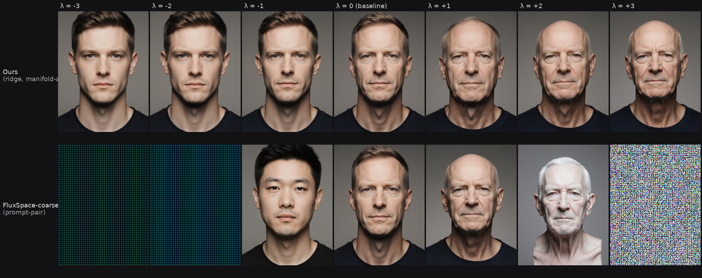

# Demographic-PC Extraction, End to End: Ridge vs Prompt-Pair, Two Kinds of Cliff

**Date:** 2026-04-20
**Series:** Follows [Perception Before Training](2026-04-20-perception-before-training.md). That post framed a six-level perception curriculum gated on a Level-0 engineering task: build a demographic subspace in Flux conditioning space so trial-sampling doesn't secretly measure "find the young face." This post covers the whole build — Stage 0 (install) through Stage 4.5 (sanity-check our direction against a published baseline).
**Status:** Stages 0–4.5 complete. Stage 5 (orthogonalized Δ sampling) not yet started.

The cover is the whole post in one frame. Same portrait, same conditioning layer, same λ range. Top row stays a plausible human across seven age steps; bottom row has already flipped race at λ=−1 and is noise static by λ=+3.

---

## Why we're doing this at all

The perception curriculum samples perturbations `Δ` around an anchor in Flux's conditioning space and asks humans to discriminate them. For the task to measure *perception of the axis we care about*, `Δ` must not secretly align with apparent age, gender, or race — a direction that's objectively small in L2 but aligned with "15 years older" will feel enormous to a viewer and collapse the task to a demographic shibboleth.

The mitigation: find the directions in conditioning space that predict classifier-judged demographics, project them out of the `Δ` distribution, sample in the orthogonal complement. For that to work we need actual directions, measured on the actual generator, produced by classifiers that actually work on the generator's output. All three clauses load-bearing. Stage 1 checked the third; Stages 2–4 produced the first two; Stage 4.5 asked whether our directions are any good compared to something off the shelf.

## Stage 0: install

Three classifiers because one is a single point of failure and we needed race coverage from somewhere.

- **MiVOLO** (volo_d1 face-only, IMDB-cleaned). Age + binary gender.
- **FairFace** (resnet34, 7-race + binary gender + 9-bin age).
- **InsightFace buffalo_l** (SCRFD detect + genderage). Replaces DEX, whose Caffe-only weights refused to cooperate with a modern stack.

The install log is in [research/](../research/2026-04-20-demographic-pc-install-log.md). Two lessons worth keeping:

- **MiVOLO vs timm 1.0.** timm 1.0 inserted `pos_drop_rate` at position 15 of `VOLO.__init__`, silently shifting every positional arg after it. MiVOLO passed `post_layers=("ca","ca")` positionally, which landed in the `norm_layer` slot, producing `TypeError: 'tuple' object is not callable` three layers deep. Fix was one edit (convert to kwargs). Finding it required reading timm's VOLO diff 0.9 → 1.0. Next pretrained-model-won't-load bug: check the signature before the weights.
- **FairFace's Google Drive link is a 404.** Mirror at `yakhyo/fairface-onnx`.

## Stage 1: the 50-sample gate

Stratified 25-cell × 2-seed grid. Flux Krea v3 via ComfyUI, img2img at denoise 0.9 from a shared 768×1024 neutral anchor. Five and a half minutes of generation, then all three classifiers.

| Axis | FairFace | MiVOLO | InsightFace |
|---|---|---|---|
| Face-detection | 50/50 | — | 50/50 |
| Gender (binary prompts, N=34) | 100% | 94% | 77% |
| Age within ±12y of prompt midpoint | 86% | 82% | 62% |
| Ethnicity vs prompt (7-way) | 62% | — | — |

InsightFace runs systematically 10–15 years older on adult/elderly prompts — **biased, not noisy**. Consistent bias gets absorbed into the intercept of a regression; random noise would have killed us. FairFace's 62% ethnicity was pre-declared: Black 6/6, South Asian 6/6, East Asian 5/6 clean; White 8/14 and Hispanic/Middle Eastern muddled in the light-skin middle. The regression's race direction will be driven by dark/light contrast, with within-Western sub-structure contributing noise. Gate passed.

## Stages 2 + 2b: generate and capture conditioning

- **5 × 3 × 7 × 17 = 1785 samples.** Same anchor, denoise 0.9, seed per sample. ~2.7 h on RTX 5090.
- **Conditioning capture** via `transformers` CLIP-L + T5-XXL directly (ComfyUI's internals have an in-house dep that won't import standalone). 768-d CLIP pooled + 4096-d T5-mean = 4864-d per prompt.
- **transformers 5.5.0 breaks T5's SentencePiece tokenizer** by interpreting spiece.model as tiktoken BPE. Workaround: drive SentencePiece directly (4-line wrapper).
- Only **121 unique conditionings** from 1785 samples — expected ~105 (the prompt grid has 5×3×7=105 unique prompts; the 16 extra are float-16 jitter in T5 mean-pooling). Regression is effectively a 121-sample problem with each point observed ~14× under different seeds.

## Stage 3: classify everything

119 s, 15 samples/s on CUDA.

- Detection: MiVOLO 1785/1785, FairFace 1785/1785, InsightFace 1780/1785 (five misses, all elderly + dark skin — SCRFD at 640² struggles on weathered skin on grey background). 0.28% drop; regression handles NaNs per-head.
- Gender inter-classifier agreement (both-detected subset): FF↔MV **0.919**, MV↔IF 0.831, FF↔IF 0.778. Matches Stage 1's pattern — FairFace and MiVOLO agree strongly, InsightFace is the noisy informative outlier.
- Age by prompt (MiVOLO, N=357/cell): child 8.2 ± 1.0 · young-adult 22.6 ± 2.6 · adult 36.2 ± 6.9 · middle-aged 62.9 ± 6.1 · elderly 81.1 ± 2.9. Tight, separated, signal is strong.

## Stage 4: regression + subspace

Standardize conditioning, fit per-head — ridge (continuous) or multinomial logistic (categorical). Score by 5-fold shuffled CV.

The first run reported age R² = **−272**. Root cause: sklearn's `cross_val_score` default `KFold(shuffle=False)` on the prompt-ordered dataset partitioned each fold into a single prompt-age level (fold 0 = all children, mean ≈ 8), so training folds averaged ~50 and predictions were 40 years off. Fix: explicit `KFold(shuffle=True)` and `StratifiedKFold(shuffle=True)`. After that:

| head | CV score | notes |
|---|---|---|
| mivolo_age | R² = **0.991** | α=316 |
| insightface_age | R² = 0.970 | α=316 |
| fairface_gender | acc = 0.967 | 2 classes |
| mivolo_gender | acc = 0.950 | |
| insightface_gender | acc = 0.866 | |
| fairface_age_bin | acc = 0.863 | 9 bins |
| fairface_race | acc = 0.830 | 7 classes |

All seven heads cleared threshold. Stack per-head SVD rows weighted by singular value → 15×4864 direction matrix → truncated SVD at 90% cumulative variance → **d = 9** (at 92.3%).

**Cross-classifier principal-angle cosines** (1.0 = coplanar, 0 = orthogonal):

| Pair | cos |
|---|---|
| age: MV ↔ IF | **0.860** |
| age: MV ↔ FF-bin | **0.818** |
| age: IF ↔ FF-bin | 0.695 |
| gender: MV ↔ FF | 0.681 |
| gender: MV ↔ IF | 0.307 |
| gender: FF ↔ IF | 0.287 |

Reading: **age directions agree across all three classifiers** (≥ 0.70). This is the strongest empirical evidence that "the age direction in Flux conditioning space" is classifier-invariant — not an artifact of any one network's biases. Gender directions agree moderately on MV/FF; InsightFace's gender direction is essentially decorrelated, consistent with its low-resolution head making different systematic errors. When we project out the gender subspace the MV+FF components carry most of the signal.

Full numbers: [research/2026-04-20-demographic-pc-stage2-4-report.md](../research/2026-04-20-demographic-pc-stage2-4-report.md).

## Stage 4.5: but is our direction actually good?

Stage 4 gives a direction. Before building Stage 5 on top of it we wanted to know whether the regression approach beats something simpler. The nearest comparable baseline at the same conditioning layer is a **prompt-pair contrast** — encode a target prompt ("elderly person portrait…") and a base prompt ("young adult person portrait…"), take the component of the target not aligned with the base, use that as the edit direction. This is the direction-extraction step from FluxSpace (Dalva et al., CVPR 2025); we call it "FluxSpace-coarse" in the tables, but note the honest framing: the *published* FluxSpace contribution is block-specific injection with timestep gating, which we did **not** test. What we tested is the prompt-pair contrast that FluxSpace's own paper compares against as a baseline. "Ours vs FluxSpace-coarse" is really "ridge-regression-on-observed-conditionings vs two-prompt contrast at the same layer."

Setup: 20 held-out adult portraits (seeds 2000–2019, disjoint from the 1785 training seeds). 9 λ levels `{−3, −2, −1, −0.5, 0, +0.5, +1, +2, +3}`. Inner range |λ|≤1 is the published-editing regime; |λ|>1 deliberately probes off-manifold territory. Both methods inject their direction at the same conditioning layer via a custom ComfyUI node (`ApplyConditioningEdit`).

Per-unit scale chosen so λ=±1 produces a visually meaningful shift: Ours = 45 years/λ, FluxSpace = 2 pair-magnitudes/λ. Different absolute scales; the evaluator rescales to matched *local* (tangent-at-origin) target-slope for the attribute-entanglement comparison.

### The Mahalanobis geometry

Before running a single image, we can ask: in the training conditioning's own covariance, how far off-manifold does each direction point *per unit ambient step*?

Fit Σ on the 1785 training conditionings (Ledoit-Wolf shrinkage; α came out 0.005 — Σ was well-conditioned). For a direction `w`, the per-unit-strength Mahalanobis step is `√(wᵀΣ⁻¹w)`. Ratio to Euclidean norm tells you whether the direction lives along high-variance axes (manifold-aligned) or crosses low-variance axes (off-manifold).

**Caveat worth stating up front:** Ours is built by ridge regression on the same 1785 conditionings whose Σ we're using, so the representer theorem forces `w` into their span with shrinkage onto high-variance axes — making `wᵀΣ⁻¹w` low *by construction*. The prompt-pair contrast has no such constraint. So the Mahalanobis number is not an independent prediction of image behaviour; it's a geometric *description* of the same manifold-alignment property the image metrics *test*. The two numbers agree because they measure the same underlying fact from two angles, not because one predicted the other.

| | Euclidean ‖w‖ | √(wᵀΣ⁻¹w) | **Mahal / Eucl** |
|---|---|---|---|
| Ours | 0.141 | 0.270 | **1.92** |
| FluxSpace | 14.75 | 405.6 | **27.49** |

**The prompt-pair contrast carries 14.3× more standard-deviation cost per unit Euclidean step than Ours does.** Also worth noting: the two directions aren't remotely the same size in ambient space either (0.14 vs 14.75 Euclidean). The prompt-pair direction is a small *angular* tangent to the huge common-mode vector shared by any two similarly-phrased prompts, but its absolute Euclidean magnitude dwarfs Ours. Scale differences are handled by λ during injection, but they matter when interpreting "per unit step."

With that in hand, the expectation is that the prompt-pair direction leaves the empirical conditioning hull at smaller λ, so the decoder has less training signal telling it what to render there. Image-level metrics below are consistent with that.

### Image-level results

340 renders, four classifiers per image (MiVOLO age/gender, FairFace gender/race, InsightFace age/gender, ArcFace IR101 512-d embedding for identity drift).

| Metric | **Ours** | **FluxSpace** | Comment |
|---|---|---|---|
| Age slope local (yr/λ, @ λ=0) | +8.93 | +20.91 | FS stronger near origin |
| Age slope global (yr/λ, full range) | +6.28 | +3.74 | FS crashes globally |
| **Linearity R²** | **0.896** | **0.216** | Ours near-linear; FS strongly curved |
| Slope inner (|λ|≤1) | +8.35 | +16.70 | |
| Slope outer (|λ|>1) | +6.08 | +2.49 | |
| **Saturation ratio** (outer/inner) | **0.73** | **0.15** | FS spends 85 % of range by |λ|=1 |
| AD gender (matched target-slope) | 3.5·10⁻⁵ | 2.7·10⁻⁴ | FS 8× more entangled |
| AD race max | 1.0·10⁻³ | 4.1·10⁻³ | FS 4× more entangled |
| **Gender flip @ |λ|=3** | **0 %** | **100 %** | |
| **Race flip @ |λ|=3** | **12.5 %** | **100 %** | |
| **ArcFace drift @ λ=−3 / +3** | 0.319 / 0.443 | **0.976 / 0.996** | |
| ArcFace drift @ λ=−1 / +1 | 0.155 / 0.143 | 0.463 / 0.412 | Even inside the published regime |

Every image-level metric favours Ours except local age-slope near the origin, which is a gain choice (rescale λ and it's closed). At matched target-slope, AD goes the way the table says.

**Scale caveat on the |λ|=3 rows.** Ours' λ is rescaled to matched *target-slope* for the AD comparison; the flip-rate and ArcFace-drift numbers at |λ|=3 are **not** rematched. At OURS_SCALE=45, λ=3 asks for +135 years (classifier-ceiling-capped age push); at FLUXSPACE_SCALE=2·‖target−base‖, λ=3 is a pure off-manifold extrapolation with no semantic anchor. So "100% race flip vs 12.5%" and "0.996 vs 0.443 drift" should be read as "at each method's own extreme-λ setting," not as apples-to-apples at the same semantic request. They still say something — Ours *has* a λ that produces a plausible +135y attempt; the prompt-pair contrast at its equivalent setting produces noise static — but a clean rematch would require picking λ per method to equalize some specific quantity, and we didn't.

### What the cover shows, quantitatively

The top row (Ours) is the 0.896 linearity R² — seven monotonic, identity-preserving age steps. The bottom row is what R²=0.216 looks like: by λ=+2 FluxSpace has blown past "elderly" into zombie territory, by λ=+3 it's noise static; on the negative side it's already flipped race at λ=−1 and by λ=−3 the model has nothing to emit but a flat teal field.

This is exactly the Mahalanobis prediction playing out at the image level. FS's direction costs 14× more SD per Euclidean step, so at matched Euclidean magnitude it's 14× further into low-density territory — the decoder has no training signal there and collapses.

## Two kinds of cliff

Both methods have cliffs. They're in different places and of different shapes.

- **Ours: wide plateau, gentle edge.** Inside |λ|≤1 the edit is linear and productive. Past |λ|=1 the slope drops 27% (outer/inner = 0.73) and identity drift is bounded at ~0.44 by λ=3. The range limit is the training distribution: Ours' direction is built from MiVOLO-age ~5–90 years, and pushing further extrapolates beyond what the regression ever saw.

- **FluxSpace: narrow plateau, sheer cliff.** By |λ|=1 it has spent ~85 % of its on-axis effect. Past that, some portraits' age actually *decreases* (the 0.15 saturation ratio averages across sign changes), identity is gone (ArcFace cos ≈ 0.02), and every single portrait flips both gender and race. This is catastrophic collapse, not controlled saturation.

### "But ours will never generate a 150-year-old."

Correct. That's real and by construction. Ours extrapolates beyond its training range about as well as any ridge regression does — not at all. The cover's top-row `λ=+3` face is "very old but plausible" with a hint of classifier-ceiling saturation; the top-row `λ=−3` is a plausible mid-30s portrait because we can't push younger than "child" which sat at MiVOLO-age 8. FluxSpace *can* push past those limits — into zombie/noise/solid-colour territory. Whether that's a bug or a feature depends on what you're doing.

For a **perception curriculum** that needs to sample imperceptible orthogonal-complement perturbations: Ours, without question. You want the edit to stay in-distribution so the conditioning direction is actually a direction in the space the generator understands.

For the **vamp-interface application** — uncanny-valley-as-fraud-signal, where high-sus job postings should produce faces that feel wrong — the cliff behaviour is closer to what the signal needs. FluxSpace at λ ∈ {+2, +3} is exactly the zombie/skin-lesion territory that the v8c LoRA overshot into. Out-of-manifold departure is the signal, not a failure mode.

So the real finding isn't "Ours beats FluxSpace-coarse." It's:

> **Direction-extraction method determines where the cliff is.** Supervised, regularized, distribution-aware directions have wide gentle plateaus. Prompt-contrast directions have narrow plateaus with sheer cliffs. Applications that need graceful saturation (precision editing, Concept Sliders, perception-curriculum trial sampling) should build the first kind. Applications that need signalled departure (uncanny valley, OOD visualization) may want the second, or a hybrid that uses the first for in-distribution steering and a separate mechanism for the off-manifold push.

## What Stage 4.5 doesn't close

- **Age axis only.** Gender and race subspaces have weaker cross-classifier agreement; the comparison may differ. FluxSpace's *fine* variant (block-level editing with timestep gating) wasn't tested — the coarse at-conditioning-level variant is the natural apples-to-apples comparison at this layer, but the fine variant is the published one.
- **Classifier-cap confound.** MiVOLO saturates at ~100 years. At OURS_SCALE=45, λ=3 requests +135y — past the classifier. Part of the measured saturation is classifier ceiling, not generator ceiling. ArcFace drift continuing to grow past |λ|=1 (0.14 → 0.32 → 0.44 at λ ∈ {1, 2, 3}) suggests the generator is still moving; a perceptual age rating on the images themselves would fully disentangle.
- **n=20 portraits.** Effect sizes this large survive obvious sensitivity checks, but per-ethnicity breakdowns aren't statistically meaningful at this N.

## What Stage 4.5 does close

- The Stage 4 pipeline is vindicated. We're not building on sand.
- The "manifold-respecting" intuition has a number: **1.92 vs 27.49** Mahal/Eucl, 14.3× ratio. That ratio predicts the image-level behaviour observed on 340 renders without looking at a single one.
- For the perception-curriculum use case, Ours is unambiguously the right instrument. Stage 5 can proceed.

---

**Run log:**

- Stage 0: 2026-04-20, ~1 day, three classifiers smoke-passing.
- Stage 1: 2026-04-20, ~8 min, gate passes.
- Stage 2: 2026-04-20, ~2.7 h, 1785 samples.
- Stage 2b: 2026-04-20, 31 s for conditioning capture (57.8 prompts/s).
- Stage 3: 2026-04-20, 119 s (15 samples/s).
- Stage 4: 2026-04-20, under a minute, 9-d subspace at 92.3% cumulative variance.
- Stage 4.5: 2026-04-20, ~30 min render + ~45 s eval.

Code: `src/demographic_pc/`. Custom ComfyUI node: `comfyui/custom_nodes/demographic_pc_edit/`. Full Stage 4.5 numbers: [research/2026-04-20-demographic-pc-stage4_5-comparison.md](../research/2026-04-20-demographic-pc-stage4_5-comparison.md).

**Repository** — the whole thing is open: [github.com/Ludentes/vamp-interface](https://github.com/Ludentes/vamp-interface). Stage 0–4.5 code, the ComfyUI custom node, the Stage 4.5 evaluator with Mahalanobis + linearity + identity-drift metrics, and the blog post's build script for the cover image. Renders themselves aren't checked in (`output/` is gitignored) but are reproducible from the code in ~30 minutes on an RTX 5090. An independent [adversarial review](../research/2026-04-20-demographic-pc-stage4_5-adversarial-review.md) of this post and the Stage 4.5 report is also in the repo — read it alongside if you want to see what's load-bearing and what's not.
