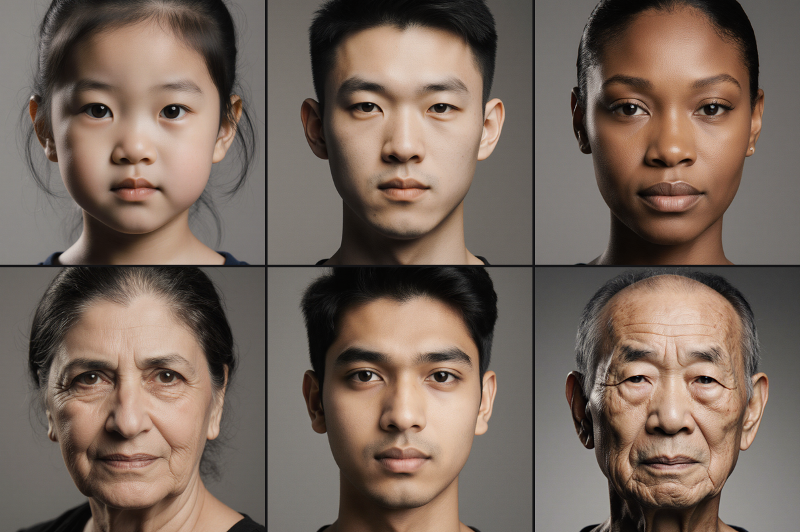

# Demographic-PC Extraction: Three Classifiers Walk Into a Flux Portrait

**Date:** 2026-04-20
**Series:** Follows [Perception Before Training](2026-04-20-perception-before-training.md). That post set up a six-level curriculum gated by a Level-0 engineering task: build a demographic subspace in Flux conditioning space so trial-sampling can avoid accidentally measuring "find the young face." This post is the progress report from Stage 0 (install) through Stage 1 (go/no-go sanity) of that subspace build.
**Status:** Stage 1 passes; 1785-sample Stage 2 generation is running as I write this.

---

## Why we're doing this at all

The curriculum samples perturbations `Δ` around an anchor point in Flux's conditioning space and asks humans to discriminate them. For that to measure *perception of the axis we care about*, `Δ` must not secretly align with apparent age, gender, or ethnicity — because a direction that's objectively small in L2 but aligned with "apparent age by 15 years" will feel enormous to a viewer and collapse the task to a demographic shibboleth.

The mitigation is to find the directions in conditioning space that predict classifier-judged demographics, project them out of the `Δ` sampling distribution, and sample in the orthogonal complement. For that to work, you need actual directions, measured on the actual generator, produced by classifiers that actually work on the generator's output. All three clauses are load-bearing, and the Stage 1 sanity check exists to find out whether the third one holds before committing to the 1800-sample run that produces the first two.

## Stage 0: install ugliness

Three classifiers, because one is a single point of failure and we needed race coverage from *somewhere*:

- **MiVOLO** (volo_d1 face-only, IMDB-cleaned). Age + binary gender.
- **FairFace** (resnet34 7-race + binary gender + 9-bin age). Only race head available in the roster.
- **InsightFace buffalo_l** (SCRFD detect + genderage). Age + binary gender. Replaces DEX, which was the original plan but ships Caffe-only weights and refused to cooperate with a modern stack.

The install log is [here](../research/2026-04-20-demographic-pc-install-log.md). The two things worth remembering:

1. **MiVOLO vs timm 1.0.** timm 1.0 inserted `pos_drop_rate` at position 15 of VOLO's `__init__`, which silently shifted every positional argument after it. MiVOLO passed a `post_layers=("ca", "ca")` tuple positionally, which landed in the `norm_layer` slot, which caused `TypeError: 'tuple' object is not callable` three layers deep with no obvious source. The fix is one edit — convert the `super().__init__()` call to kwargs — but finding it required reading timm's VOLO diff between 0.9 and 1.0. Mention preserved here so the next person debugging a pretrained-model-won't-load error checks the signature before the weights.

2. **FairFace's Google Drive link was dead.** The repo's README points to a 404. Mirror at `yakhyo/fairface-onnx` GitHub release has the 7-race res34 weights. Cost us thirty minutes we'd rather have kept.

DEX was blocked on the Caffe-to-PyTorch conversion path. `siriusdemon/pytorch-DEX` ships a conversion script that assumes you have pycaffe and the original 2015 `.caffemodel`; modern Python 3.12 + caffe is an unmaintained install nightmare; no one has published a pre-converted mirror. Pivoted to InsightFace on user suggestion — zero install pain, but the pivot concentrates race labeling onto FairFace alone, which was already flagged as concentration risk.

Total Stage 0: one working day, end-to-end smoke-passing on four Flux portraits.

## Stage 1: the 50-sample gate

A stratified 25-cell × 2-seed grid, hand-balanced so every age level appeared at least five times, every gender at least eight, every ethnicity at least three. Prompt template:

> A photorealistic portrait photograph of a {age} {ethnicity} {gender}, neutral expression, plain grey background, studio lighting, sharp focus.

768×1024 portrait, Flux Krea v3 via ComfyUI, img2img from a fresh neutral anchor at denoise 0.9 — aggressive enough that demographics come from the prompt, not the anchor. Five and a half minutes of generation, then all three classifiers on all 50 images.

| Axis | FairFace | MiVOLO | InsightFace |
|---|---|---|---|
| Face-detection | 50/50 | n/a (whole-image) | 50/50 |
| Gender (binary prompts, N=34) | **100%** | 94% | 77% |
| Age within ±12y of prompt midpoint | **86%** | 82% | 62% |
| Ethnicity vs prompt (7-way) | 62% overall | — | — |

**Gender:** FairFace nails every binary-prompt face. MiVOLO's two misses are elderly-woman prompts where grey hair and androgynous bone-structure flipped the call. InsightFace's 77% is the expected consequence of its 96²-pixel internal input — it's a detection-and-quick-classify head, not a resolution-loving classifier, and on children especially it makes confident-but-wrong calls. Useful, noisy, not catastrophic.

**Age:** MiVOLO and FairFace cluster near the prompt midpoint. InsightFace runs systematically ten to fifteen years *older* on adult and elderly prompts. This is the kind of result that's easy to read as "InsightFace is broken" and hard to read correctly: InsightFace is **biased, not noisy**. Its definition of "young adult" sits higher on the age axis than the other two. For regression, consistent bias directions get absorbed into the learned weight matrix — random noise would have killed us. Structured bias just shifts the intercept.

**Ethnicity:** The pre-declared FairFace failure mode lands as pre-declared. Black 6/6, South Asian 6/6, East Asian 5/6 — the high-contrast regions of the 7-class map. The light-skin middle is mush: White 8/14, Hispanic 2/6, Middle Eastern 1/6, and the three confuse each other in all directions. This was flagged as concentration risk in the plan; it's now operational rather than hypothetical. The regression's race direction will be driven by the dark/light contrast, with the within-Western sub-structure contributing noise.

**Coverage:** both detection pipelines hit 50/50. No NaN rows from missed faces, no cherry-picking from detection side. With dlib alignment FairFace is reliable; without it, race confidences ran at 0.25–0.30 for a 7-way softmax — basically chance. Alignment is mandatory; the install log has the dlib-chip parameters.

**Inter-classifier gender:** 42/50 all three agree. Six cases of MiVOLO=FairFace disagreeing with InsightFace, two of MiVOLO=InsightFace disagreeing with FairFace. No three-way fork.

## What this means for Stage 2's regression

Stage 2 generates 1785 samples (5 ages × 3 genders × 7 ethnicities × 17 seeds), captures the conditioning vector per sample, runs all three classifiers, and fits `y = f(c) + ε` — ridge per continuous head, multinomial logistic per categorical. Then stacks the weight-matrix singular vectors per head and truncated-SVD's the stack to get the demographic subspace.

What Stage 1 tells us about the outcome:

- **Age direction will be clean** — MiVOLO + FairFace both informative with low per-head noise. Probably 3–5 effective dimensions after whitening.
- **Gender direction will be cleanest** — three agreeing classifiers and a categorical head that's essentially error-free on binary prompts. 1–2 dimensions.
- **Race direction will be strongest along a "non-Western-dark / Western-light" axis** (2–3 dimensions of strong signal), with a weaker within-Western sub-structure contributing noise.
- **Non-binary prompts** stay in the grid. The classifiers have no third gender class and fall back to binary. That's fine for label coverage — the regression is fitting a continuous space, not arguing about the existence of a third discrete class — and dropping them would bump us from 105 cells to 70, awkward for seed allocation.

Expected subspace dimension: 10–15, as planned.

## What Stage 1 doesn't yet tell us

- Whether the directions the three classifiers find in conditioning space *agree with each other*, or whether the per-head direction matrices span different subspaces. If InsightFace's age bias is consistent, its direction should still be *parallel* to MiVOLO's age direction, just with a different intercept. We'll measure cosine similarity between per-classifier direction matrices in Stage 4.
- Whether the 1785-sample regression can actually extract a useful subspace in 4864-dim conditioning space (concat[CLIP-L pooled 768, mean-pooled T5 4096]). Sample-to-dimension ratio is aggressive but L2 regularization should keep us honest; we'll report CV R² per head and drop any head with R² < 0.3 from the stack.
- Whether the orthogonalized `Δ` sampling actually produces demographically-neutral perturbations when we project and re-render in Stage 5. That's the only result that matters for the curriculum; the Stage 4 subspace is just an instrument.

## Engineering note on the anchor

Stage 1 uses one 768×1024 neutral anchor (Flux text2img, seed 42). Stage 2 reuses the same anchor for all 1785 img2img samples. At denoise 0.9 the anchor contributes barely enough geometric scaffolding to stabilize composition while letting prompt-driven demographics dominate. Lower denoise would have bled anchor-identity into the regression signal — the classifiers would have learned a demographic direction plus the anchor's personal features, and the direction would be confounded. Higher denoise is effectively text2img and loses the calibration benefit of a shared composition prior. 0.9 is the compromise; Stage 1 confirms it passes the prompt→label agreement gate.

---

Stage 2 is running. Next post has the regression and the subspace.

**Run log:**

- Stage 0: 2026-04-20, ~1 day, three classifiers smoke-passing.
- Stage 1: 2026-04-20, ~8 minutes end-to-end, gate passes.
- Stage 2: 2026-04-20, ~2.7 hours unattended, in progress at time of writing.

Reports in `docs/research/2026-04-20-demographic-classifiers.md`, `…-demographic-pc-extraction-plan.md`, `…-demographic-pc-install-log.md`, `…-demographic-pc-stage1-report.md`. Code in `src/demographic_pc/`. Sample JSON in `output/demographic_pc/stage1/sanity_check_50.json`.
