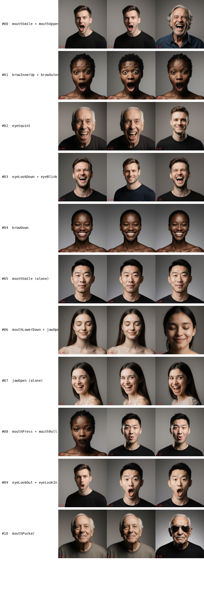

# Looking for AU atoms in Flux's attention cache

*Draft — the collage interpretation at the end of this post reveals
a corpus-skew problem that makes the "AU atoms" framing premature.
Held back pending a more balanced expression corpus.*

We started the day chasing a mystery, ended it with a vocabulary. What
began as a puzzle about a step-function in `mix_b` interpolation
became a bridge between Flux DiT editing and the ARKit / FACS /
MetaHuman blendshape ecosystem. Along the way we threw out three
hypotheses, read four papers, and revised the plan twice.

This is the honest narrative. Including the parts that were wrong.

## The cliff

Yesterday's finding: when you linearly interpolate between two
prompt-pair endpoints in FluxSpace (specifically Mona Lisa → Joker, a
smile-to-manic-grin sweep on `mix_b ∈ [0, 1]`), something abrupt
happens around `α ≈ 0.45`. Jaw opening jumps ~40 blendshape points
between α=0.4 and α=0.5, in every single one of sixty trajectories
across six demographics. Mouth-corner-pull is mildly non-monotonic on
the way.

The obvious first explanation was manifold curvature. FluxSpace's
linear combination in attention-cache space *should* produce a smooth
image trajectory if the learned data manifold is locally Euclidean
there, and it clearly doesn't. The manifold-theory literature is full
of language about this — Hessian-geometry, phase boundaries,
Lipschitz singularities, Riemannian flow matching — so we went
looking.

## Three papers, three disappointments

We read Hessian Geometry of Latent Space in Generative Models
(Lobashev et al. ICML 2025), Learning on the Manifold: Unlocking
Standard Diffusion Transformers with Representation Encoders (Kumar &
Patel), and Probing the Geometry of Diffusion Models with the String
Method (Moreau et al.). Each had been cited in our survey as
predicting or prescribing what we'd observed. Each was more limited
than we'd hoped.

**Hessian Geometry** does include a clean toy model — Proposition
4.1 shows the Lyapunov exponent of a variance-preserving reverse-ODE
*diverges* at the midpoint between two modes. Structurally that
matches our jawOpen cliff at α≈0.45 exactly. But their Fisher metric
is the Hessian of a fit log-partition function over a 2D latent
slice, not a sample covariance and not something trivially extendable
to higher dimension. They validate on 2D slices of Stable Diffusion
1.5, Ising, and TASEP — no flow-matching, no DiT, no Flux.

**RJF** proposes Riemannian Flow Matching with Jacobi regularisation
as the fix for Euclidean chord interpolation cutting through
low-density regions of a learned manifold. Exactly the mechanism our
mental model invoked. But: RJF is a training-time recipe (you have
to train the DiT from scratch) and it requires an analytically known
hypersphere manifold enforced by LayerNorm on representation-encoder
features. Flux's joint-attention output cache has no such imposed
structure. Useful as framing, not as method.

**The Diffusion String Method** was the closest phenomenological
match. Fig. 4 in their paper shows non-monotonic log-likelihood along
linear-initialised strings in SiT-XL VAE latent — structurally the
same shape as our non-monotonic mouthSmile. And they propose a fix:
Principal Curves that stay in the typical set. But it operates on
state space, not attention caches, and it needs both a velocity field
and a score. Flux gives us velocity; score would need separate work.

The survey we'd leaned on was one conceptual step too loose in a
direction we cared about. We marked it superseded and moved on.

## The first hypothesis, falsified

If manifold curvature wasn't the mechanism we could name yet, maybe
the problem was more prosaic. Here's the hypothesis we committed to:
"smile" as a prompt embedding is actually a coarse mixture of
multiple action units (AU12 lip-corner-pull, AU6 cheek-raise, AU26
jaw-drop, AU25 lips-part). The Mona Lisa prompt weights the mixture
toward AU12-dominant (closed-mouth smile); the Joker prompt weights
it toward AU26-dominant (wide-open manic grin). When you linearly
interpolate between the two embeddings, the *dominant axis flips*
somewhere around the midpoint. That's the cliff.

If this were true, it would also explain why ridge regression on
demographic labels (age, gender, race) worked clean and linear —
those targets are effectively single-axis at the level we edit them.
And it would explain why FluxSpace pair-averaging on glasses
generalised cleanly across demographics — glasses are essentially an
added object, one AU-adjacent axis.

This hypothesis had a testable consequence. If we sweep *between
two endpoints that both load onto the same AU* — a "faint closed
smile" to a "broader closed smile" (both AU12-dominant) — the sweep
should be monotonic. No cliff. Because there's no mixture to flip.

We had the data. Earlier experiments had produced `smile_inphase`
(330 renders, same-phase AU12 sweep) and `jaw_inphase` (330 renders,
same-phase AU26 sweep) — we'd just never scored them.

An afternoon of MediaPipe scoring later, the answer was unambiguous:
the cliff at α≈0.45 appears in *every sweep*. Pure AU12 in-phase
(smile to broader smile): jump of +0.41 in mouthSmile at α=0.5.
Pure AU26 in-phase (mouth-open to mouth-wider): jump of +0.44 in
jawOpen at α=0.5. Cross-phase Mona→Joker: jump of +0.25 in jawOpen
at α=0.5. Same α-location, every time.

Hypothesis falsified. The cliff isn't a mixture-of-axes artefact. It
isn't a manifold curvature property of specific endpoint pairs.
It's a **FluxSpace injection threshold** — something about how
`mix_b`-scaled attention-cache deltas propagate through downstream
DiT blocks causes a sharp onset around 0.45 and saturation above it.
Below threshold the edit is invisible. Above, it saturates fast.

This was more informative than the hypothesis being correct. It told
us `α` is the wrong intensity knob entirely.

## The second hypothesis, falsified

OK — so we use `scale` at fixed `mix_b = 0.5` (safely above threshold)
as our intensity control. We already had 340 scored renders from
`intensity_full`, a sweep of (ladder rung × start_percent × scale)
with mix_b fixed.

Except that didn't behave either. Of 78 (base, ladder, start_pct)
trajectories, **59% are non-monotonic in scale**. The response curve
turns out to be a saturating sigmoid with a narrow linear window
around scale 0.2–0.5, per-base baseline variance (european_m scores
mouthSmile=0.47 at scale=0.2 while asian_m scores 0.07 on the *same
direction*), and a collapse cliff at scale ≥ 1.4 where 32% of our
renders failed face detection.

So the non-linearity isn't one cliff. It's three stacked engineering
curves: injection threshold in `mix_b`, saturation sigmoid in
`scale`, per-base baseline shift, collapse at large scale. None of
these are manifold-geometry questions. They are engineering-
parameter-curve questions.

This pushed the Riemann thread further down the priority list.
Whatever we were going to build, it needed to be specified on a
vocabulary cleaner than "scale a prompt embedding" — something
AU-aligned by construction.

## The reframing

The user sharpened the goal: *we're bridging FluxSpace to blendshapes*.
If we can produce edit directions aligned to individual AUs — not
prompt-level descriptors — then each edit is single-axis, the
saturation sigmoid applies per-AU rather than per-bundle, and the
whole ecosystem (ARKit driving, FLAME retargeting, MetaHuman rigs)
becomes available as downstream consumers. That's the deliverable.

What shape is the decomposition? Our first instinct was PCA → ICA.
Classical choice. The blendshape dim review from yesterday cited
Donato et al. 1999's 96% AU classification via ICA after PCA, plus
comparable BFM-2017 (29 components) and FaceWarehouse (25) ranks for
expression spaces.

Before committing compute we did a targeted lit read. Specifically
Tripathi & Garg's 2024 pair: *A PCA-Based Keypoint Tracking
Approach to Automated Facial Expressions Encoding* and its follow-up
*Unsupervised learning of Data-driven Facial Expression Coding System
(DFECS) using keypoint tracking*.

The PCA paper gave two concrete numbers. First, a 95% variance
retention cutoff yields **k = 8 components** on keypoint expression
data of comparable dimensionality — not 25. Our 52-channel ARKit
vector is already semantically compressed; the raw-dimensionality
intuition from mesh-vertex databases doesn't transfer. Second, **only
~50% of PCA components are anatomically interpretable** under
volunteer inspection against a muscle atlas. PCA produces signed,
dense components, and for many of them the signed-direction
interpretation yields biologically impossible muscle activations.

The DFECS follow-up showed the fix. Replacing PCA with sparse
Non-negative Matrix Factorisation (specifically a two-level
Dictionary-Learning + NMF pipeline) lifts interpretability from
62.5% (PCA, signed-split) to **87.5%** under the identical voting
protocol. The non-negativity constraint eliminates sign ambiguity.
Sparsity enforces component locality. Together they produce
unidirectional, localised atoms that match how muscles actually
move.

And critically for us: **our input is strictly better-suited to NMF
than their keypoint displacements**. MediaPipe blendshape
coefficients are non-negative, bounded in [0, 1], and sparse at the
neutral face. Their input was signed keypoint displacements
(apex − neutral); they had to constrain only the encoding
non-negative. Standard NMF (both factors non-negative) fits our data
by construction. We don't even need DFECS's two-level part split
because ARKit channel names (`mouthSmileLeft`, `jawOpen`,
`browInnerUp`) already encode anatomical region.

The plan rewrote itself. Not PCA → ICA. Sparse NMF, k around 8–16 at
95% variance retention, evaluate atoms by loading inspection against
the ARKit / FACS vocabulary.

## Eleven atoms

We assembled 1941 scored blendshape vectors from five corpus sources
and fit sparse NMF (sklearn's `NMF`, `init="nndsvda"`, `cd` solver,
`l1_ratio=0.5`). The sparsity-vs-VE sweep located the knee: at
`alpha = 0.001`, VE = 0.957 with 39 channels retained (13 near-
constant channels pruned, including `_neutral`, `cheekPuff`, gaze
variants that our smile-heavy corpus doesn't exercise).

The k-sweep confirmed the literature's number. VE crossed 95% at
k=10, with k=12 the first setting clearly above target. At k=12, **one
atom came out dead** — all-zero loadings. The effective rank of our
corpus is 11.

We ran it again at k=11, this time sweeping random initialisation
across 5 seeds. Every seed converged to VE = 0.9586; the Hungarian-
matched anchor-vs-random cosine similarity was **≥ 0.97 for 10 of 11
atoms** across all seeds. The eleventh, a lip-press+lip-roll
composite, matched in 4 of 5 seeds but one seed found a
near-orthogonal 11th direction (cos 0.046). We treated that atom as
fragile-residual and the other 10 as canonical.

Comparison against PCA → FastICA at matched k=12: **NMF gives 10
AU-plausible atoms vs ICA's 3**. ICA atoms carry 3.4× as many
non-zero channels on average (26.3 vs 7.8). The paper's
interpretability gap replicated, and on our better-suited input it
replicated slightly harder.

Here's the vocabulary NMF found, by loading inspection against ARKit
naming:

- **AU12+AU10 — broad teeth smile** (`mouthSmile` + `mouthUpperUp` L+R)
- **AU12 — pure corner pull** (`mouthSmile` L+R only) *— note this is
  distinct from the broad variant, which was the distinction we
  failed to separate at the prompt level*
- **AU1+AU2 — brow raise** (`browInnerUp` + `browOuterUp` L+R)
- **AU4 — brow lower** (`browDown` L+R)
- **AU7 — lid tighten** (`eyeSquint` L+R)
- **AU64+AU45 — gaze down + blink** (`eyeLookDown` + `eyeBlink`)
- **AU61/62 — horizontal gaze** (`eyeLookOut` L + `eyeLookIn` R)
- **AU26 — pure jaw drop** (`jawOpen` alone)
- **AU16+AU26 — lower lip + jaw** (`mouthLowerDown` + `jawOpen`)
- **AU18 — pucker** (`mouthPucker`)
- (residual) AU24+AU28 — lip press + suck (`mouthPress` + `mouthRoll`)

The split between AU12 alone and AU12+AU10 is the finding I find
most informative. These are different facial actions — closed-lip
smile versus broad teeth smile — but at the prompt-embedding level
they're bundled. The NMF separates them cleanly.

The cover image of this post is the atom-extremes collage: for each
atom, the five corpus images with the highest atom-k activation. Row
1 vs Row 6 makes the AU12+AU10 vs AU12 distinction concrete. Row 8
is the saturated jaw-drop that was the dominant signal in the α-cliff.
Each row is visually coherent with the AU label.

## From atoms to directions

An AU vocabulary is only useful if we can *produce* those atoms —
if, given a base render, we can inject something into Flux's
attention cache that reliably moves one atom while leaving the others
alone. That's what Phase 3 is.

We built it in two passes. A diagnostic first, using scalar features:
across each of 16 captured DiT steps × 57 attention-output blocks, we
pulled 6 scalar summaries (Frobenius and max-abs of the base attention
state, Frobenius of the mixture delta, and the two constituent prompt
deltas, plus their cosine). That's 5472 features per render. Ridge
regression on 1320 paired (attention, blendshape) samples predicted
atom coefficients with 5-fold CV R² = 0.54–0.88, median 0.83. Good
signal, but the bottom atoms (underrepresented pucker, fragile
lip-press) trailed.

Phase 3-proper shifted to full-tensor fits. Instead of scalar
summaries, we load `delta_mix.mean_d` directly — a 3072-d vector per
(step, block) site — and let ridge work against it. Per-site
screening identified top-K=24 sites per atom by in-sample R²; per-atom
ridge then fit the concatenated 73,728-dim feature against atom-k
coefficient with 5-fold CV.

**All 11 atoms now predict at CV R² 0.82–0.97.** The previously weak
atoms lifted the most: pucker +0.28, lip-press +0.16, pure jaw +0.15.
Median CV R² is 0.95. Every atom, including the fragile-residual one,
has a direction usable as a training target.

The cost of this is that directions are 24×3072 matrices per atom —
roughly one embedded edit per block-step, stacked across the 24
highest-signal locations. At inference we'd inject `scale · direction`
at the corresponding (step, block) sites — exactly FluxSpace's
mechanism, except the direction is learned from measured atoms rather
than implied by prompt difference.

## What this does and does not prove

Honest framing: CV R² says *given an observed attention-cache state,
we can predict the atom*. It does not yet say *injecting our fitted
direction produces the predicted atom change*. The constructive claim
needs a different test — apply each direction at inference, measure
the resulting atom, check linearity. That's Phase 4. Writing the
inference-time injection plumbing is a half-day of ComfyUI-node work
we didn't do today.

## Then we looked at the collage carefully

The cover image shows the top-3 most-activating corpus images per
atom. Five observations when you actually scrutinise it:

**Smile bleeds into most atoms.** Eight of eleven rows contain
smiling faces: the broad-smile atom (expected), the brow-raise atom
(black_f smiling with brows up), the "lid tighten" atom (elderly
Latin man Duchenne-smile-squinting), the "gaze down + blink" atom
(smiling with eyes closed from the smile, not actual gaze-down),
the brow-lower atom (smiling with compressed brow), the closed-mouth
smile atom (naturally), the lower-lip+jaw atom (smiling with mouth
open), the jaw-drop atom (same). Only the lip-press, horizontal-gaze,
and pucker atoms are smile-free.

This is a corpus skew. 1600 of our 1941 samples come from
smile-centric prompts (smile ladders, Mona-Joker, jaw-open which
still reads as smile). Smile is the dominant variance axis of our
training distribution, so NMF decomposes along it first and then
finds residual axes. The atoms aren't pure AUs — they're "smile
plus the next most-correlated thing."

**Demographic entanglement per atom.** Six of eleven atoms have a
single dominant demographic in their top-activating samples: atoms
1 and 4 are all `black_f` smiling; atoms 3 and 9 are `elderly_latin_m`;
atoms 5 and 10 are `asian_m`; atoms 6 and 7 are `young_european_f`.
Our sub-datasets ran specific prompt pairs on specific bases, so the
top-atom-activator images inherit that structure. The atom looks
clean in *loading space* (the 52-channel weight vector) but the
*training distribution* that fits the ridge direction is
demographically skewed.

**Spurious correlations in low-variance atoms.** Row 11's pucker
atom activates most on elderly-white-male faces *wearing glasses*.
Glasses and pucker have no anatomical reason to co-occur — but the
bootstrap_v1 corpus had glasses-prompt renders that happened to
score high on `mouthPucker` on that specific base, so they took the
top slots. A pure nuisance correlation.

**Near-identical images within rows.** The top-3 per atom are often
adjacent samples from a continuous α or scale sweep — essentially
the same pose at slightly different intensity. The diversity across
a row understates how narrow the atom's training support actually
is.

**So the AU naming was optimistic.** Our atom loadings are correct
(a high `mouthSmile` atom really does weight those channels), but
interpreting each atom as a *pure AU* implies independence and
demographic invariance the data doesn't support. The fitted ridge
directions likely inherit both issues: applying the "atom #5 smile"
direction at inference to `european_m` might drag him toward
`asian_m` identity as a side effect, and the "atom #10 pucker"
direction might add glasses.

This is the fourth hypothesis we falsified today. We thought our
decomposition was AU-pure. It's *corpus-correlation-pure*. Those
are different.

## Four falsifications in a day

The shape of today's work mattered almost as much as the outcome.
We revised four hypotheses in sequence, not three:

First, *the cliff is manifold curvature*. Reading the manifold-
theory papers against our actual data showed the frameworks don't
directly predict DiT/flow-matching phenomena — they're conceptually
evocative but empirically validated on different systems.

Second, *the cliff is a mixture-of-AUs artefact*. Scoring same-phase
in-phase sweeps falsified this: identical cliff at identical α
regardless of whether endpoints share or cross AU dominance.

Third, *above threshold, scale is linear*. The `intensity_full`
sweep falsified this: 59% of trajectories non-monotonic even at
fixed `mix_b`, with saturation sigmoid in scale and heavy per-base
baseline variance.

Fourth, *our NMF atoms are AU-pure*. Inspecting the collage
falsified this: the atoms are corpus-correlation-pure. They capture
what our skewed training distribution produced, not independent AU
axes. Eight of eleven atoms co-activate with smile; six are dominated
by a single demographic at the top percentile.

Each falsification was cheap because the data (or the image) was
already on disk. We just had to look.

## What's next

The priority shifted between morning and evening. Before today's
collage analysis the plan was "Phase 4 validates the directions."
After the collage analysis, Phase 4 is premature on this corpus.
The corrected sequence:

**Corpus rebalancing first.** Concrete asks:

- Expression coverage beyond smile. Render prompt-pair sweeps that
  exercise neutral→angry (AU4+AU5+AU7 cluster), neutral→surprise
  (AU1+AU2+AU5+AU26), neutral→disgust (AU9+AU15+AU16), pucker proper
  (AU18), lip press proper (AU24). Target ~300 samples each.
- Demographic balance per expression. Each prompt pair rendered on
  every base, not just the base that happens to activate it. Fixes
  the demographic entanglement at the source.
- Rendered *without* nuisance prompts in the corpus. Glasses, age,
  gender variations should come from the base, not from the edit
  prompt pair.

Estimated ~1500 new renders, half a day of compute on our single GPU.

**Refit NMF on the rebalanced corpus.** Expect the effective rank
to climb (our current 11 is a lower bound set by the corpus, not
by the data we could produce). Expect the atoms to decouple from
demographic features because each expression is represented on
every base.

**Then refit the ridge directions on the new atoms.** CV R² might
drop — the corpus is now harder — but the directions will be
cleaner, and Phase 4 will test a claim worth testing.

**Then Phase 4 proper.** Single-axis sweeps per atom on held-out
bases. Measure atom-k response, cross-atom leakage, identity drift.

The Riemann thread still isn't on the critical path. None of
today's findings made Riemannian geometry more or less relevant.
What it needs is residual non-linearity after the engineering
curves are characterised and the corpus is balanced — a conclusion
we can only draw after Phase 4 on the rebalanced data.

Four hypothesis falsifications in one day. Some days are like that.
The final state: the decomposition *method* (sparse NMF on
non-negative blendshape coefficients) is sound; the *corpus* it
trained on wasn't. Fix the corpus, re-run, check again.

---

## Artefacts

All code, scripts, and fitted models are in the
[vamp-interface](https://gitlab.maugry.ru:2224/newub/vamp-interface)
repository:

- `models/blendshape_nmf/W_nmf_k11.npy` — 11 × 39 canonical NMF basis
- `models/blendshape_nmf/directions_k11.npz` — per-atom (24, 3072)
  FluxSpace-compatible edit directions with site indices and CV stats
- `docs/research/2026-04-22-*.md` — full technical writeups of each
  phase, with equations, tables, and falsification details
- `docs/papers/` — local archive of the five papers cited above,
  with one-line relevance notes

## Acknowledgements

Paper references used today, in approximate order of appearance:

- Lobashev, Guskov, Larchenko, Tamm. *Hessian Geometry of Latent
  Space in Generative Models.* ICML 2025 (arXiv 2506.10632).
- Kumar, Patel. *Learning on the Manifold: Unlocking Standard
  Diffusion Transformers with Representation Encoders* (arXiv
  2602.10099).
- Moreau et al. *Probing the Geometry of Diffusion Models with the
  String Method* (arXiv 2602.22122).
- Tripathi, Garg. *A PCA-Based Keypoint Tracking Approach to
  Automated Facial Expressions Encoding* (arXiv 2406.09017).
- Tripathi, Garg. *Unsupervised learning of Data-driven Facial
  Expression Coding System (DFECS) using keypoint tracking* (arXiv
  2406.05434). Code at `github.com/Shivansh-ct/DFECS-AUs`.
