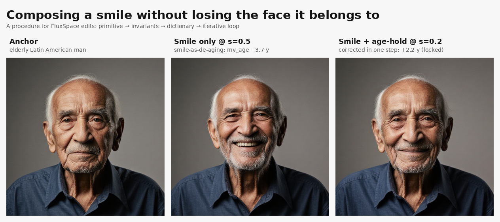
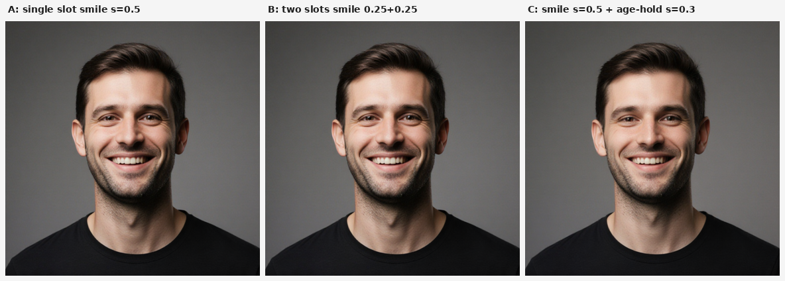

# Composing a smile without losing the face it belongs to

We spent the last two weeks turning one working primitive — FluxSpace attention editing — into something closer to a procedure. This post walks the chain of reasoning: the primitive, the invariants we discovered the hard way, the dictionary that turns one-off experiments into a reusable cache, and the iterative loop that finally composes two edits without one erasing the other. It ends with a worked demo where the loop detects an unwanted side-effect and corrects it in a single step.

It is not a theory of image editing. It is a recipe that works on Flux Krea today, tested against real classifiers and real failure modes, with the caveats that matter written alongside the claims.

## The principle

Tell the model what you want. Measure what you got. Compose counters to cancel the difference.

Every edit we make is expressed as a prompt pair — two short texts whose asymmetry encodes the axis we want to move. There is no learned direction, no retraining, no LoRA. We read the model's own attention while it generates the target, and inject the pair-average back into the attention slot during the base generation. FluxSpace gave us the primitive; the procedure builds the rest around it.

Atoms (sparse NMF decompositions of the attention residuals) and ridge-fit linear classifiers are measurement tools, not edit mechanisms. Previous work in this repo tried injecting them directly and it didn't move pixels. The **live** attention output is the thing you have to touch.

## The primitive and its two surprises

`FluxSpaceEditPair` is conceptually simple: run the model forward with prompt A's conditioning, then with prompt B's, then with the base conditioning — averaging A and B's attention patterns into the base pass at a single steering scale. Two surprises made us rewrite our mental model.

**Pair averaging is not subtraction.** Both halves of the pair should push in the *same* direction, with secondary confounds that cancel. If you build a pair as "positive vs. opposite" — `"a Latin American man smiling"` vs. `"an East Asian man smiling"` — you get a *mixture*, not a cancellation, and the mixture is dominated by whichever token Flux's attention weights more strongly. We burned several iterations on this before the math clicked.

**Shared tokens cancel in the delta.** Putting `{ethnicity}` in both halves of a smile pair doesn't anchor race: shared tokens contribute zero to the delta. The *asymmetry* is the whole signal. Demographic anchoring belongs in the **base** prompt, not in either half of the edit pair.

These two look obvious once stated. They were not obvious until we had the measurement traces to prove they mattered.

## The adjacency rule

Given the averaging semantics, what should pair halves look like?

The data said: **adjacent on the confound axis, not diametric.** On an elderly Latin American base, `Latin + Middle Eastern` produces a clean smile with no race flip. `Latin + East Asian` (diametric) collapses to a mixture dominated by East Asian. `Latin + European` works but with a visible shift toward Mediterranean. `Latin + South Asian` produces a weaker edit with race drift toward Indian.

The rule generalised directionally: the right neighbour is one "bucket" away on the classifier, on the side that opposes Flux's own drift for the target prompt on that base. We have one clean demonstration of this on Latino bases (iteration 7), a weaker confirmation on European bases (iteration 8, under-determined because FairFace lumps European neighbours into one "White" category), and no automated prediction rule yet. Picking the adjacency is still manual.

## What does *not* work: naive chaining

Our first attempt at composing two edits was to chain two `FluxSpaceEditPair` nodes in ComfyUI. We discovered experimentally that this does nothing — or worse. A 2-D sweep (smile × race) showed that adding a race edit at any non-zero scale completely killed the smile.

The cause is structural, not a parameter problem. `set_model_attn1_output_patch` is a *single-slot* hook in ComfyUI. The second node's patch silently overwrites the first. Chaining gives you whichever edit was wired downstream; the other is erased.

Any multi-axis composition had to happen inside a single hook. That is what the new node does.

## Additive composition in one patch

`FluxSpaceEditPairMulti` accepts up to four pair slots and composes them **additively in the delta space** within one attention hook:

```
steered = attn + Σᵢ scaleᵢ · (edit_meanᵢ − attn)
```

Per sampling step we run `2N + 1` forward passes (edit-A and edit-B for each of the N slots, then the base pass), and inject the summed per-slot deltas. Cache keying is per-slot, so no cross-contamination. A smoke test validated the mechanism at the pixel level:



Single slot at scale 0.5 and two slots (same pair, 0.25 + 0.25) are indistinguishable. Panel C (smile + a second axis) shows the composition runs without catastrophe. Additivity holds — which is what we need for any principled composition algorithm to be legal.

## The dictionary is a cache

Each row of the dictionary is a characterised axis pair on a specific base: prompt pair, per-readout slope, R², sweet-spot scale, confounds above threshold, identity behaviour at the sweet spot. We now have 99 rows, 87 of which pass our verification gates (target fires, identity survives, composite score above floor).

The dictionary is keyed on `(axis, base)`, not just on axis. This reflects the measured reality: the same pair produces a different delta on a different base because the base's attention pattern changes what the edit sits on top of. A "portable direction" across bases is a separate question (one we plan to investigate by mining the cached attention tensors directly — a bonus thread not in this post).

For any solver to use these rows, the metadata has to be machine-readable. Our backfill computes, per row:

- `good_scale_range` — contiguous scales where the target fires **and** identity survives
- `sweet_spot_scale` — scale maximising `target / (1 + 1.5·|identity drift|)`
- `confounds_above_tau` — list of side-effects exceeding per-readout thresholds
- `verified_on_bases` — bases where the row's gates all pass

Once these exist, the solver is a lookup: "smile on elderly_latin_m" returns the known-working pair, the scale to use, and the confounds you should expect to correct against.

## The iterative loop

With a pair-additive composition primitive and a dictionary with confound metadata, the loop becomes mechanical:

```
t = 0: render primary-only, score
       any readout that exceeds its threshold activates a counter pair
       at an initial small scale
t > 0: render primary + all active counters, re-score
       per counter:
         if its readout dropped below threshold → lock its scale
         if still violating → bump scale, retry next iteration
         if a new confound emerged → activate its counter (or back off)
stop: all confounds below threshold, or budget exhausted
```

The loop is residual-descent in vocabulary space, one axis at a time. Each step is diagnosable (one thing changed); counter pairs are single-purpose and easier to design than a one-shot solver. Threshold gating avoids wasting compute on small drifts.

## A worked demo

Primary: the Latino-vs-Middle Eastern smile pair at scale 0.5, fired on an elderly Latin American man. In previous measurements, this smile pair de-ages the base — the smile signal drags age downward, a well-known correlation in Flux's attention.

Confound to correct: age drift *downward* more than 2 years on the MiVOLO detector. (We used a signed threshold — drifting upward is fine; this base is old, smile making him look younger is the undesired effect.)

Counter: an adjacency-compliant age-up pair — both halves elderly-side (`seventies` and `eighties`), averaging to ~75 and pushing age up when the primary pulls it down.

| iter | pairs active | target (smile) | identity cos | mv_age delta | decision |
|---|---|---|---|---|---|
| 0 | smile @ 0.5 | +0.023 | 0.649 | **−3.7 y** | activate counter @ s=0.2 |
| 1 | smile @ 0.5, age-hold @ 0.2 | −0.002 | **0.819** | +2.2 y | **lock — under threshold** |

Reading this trace: the smile still fires (margin +0.02 over baseline), the confound is cancelled in one step (−3.7 → +2.2, well inside the signed gate), and identity gets *closer* to the anchor (0.65 → 0.82) as a side-effect of cancelling the off-axis drift. The cover image of this post shows exactly these three panels: base anchor → smile-only → smile + age-hold.

One caveat that the data surfaces honestly: FairFace flips the race label from Latino_Hispanic to Middle Eastern at iteration 1. This is the next confound the loop would attack, if we added a race-hold slot. We didn't, because the scope of this demo is one confound corrected cleanly. The framework supports composing more slots; the dictionary has race-axis rows; the loop would escalate. That is an additional render, not an additional theory.

## What is honestly limited

**Identity drift ceiling.** Even our cleanest smile on its winning base carries an identity cosine of ~0.4–0.5 drift from the anchor at any scale where the smile is clearly visible. This is a property of how FluxSpace replaces attention, not a property of pair design. If a downstream consumer needs sub-0.2 drift, the pair framework is the wrong tool — ArcFace-loss-guided steering (FlowChef-style) is the exit.

**Base specificity.** A pair that works on elderly_latin_m doesn't automatically work on european_m. The dictionary reflects this by keying rows on `(axis, base)`. We do not yet know how much of this is attention-geometry and how much is an artefact of the pair encoding — there are cached attention tensors on disk for hundreds of renders that could answer this, and it is a follow-up thread for a separate post.

**Pair-selection rule is manual.** We have one clear adjacency data point (Latin + Middle Eastern is the right neighbour on a Latino base) and a weaker one on European bases where FairFace's resolution is too coarse to discriminate. Predicting the right neighbour from first principles — from a classifier distance metric plus Flux's drift vector — is open.

**Axis library coverage is uneven.** Smile is richly characterised (67 verified rows). Age and race are thin. The backfill machinery and the procedure do not change on axis — adding coverage is a mechanical iteration loop, but it's tens to hundreds of renders we haven't done yet.

## What the procedure gives you today

A principled way to describe what you want as a pair. A rule for designing the pair so it doesn't collapse to a mixture. An additive multi-slot composition that doesn't step on itself. A dictionary whose metadata a solver can consume. A loop that renders, measures, and corrects, one axis at a time, stopping honestly when it cannot do better.

None of this is a magic direction in a latent space. It is bookkeeping done carefully over a working primitive. The bookkeeping is the thing.

## Future work, explicitly

- **Cache-derived axis vectors.** The attention tensors saved during each render let us ask whether a common "smile direction" exists across bases in the attention slot itself. If yes, we can skip the live prompt-pair inference for known axes — the dictionary becomes a library of pre-computed vectors, not recipes. This is the post-mortem for why ridge-on-residuals failed (it was fitting the wrong subspace), and it is the next bonus thread.
- **Anchor cache architecture.** When generating many variations from one base, 80% of the compute per render is redundant. A three-layer cache (base, pair library, variation) can collapse this. Designed, not built yet.
- **Axis-library build-out.** Mechanical: run the pair-iterate loop on age, gender, beard, glasses, hair across our three canonical bases. Build a counter library so the iterative loop has ammunition without human spec-writing.
- **Predicting the right adjacency.** An actual classifier-distance heuristic fit across multiple bases, so picking the counter becomes a lookup instead of an experiment.

Everything above is additive — none of it changes the procedure in this post. What is here works today.
