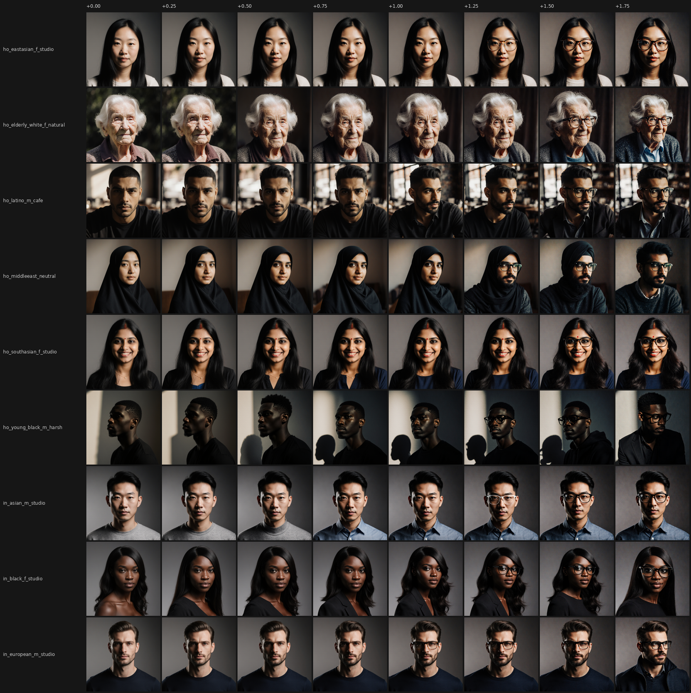

# From FluxSpace edits to a working glasses slider — what five days taught us

The last post ended with FluxSpace pair-averaging working as a measurement and inference-time edit substrate: tell the model what you want via a prompt pair, average its attention, inject. Composing edits worked. The dictionary was filling up. The piece that was missing was the one most people care about: a **slider** — a checkpoint you load once, dial with a single number, and use without running three forward passes per sampling step.

This post is the five-day arc from that point to a working `glasses_slider_v7_000001200.safetensors`. It is the journal version, not the cleaned-up paper. Four hypotheses got falsified along the way, and the surviving picture only makes sense in light of what failed. We end with the slider, the eval numbers, and the two failure modes that v7.1 will go after.

## The cached-replay dead end

The first idea was the cheap one. We had attention pkls for thousands of FluxSpace edits already archived. If editing is "inject the pair-average δ into the attention slot," surely we could compute δ once, store it, and replay it at any new render without re-running the edit prompts.

Four experiments ran. Channel-mean replay, full `(L, D)` replay at K=20 layers, full replay with renorm to scale=300, an on-latent sanity baseline. Every one of them produced **zero visible edit** at the same seed where live `FluxSpaceEditPair` produced a dramatic smile.

The mechanism wasn't subtle once we accepted it: Flux editing is a **stateful residual-stream cascade**, not a static direction. Each layer's attention output depends on every previous layer's edited output. A δ computed against one base passage is wrong for any other base, and even for the same base it is wrong once you patch it back in, because the downstream layers see a different residual and produce different `attn_base` themselves. The trick of the live `FluxSpaceEditPair` is exactly that the edit recomputes through the whole stack on every run — that's not a wart, that's the mechanism.

This falsified two thread-architectures at once. The "anchor cache" plan that would have given us 4–7× speedups for N-variations-from-one-base went away. So did the more ambitious "learn `g(attn_base) → δ`" idea, which was structurally the same dream wearing a neural network. Caches remain useful — they're how we measure axes and feed the dictionary — but they cannot ship as edits.

If we wanted a fast, single-forward-pass slider, we had to train one. Concept Sliders.

## Concept Sliders, and the corpus that wasn't

Concept Sliders (Gandikota et al., ECCV 2024) trains a small LoRA whose effective direction is the difference between a positive and a negative prompt's predicted noise — distilled into rank-r weights you can stack at any strength. The reference implementation we used is the `concept_slider` extension in ai-toolkit, which on Flux runs at α=1, r=16, and conditions on a target/positive/negative prompt triple.

The data prep was the easier half. We curated a 60-pair v2 dataset (acetate variant included), demographic-conditioned, photorealistic studio-lit portraits with and without glasses. The trainer's view of the world is "two prompts that differ on the target axis, plus a target_class anchor."

The harder half — that took most of five days — was the optimisation.

## The v0 → v3 hunt: scope, magnitude, stability

v4 wasn't the first run — it was the survivor of four earlier attempts that each falsified one knob.

**v0 at lr=2e-3** overshot into pure noise by step 400. **v0 at lower LR** stopped producing noise but *drifted in the wrong direction*: at +1.5 it grew mustaches and stubble instead of glasses. The LoRA was finding *some* signed direction that satisfied `pos_pred > neg_pred`, but the scope was too broad — gradients were leaking into MLP and `single_transformer_blocks` weights, where Flux's facial-hair priors are easier to perturb than its eyewear priors.

**v1** narrowed the scope to cross-attention only (the `add_*_proj` projections). Result: *stable but immobile*. No glasses, no mustaches, no movement. The scope fix removed the escape valves; it also exposed a weak-signal floor — Flux's guidance-distilled training meant the `(pos − neg)` magnitude in xattn alone was too small to move the LoRA at the LR we'd dialed in.

**v2** patched the magnitude. Glasses appeared at step 200 on two demos — first real engagement. Then vanished by step 400 and got replaced by stubble drift on the s=0 column. EMA was off (inherited from v1), so the saved checkpoint reflected whatever instantaneous direction the optimizer happened to be in; step 200 landed on glasses, step 400 wandered off. Killed at step 600.

**v3** re-enabled EMA at decay=0.95 to dampen v2's overshoot. Killed at step 600 — the EMA buried the signal anyway. Even at 0.95, averaging over ~20 steps was enough to smear out the brief glasses window.

**v4** was a hail mary, honestly. The recommended parameters weren't working. The smaller, more careful configurations weren't working. So we cranked everything: lr=1.25e-4 constant (toward the high end of what the LoRA literature treats as reasonable for rank-16), guidance_strength η=4.0, no EMA, no decay schedule, 1500 steps, "let's see what happens." It engaged glasses at step 600 and held through 1200 — the first stable run. The retrospective rationalisation that v4 "synthesised v0–v3's lessons" arrived after the run worked. At the time it was a brute-force test of whether any config in this space could engage the concept at all.

The catch: from step 600 onward the slider learned a *cluster shift*, not a feature. The +1.5 column was not "person + glasses" — it was "person → studio-portrait stereotype with glasses, formal clothes, makeup or beard, harder lighting." The bundle was not a tuning artifact; it was the supervision signal itself. `(pos − neg)` traces the inter-cluster mean of "person with eyewear" vs "person without" in Flux's prior, and that mean carries the whole bundle.

## The local/global asymmetry

This is structural, not a bug — and we already wrote it up in the framework procedure. What we didn't yet have was a way to make the LoRA spend its rank-16 capacity on the local feature instead of the global confounds.

The hypothesis we eventually arrived at, after writing it on a whiteboard twice and calling it the "local/global asymmetry":

> Plain L2 over the full latent gives **global** features (clothing, lighting, hair, scene composition) ~80× more loss-mass than **local** features (the eye region, ~1–2% of the latent area). A rank-r LoRA exhausts capacity on the global PCs first; local features only get gradient after the global PCs plateau.

v4 worked at all because 1500 steps × constant LR was enough cumulative gradient to *also* push into the local regime after the bundle had saturated. It was a brute-force solution disguised as a default config.

We tested the implication on two failed runs.

**v5** raised α to 16 — high per-step LoRA pressure. Falsified: the slider committed to a shallow lazy-fixed-point basin and stopped moving. We killed it after step 450.

**v6** kept α=1 but switched to Lion at lr=3e-5 with cosine→0. The hypothesis was that Lion's sign-based updates would escape v5's basin via uniform per-dimension pressure. **No glasses appeared on any sample at any step** through 800. This falsified the entire optimizer-dynamics line of reasoning. The integral of gradient mass was the bottleneck:

| Run | LR profile | Steps | ∫ lr·dt |
|---|---|---|---|
| v4 | 1.25e-4 const | 1500 | 0.188 |
| v4 step 600 (first engage) | const | 600 | 0.075 |
| v5 | 1.25e-4 cos→0 | 450 (killed) | ~0.040 |
| v6 | 3e-5 cos→0 | 800 | ~0.015 |

v6 had ~12× less cumulative gradient than v4 at first engagement. Lion's per-step mechanic operates on an integral that wasn't there. **The bottleneck is gradient budget plus loss formulation, not optimizer choice.**

That reframe was the unlock. Don't search for a smarter optimizer. Reshape the loss so each step buys local learning instead of global learning.

## v7: a Gaussian over the eye region

v7 keeps every v4 known-good value (adamw8bit, lr=1.25e-4 constant, α=1, r=16, η=4, xattn-only scope, EMA off, 60-pair v2 dataset) and changes one structural thing: the slider's MSE loss is **spatially weighted by an anisotropic Gaussian centred on the eye region**, with `peak=5.0`, `σ_y=0.06` (narrow vertically — brow plus lid), `σ_x=0.18` (wide horizontally — both eyes plus temples), centre `y=0.41, x=0.50` in latent coordinates. The mask is normalised so its mean weighting is 1; the peak is 5× the baseline.

The mask is **not a regulariser**. It's a gradient-budget allocator. By up-weighting ~5% of the image area, it shifts roughly 3.5× of the loss-mass to where the local feature lives. The bundle is still encoded in the supervision — we cannot remove it — but the LoRA's optimisation now sees the eye region as the cheapest place to reduce loss. Capacity goes there first.

v7 engaged glasses by **step 550**, with sample-grid evidence on all three training demographics. By step 800 the engagement had reorganised across demographics (asynchronous: east-asian-m lost glasses then re-engaged with a different frame style at step 900; black-f stayed engaged with a strengthening bundle; european-m held throughout). By step 1200 it had stabilised into the cleanest checkpoint of the run, with the lowest bundle metric of any engaged checkpoint and the highest worst-demographic engagement.

We stopped training. We ran the full eval battery.

## What v7 step 1200 actually delivers

The eval grid (cover image, top of post): nine prompts (three in-distribution, six held-out scene/demographic combinations), eight strength values from 0 to 1.75 in 0.25 steps, three seeds — 216 cells. Each cell is scored by a SigLIP-2 zero-shot probe for the engagement signal (`glasses` vs `no glasses` margin) and five bundle channels (earrings, formal clothing, beard, hair-long, hair-curly), and by ArcFace cosine similarity to the s=0 baseline of the same seed and demographic.

Headline numbers:

```
in_distribution Spearman ρ = +0.669    separation +0.060
held_out        Spearman ρ = +0.608    separation +0.048
identity        mean cos 0.712, min 0.000, 20/189 cells <0.4

fraction_with_glasses (siglip>0):
  in_dist:  0.00 0.00 0.00 0.00 0.33 0.67 0.89 1.00   (s=0 ... 1.75)
  held_out: 0.00 0.00 0.00 0.11 0.11 0.39 0.78 0.89
```

This is a slider. It engages glasses with 89–100% reliability at moderate-high strength on both in-distribution and held-out prompts, the rank order on strength is positive across all 216 cells, and identity is preserved on the median cell. Compared to v4-1500 (the "brute force" baseline that never had a clean readout because we never built the eval battery for it), v7-1200 has lower bundle drift and tighter engagement onset.

## The two failure modes still visible

v7 isn't done. The fraction-with-glasses curve has a **dead zone** at `s ∈ [0, 0.75]`: the slider does nothing visible until s≈1.0. The Spearman ρ penalty (0.669 vs the soft target of 0.85+) comes entirely from this flat tail, not from non-monotonicity in the engaged range. Visually, you can't dial "subtle glasses" — you go from no glasses to glasses with no in-between.

The **identity floor is lumpy**. Mean cos is 0.712 (fine). Twenty of 189 cells score below 0.4, and they cluster on minority demographics in held-out scenes (latino_m_cafe, young_black_m_bench, hijab woman). The training distribution was studio-lit portraits; held-out scenes amplify whatever brittleness the LoRA encoded.

We diagnose both as the *same* problem worn two ways: the spatial mask that broke through cold-start is now over-concentrated for refinement. A mask peak of 5× was a gradient-budget allocator for getting engagement to happen at all. Once engagement is locked in, the same peak keeps spending cost in a narrow region — producing a high-amplitude "spike" direction that has to be pushed past s=1.0 to register, and over-committing in 5% of the image where the prior is weakest on out-of-distribution demographics.

The v7.1 plan branches from step 1200 with three deltas: `eye_mask_peak: 5.0 → 2.5` (broaden the support), `lr_scheduler: constant → cosine_with_min_lr` with `lr 1.25e-4 → 2e-5`, and a 400-step cap. The hypothesis: **broaden the support, not sharpen it**. The pre-stated falsification: if the dead zone shrinks but bundle creeps past 0.12, the mask was load-bearing for bundle suppression at peak=5 and v7.2 retreats to peak=4. If the dead zone doesn't shrink, the rank-capacity hypothesis takes over and v7.2 tests r=32 at peak=2.5.

## What changed in our model of slider training

Five lessons that compounded.

**Editing through a stateful cascade can't be cached.** Every edit must run through the live forward pass with the edit conditioning. Caches remain valid as a *measurement* basis (NMF atoms, blendshape regression, classifier ridge fits) but never as an *injection* substrate. This narrows the design space — no shortcut to amortise edits — but it also retires three planned architectures we don't have to build.

**Loss formulation beats optimizer dynamics until you hit the gradient-budget wall.** v5 (high pressure) and v6 (Lion + cosine) both falsified the "find a smarter step rule" thread. v4 worked because it spent enough cumulative gradient. v7 worked because it allocated the gradient to the right pixels. Optimizer choice is a knob worth maybe 10% inside the right loss, not the path forward when nothing engages.

**Spatial loss masks are gradient-budget allocators, not regularisers.** Calling them "regularisers" suggests they trim outputs after-the-fact. They don't. They tell the optimiser which pixels are worth reducing loss on, and the LoRA reorganises its rank-16 capacity around that signal. The cost is real: every rank-budget point spent on the eye region is a point not spent elsewhere, which is exactly the point.

**The bundle lives in the supervision, not the trainer.** The "intellectual professional" stereotype on glasses, the squint-tired-old confound on eye_squint, the wedding stereotype on age — these come in through `(pos − neg)` because Flux's prior already correlates them. No trainer hyperparameter subtracts a confound that lives in the supervision itself. You can attenuate it (mask, scope, low α) but you cannot eliminate it from prompt-pair supervision. The path that *can* eliminate it is curating intra-cluster image pairs from a measured corpus — which is what Solver C is for, and why the smile→eye_squint transfer keeps wanting it.

**Quality measurement is the language to negotiate the next move.** We had no opinion about v4's quality until we built the eval battery. We had a clear, falsifiable plan for v7.1 within an hour of running it on v7-1200. The numerical contract — Spearman ρ, fraction-with-glasses curve, identity floor count, bundle metric — is what makes "broaden the mask" a statable hypothesis rather than a guess. Build the measurement before the next training run, not after.

## Parallel thread: replace velocity-MSE with differentiable metric losses

The spatial mask in v7 is a workaround. It accepts that the slider's loss is `‖predicted_velocity − target_velocity‖²` over the latent and re-weights *where* in the latent that error counts. It does not address the deeper issue that velocity-MSE is the wrong loss for the thing we actually care about. What we care about is "the rendered image has glasses, the same face, no extra confounds." Velocity-MSE is a per-pixel proxy that correlates with that goal only loosely, which is exactly why the local/global asymmetry exists in the first place.

The principled fix is to replace velocity-MSE with **differentiable metric-space losses** computed directly on the latent: ArcFace identity (does the face stay the same?), MediaPipe blendshapes (did `eyeBlinkL/R` increase the right amount on an eye_squint axis without dragging `mouthSmileL`?), SigLIP attribute probes (is the glasses signal up, the formal-clothing signal flat?). These are losses we already use for *evaluation*. The plan we've been writing in parallel is to make them **training losses**.

The blocker is that ArcFace, MediaPipe, and SigLIP all consume RGB pixels, not VAE latents. Using them as training losses today means VAE-decoding the predicted noise at every training step — the PuLID / DRaFT pattern — which is expensive and limits how many metric heads you can stack. The proposed fix is to **distill** each pixel-space teacher into a small student network that consumes Flux VAE latents and outputs the same embedding/score, with cosine R² ≥ 0.95 on held-out FFHQ. The student costs roughly one transformer block per metric head; the VAE decode is the cost of an entire generation. Once distilled, you can stack four or five metric heads in the training loop for less than the cost of one decode.

Topic research (15 papers) places this between novel and adjacent: PuLID's ArcFace identity loss is well-established but lives downstream of the VAE decode; REPA's projection-head alignment of noisy latents to a frozen vision encoder is the closest precedent for the latent-side architecture; nobody we found does the exact recipe of "distill multiple frozen pixel-space attribute models into latent twins and run them as the slider training loss." Path-dependence, not impossibility — single-image methods accept the decode cost; campaigns of slider runs do not.

This is parallel work to v7. The spatial mask attacks the symptom (loss-mass concentration in 5% of the image) inside the existing velocity-MSE objective. The distilled metric losses attack the cause (velocity-MSE is the wrong objective for the thing we actually want) by replacing the objective entirely. We expect both to converge on the same outcome — a slider that engages the local feature without a confound bundle — but via different mechanisms, with the metric-loss path also unblocking anchor-only training (no paired-image corpus needed when the loss is "this latent reads as glasses+keep-identity"). The first foundational artifact, `arc_latent`, has a self-contained build spec and a numerical pass criterion. It runs separately from the v7→v7.1 line.

## Where this puts us

- A working glasses slider (v7-1200) shipped as a checkpoint, stackable at any strength.
- A pre-stated v7.1 cosine-refinement plan branching from 1200, with falsification gates for peak=4 retreat or rank-32 expansion.
- A canon-flagged FluxSpace pair-averaging dictionary that still drives measurement and inference-time edits, and that we now believe is the right substrate for **curating training pairs** for harder axes (eye_squint next), not for shipping edits directly.
- A taxonomy of three solvers (FluxSpace composer built; checkpoint-mixer tabled; intra-cluster pair selector active for eye_squint).
- A parallel thread for differentiable metric-space losses (latent-distilled ArcFace + SigLIP + MediaPipe), with a self-contained `arc_latent` build spec as the foundational artifact.
- A retired "anchor cache + cached-δ replay" architecture, with the falsification doc kept on file so we don't re-derive it.

The next post will be either v7.1 refining v7 to a clean slider, or eye_squint reproducing the bundle-failure on a structurally harder axis and forcing us to ship Solver C. Whichever comes first is the right next experiment.

## References

- v7 yaml: `/home/newub/w/ai-toolkit/config/glasses_slider_v7.yaml`
- v7 step 1200 eval: `models/sliders/glasses_v7/glasses_slider_v7_000001200/eval.parquet`
- v7.1 plan: `docs/research/2026-04-27-v7.1-cosine-refinement-plan.md`
- Local/global asymmetry math: `docs/research/2026-04-27-concept-slider-local-vs-global-math.md`
- Cached-δ replay falsified: `docs/research/2026-04-23-cached-delta-replay-falsified.md`
- v6 Lion falsified: `docs/research/2026-04-27-v6-lion-falsified.md`
- v7 step 550 engagement border: `docs/research/2026-04-27-v7-step550-engagement-border.md`
- Slider quality measurement procedure: `docs/research/2026-04-26-slider-quality-measurement.md`
- Solvers taxonomy: `docs/research/2026-04-26-solvers-taxonomy-and-next-steps.md`
- Previous post (FluxSpace editing procedure): `docs/blog/2026-04-23-fluxspace-editing-procedure.md`
