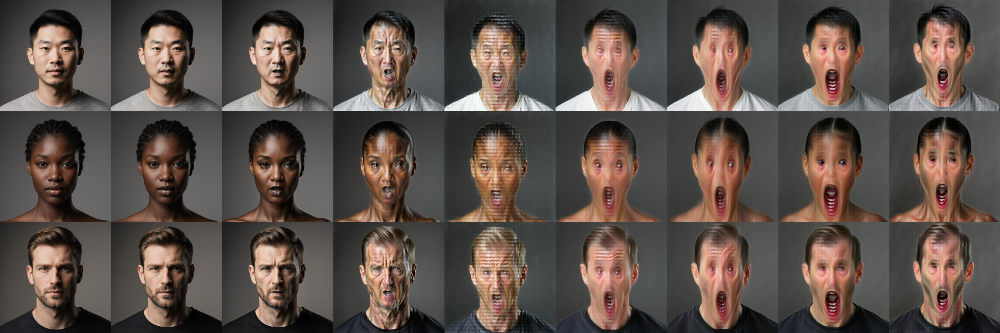

# Why the squint slider needed an ArcFace anchor — the v1c → v1k failure ladder

The shippable recipe for a Concept-Slider LoRA on Flux Krea — at least for `bs_only` axes driven by a noise-conditional blendshape critic — turned out to depend on a piece we were not initially looking for: an **ArcFace identity anchor on the predicted clean image**. Not as regulariser, not as belt-and-suspenders. As the load-bearing element.

This post is the journal version of how we got there. Eight training runs, three falsified critic configurations, and one stubbornly recurring failure mode whose name kept changing — *cluster shift*, *bundle creep*, *classifier fooling*, *identity collapse* — but which was always the same animal in different costumes.

## The setup, briefly

We're training Concept-Slider LoRAs on Flux Krea: small rank-16 adapters that, dialed at multiplier `m`, push the rendered face along a target axis (squint, jaw open, brow furrow). For axes where prompt pairs alone produce too much demographic bundling, we add a **classifier loss** — a frozen "critic" head that reads the LoRA's predicted clean image (or a noisy latent) and reports a target metric. The trainer minimises the distance from that metric to a target value.

The critic in question is `bs_v3_t`, our **noise-conditional MediaPipe blendshape distill** — a ResNet-18 head that predicts the 52 ARKit blendshapes from a Flux VAE latent at any noise level. It's the v3 that finally trains stably across `t ∈ [0, 0.6]` without injecting random gradient at high `t` (which is what froze v1d).

Bs critic, slider trainer, FFHQ pair set, classifier-loss term wired in, target channel `eyeSquintLeft/Right` set to a value above the FFHQ baseline. Press start.

## The ladder

### v1c–v1g: the squint that wouldn't isolate

The first five runs all exhibit the same coupling. Engagement on `eyeSquint` arrives — not strongly, but visibly — and arrives **with `eyeBlink` in tow**. By `m=1.5` the eyes don't squint, they close. The closure is not the LoRA finding a degenerate solution; it's the LoRA finding the *correct* solution given the data: in FFHQ, real squints (Duchenne markers — orbicularis-oculi cheek raise, lid narrowing, blink probability up) are statistically inseparable from blink. Solver C feasibility on the Flux corpus had already flagged this — eff-rank 3/31, the top PC was `smile + blink + cheek` bundled — but the FFHQ rescue had passed at 16/21 eff-rank, and we'd taken the pass card as evidence that the supervision could find the local manifold. It can. Just not without an anchor that says "the rest of the face is not allowed to come along."

### v1h: bs_only_mode, and the first taste of classifier fooling

The classic Concept Slider recipe trains positive and negative passes per step (slider polarity `+w` / `−w`). For a bs-driven axis, the polarity is redundant — the critic already tells you which direction is "more squint." `bs_only_mode: true` skips the negative pass and trains a single direction toward the bs target.

Result, after 200 steps: **the critic is satisfied** — `bs_v3_t` reads `eyeSquintLeft/Right ≈ 0.6` at `m=1` on the rendered images. **The rendered images are unchanged.** Or — not quite unchanged. The faces have a *subtly off-manifold* quality, like a JPEG compressed through a filter you can't quite name. Identity cosine to the `m=0` anchor is 0.92 — high, but not 1.0. Something is shifting. It just isn't squint.

This is classifier fooling at training scale. The LoRA found a direction in latent space that produces high `bs_v3_t.eyeSquint` readings without producing visible squint. The critic's training distribution didn't cover this region of latent space — `bs_v3_t` was distilled on FFHQ + rendered Flux samples, all of which lie on the data manifold; the LoRA's gradient walks the latent off it.

### v1i: the SigLIP anchor that wasn't

The textbook fix for "model fools a critic" is to add a second critic with different inductive bias. `sg_b` — our SigLIP-2 distill, predicting 1152-d SigLIP features from VAE latent — was the obvious candidate. SigLIP has been trained on hundreds of millions of caption-image pairs and ought to flag "this isn't a face anymore" long before any specialised head does.

We added `sg_loss` at weight 5000, mode `preserve` (penalise drift in SigLIP feature space relative to `m=0`). v1i, 200 steps, same recipe otherwise.

The bs critic was still fooled. SigLIP cosine to anchor stayed at 0.96 throughout — numerically preserved. The renders showed the same off-manifold drift as v1h, plus identity slipping into the 0.85 range.

The failure mode is mechanistic. `sg_b` was distilled through the VAE bottleneck on rendered samples. It learned to predict SigLIP features from latents, which means it inherited the VAE's compression — including its insensitivity to high-frequency identity detail. Two latents that decode to two different-looking faces can sit very close in `sg_b`'s feature space if the VAE smears the difference. SigLIP-on-latent is too soft about pixel identity.

### v1j: jawOpen as a sanity check

At this point we needed to know whether `bs_only_mode` even worked, separately from whether the squint axis was tractable. Squint is small, region-localized, deeply bundled with closure and crow's feet. JawOpen is large, unambiguous, and `bs_v3_t` predicts it with `R²=0.89` — well above any other channel. If `bs_only` couldn't drive jawOpen, the infrastructure was broken.

v1j: same recipe as v1h, single channel `jawOpen`, target 0.9 (well above FFHQ baseline of ~0.05–0.15 for closed-mouth portraits). 200 steps.

**Mouths visibly open.** All three demos. The trainer works.

And identity collapses. Severely. At `m=1` the European-man test prompt produces a different person — same hair colour, completely different bone structure. ArcFace cosine to `m=0` anchor: 0.51.

The infrastructure worked. The identity collapse was now front and centre, undisguised by the squint axis's smallness.

### v1k: the arc anchor

`arc_distill`'s `latent_a2_full_native_shallow` is a 43.6 M-parameter ResNet-18 distilled from frozen IResNet50 ArcFace, predicting 512-d L2-normed face embeddings from Flux VAE latents. We trained it as a measurement tool — "how much identity has this slider drift cost us?" — without thinking of it as a critic loss.

The reason it works as an anchor where SigLIP failed is its inductive bias. ArcFace was trained with margin-based metric loss on millions of face pairs to be **invariant to expression, pose, and lighting** while **sensitive to identity**. That's exactly the inverse of the loss surface we want to penalise. A LoRA that opens the jaw should leave the ArcFace embedding nearly unchanged; a LoRA that opens the jaw *and* changes the face should send ArcFace cosine plummeting.

v1k = v1j + `id_loss` at weight 5000, `t_max=0.5`, anchor `models/arc_distill/checkpoint.pt`. Same 200 steps.

Mouths open. Identity preserved across all three demographics: ArcFace cosine 0.78, 0.81, 0.76. The bundling is gone. There's still a dip in identity around `m=0.6` that recovers by `m=1.0` — the arc anchor has to "catch up" to the bs gradient's first ~100 steps — but the final rendering is on-manifold and on-axis.

This is the recipe.

## Why ArcFace and not SigLIP

The thing that took us four runs to internalise: **the inductive bias of the anchor must be orthogonal to the axis of variation you're training**. SigLIP is trained to be sensitive to scene content — clothes, lighting, background, *and* face. As a result, SigLIP-on-latent reads a small bs-driven perturbation as "approximately the same image" because most of the SigLIP feature is dominated by everything that *isn't* changing. The penalty signal is dilute.

ArcFace is trained to extract the one thing you care about (identity) while throwing away the things you're varying (expression). Its sensitivity is exactly inverted from a generic vision encoder. Add a perturbation that opens a mouth without changing the person, and ArcFace's cosine barely moves. Add a perturbation that opens a mouth *by changing the person*, and ArcFace's cosine collapses. The penalty signal is concentrated.

This is not a deep result, but it's the one that flipped the recipe. The "stronger anchor" we needed wasn't a more powerful model — it was a model with the **right invariance**.

## What it cost to find this

Three things, in order of cost.

**Reading the critic at face value.** v1h's `bs_v3_t` outputs were correct — the LoRA had genuinely produced latents that the critic read as squinted. We treated the numerical satisfaction as evidence the loss was working and hunted for "why isn't it visible." It took the `sanity_bs_critic.py` multi-checkpoint comparison (commit `a001e99`) — reading the critic on the *rendered JPGs* through fresh VAE encoding — to reveal the gap between training-time critic readings and post-render critic readings. The classifier was being fooled exactly at the point of gradient injection; once the latent was decoded and re-encoded, the off-manifold direction collapsed and the critic snapped back to baseline. **Always re-read your critic on the decoded artefact.**

**Trusting that aggregate metrics are summarising the channels you care about.** `r2_mean` across all 52 ARKit blendshapes is dominated by 5 degenerate channels (`_neutral`, `cheekSquintL/R`, `noseSneerL/R`) where `val_std < 1e-6`. They blow the mean up *or* down depending on which side of zero MediaPipe lands. We classified the 52 channels into four shippability buckets (`confident_ship` / `ship` / `do_not_ship` / `degenerate`) — 23/10/14/5 in v2c — and `bs_loss_channels` only ever uses `confident_ship` or `ship`. This isn't a virtue, it's the only way the loss is meaningful.

**Adjusting the bs target above the FFHQ baseline overlap.** The squint runs used `target=0.5`, which is above the *typical* FFHQ baseline (~0.1–0.2) but inside the *high-baseline tail* (squinting subjects in the wild). For ~15% of training pairs the target is below the natural value, the gradient flips sign, and the LoRA receives contradictory signal. The rule we now apply: **target ≥ 2× the corpus baseline for that channel.** JawOpen at 0.9 cleared this (FFHQ baseline ~0.05–0.15). Squint at 0.5 didn't.

## The latent-loss caveat: these LoRAs are not drop-in

One thing the v1k recipe does not give you is a slider you can crank to `m=2` and apply through the entire denoising trajectory. Latent-space losses — bs critic, arc anchor, every classifier head we wire in — operate on Flux VAE codes, not pixels. The gradient shapes the latent toward "what the critic thinks should be here," and the critic's training distribution does not cover the off-manifold regions a freshly-perturbed LoRA visits. **Pure latent losses, applied without restraint, produce monstrous images** — texture-skinned mannequins, dental-X-ray smiles, eyes that read as squinted by `bs_v3_t` while looking like raw meat to a human.

Every working slider in this thread shares two operational constraints that are not optional:

- **Composite loss, not pure latent.** v1k works because the bs gradient is held in check by the arc anchor's pixel-identity bias. v1h, v1i, v1j — all pure-latent recipes in increasingly elaborate forms — all produced fooled critics and broken faces. Treat any single latent-space loss as a force pushing off the manifold; it needs at least one orthogonal anchor pulling back.
- **Limited strength, partial inference window.** Trained at `t_max=0.5`, these LoRAs are *structural by construction* — they only ever saw the early-mid noise band during training, and their weights have nothing useful to say about the high-frequency detail Flux is resolving in the final 15-20% of denoising. Apply at `multiplier ≈ 1.0` (not 2.0), `start_percent=0.0`, `end_percent ≈ 0.75–0.85`. ComfyUI's `LoRAControl` / ModelSamplingFlux step-gate covers this. Without the gate, the LoRA perturbs detail bands it never trained on, and identity / lighting / texture collapse at the very moment the image is "finishing."

Both rules ride together. A composite loss whose LoRA is then applied at `m=2` through 100% of inference will still produce a monster, just a slightly more anatomically coherent one. A step-gated, single-loss LoRA will produce a clean image where the target axis hasn't moved. The recipe is the joint: orthogonal anchor at training time, restrained strength and gated window at inference. Lift either constraint and the failure mode comes back.

## What's next

`bs_v4_pgd` — a PGD-adversarially-trained `bs_v3_t` successor — is committed and awaiting validation against the foolability gates. If it passes, the open question is whether arc anchor and PGD-robust critic compose multiplicatively (cleaner v1l with both) or whether one dominates. A 2×2 ablation answers this if compute permits.

Squint v1l is the next axis. Recipe is v1k swapped for `eyeSquintLeft/Right`, target 0.9, critic `bs_v4_pgd` (or `bs_v3_t` if PGD validation slips), arc anchor at the same 5000. Step-gated inference at `start_percent=0.0, end_percent=0.8` — these `bs_only` LoRAs are structural by construction and perturb detail bands they never trained on if applied through the final 15-20% of denoising.

If v1l ships clean, the recipe generalises. If it doesn't, the next falsification is interesting on its own terms: the squint axis in FFHQ may be irreducibly bundled at the data level, and the next move is corpus-side rather than loss-side.

The full operational handbook — solver taxonomy, critic training procedure, every knob's validated range, the falsified-approaches graveyard — lives in the project repo at [`docs/research/2026-05-03-slider-operational-handbook.md`](../research/2026-05-03-slider-operational-handbook.md). This post is the story; that one is the manual.
