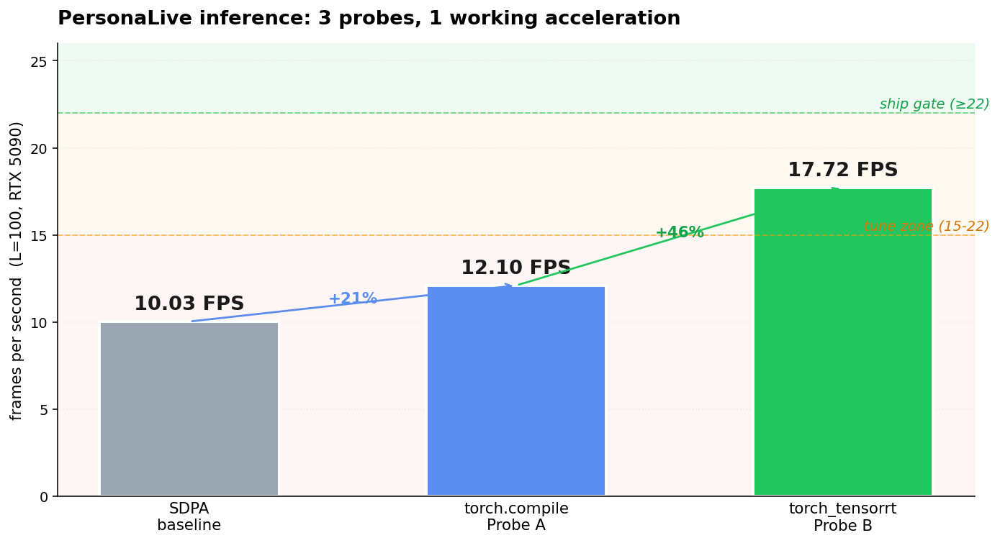

# Three falsifications, three fixes — getting torch_tensorrt to actually accelerate PersonaLive

PersonaLive is a recent portrait-animation diffusion stack — reference UNet, denoising UNet with a temporal module, motion encoder, pose guider, VAE — that ships at ~10 FPS on an RTX 5090 with stock SDPA attention. We want ≥25 FPS for a webcam pipeline. This is the journal of the second optimization probe, the one that actually moved the number.

The plan was a three-probe ladder with a hard gate — each probe ships if it hits ≥22 FPS, tunes if it lands 15-22, and advances to the next probe under 15. The first probe was `torch.compile`. The second was `torch_tensorrt`. The third — bundled ONNX → TensorRT engine with PersonaLive's own converter — is still on the bench.

## The xformers detour, briefly

The optimization started by trying to enable `xformers` memory-efficient attention. Both xformers and flash-attn have Blackwell PRs landed but no released wheel that resolves cleanly against torch 2.11+cu128 on sm_120. Source builds OOM-killed nvcc or hit template instantiation errors. We spent a day on this before declaring it falsified and treating stock SDPA as the floor. That's the 10.03 FPS line on the cover chart.

## Probe A: torch.compile + the `dynamic=True` trap

`torch.compile(mod, mode="reduce-overhead")` on the three biggest modules — `denoising_unet`, `reference_unet`, `vae.decode` — got us to 12.10 FPS. About a 20% lift, comfortably "advance to next probe" under the gate, but the diagnostic detail is worth keeping.

The first attempt added `dynamic=True`, on the theory that the diffusion pipeline's batch / temporal-window dims were genuinely shape-dependent and we wanted one compiled artifact across them. The result: the very first denoising step took **ten minutes**. Not stuck — actively making progress, with sympy printing `pow_by_natural([VR[1, int_oo], VR[-1, -1]])` failures every few seconds. The CPU was pinned at 97% on a single thread; the GPU was idle. Total estimated time for the 8-step warmup: ~90 minutes.

What was happening: TorchDynamo had traced the graph into FX, AOTAutograd had lowered it to ATen, and Inductor was now trying to codegen Triton kernels and have ptxas assemble them. With symbolic shapes in play, sympy was being asked to prove things like "is this fused conv kernel valid for *any* batch dim ≥ 1?" — and many of those proofs are undecidable in finite time on diffusion-style graphs. Each unresolved symbol forced a fallback to a less efficient codegen path, which then hit the next symbol, and so on.

Drop `dynamic=True`. torch.compile specializes per shape, finishes the first call's compile in normal time, caches the artifact, and you're at 12.10 FPS. The lesson is general: for pipelines where the call shapes are stable in practice, the symbolic-shape machinery is pure overhead.

## Probe B: install drama before any model touched the GPU

`torch_tensorrt` was supposed to be the easy one. PyPI has `torch-tensorrt 2.11.0`, matching our torch version. We installed it. It pulled `tensorrt`, `tensorrt-cu13`, `tensorrt-cu13-bindings`, `tensorrt-cu13-libs` — version 10.15.1.29, which satisfies the ≥10.4 sm_120 requirement.

Then it failed to import.

```
OSError: libcudart.so.13: cannot open shared object file: No such file or directory
```

The `tensorrt-cu13` wheel was built against CUDA 13. Our torch was built against CUDA 12.8 (`torch 2.11.0+cu128`). The PyTorch nightly index does ship a `cu128` build of torch_tensorrt — but only at version `2.9.0+cu128`, which is bound to torch 2.9. Major mismatch.

We had four options: downgrade torch (lose Blackwell support), upgrade to CUDA 13 system-wide (large-scale refactor), give up on Probe B, or try to make CUDA 12.8 and CUDA 13 runtime libraries co-exist in the same Python process. The last one is the kind of thing that sounds wrong and works.

`pip install nvidia-cuda-runtime nvidia-cuda-nvrtc` — these meta-packages, in their *current* version, ship the CUDA 13 runtime. They land at `site-packages/nvidia/cu13/lib/libcudart.so.13`. Crucially, they install *alongside* the existing `nvidia/cuda_runtime/lib/libcudart.so.12` that torch is linked against. Two `libcudart` files, two `libnvrtc` files, side by side.

Then we run with `LD_LIBRARY_PATH=$VENV/lib/.../nvidia/cu13/lib:$LD_LIBRARY_PATH`. The dynamic loader resolves each library by SONAME — `libcudart.so.13` finds the cu13 file, `libcudart.so.12` finds the cu12 file. Torch and torch_tensorrt each get their own runtime. The two never collide because the SONAMEs differ.

Smoke test: `import torch_tensorrt as ttrt; ttrt.compile(linear_model, ir='dynamo')` returns a working callable, output matches eager, max abs diff `0.0`. We're in.

## The first compile attempt: three failures, three different shapes

The bench harness was built around a probe pass: run a 16-frame warmup with forward-pre-hooks on `denoising_unet`, `reference_unet`, and `vae.decode`, capture the actual `(args, kwargs)` each module sees, then hand those captured tensors to `ttrt.compile(...)` per submodule.

All three failed.

**`denoising_unet`** died with `ValueError: Tensor does not have a supported memory format, supported formats are contiguous or channel_last`. Diffusion UNets take a 5-D `(batch, channels, frames, H, W)` latent. Our hook captured those tensors with `.detach().clone()` — but `clone()` preserves layout, and the tensor that came out of the pipeline's slicing/reshape upstream wasn't actually contiguous. `torch.export.export` validates memory layout before tracing.

**`reference_unet`** died with `GuardOnDataDependentSymNode: Could not guard on data-dependent expression Eq(u0, 1)`. Diffusers' `Upsample2D.forward` calls `F.interpolate(x, scale_factor=2.0, mode="nearest")`. `torch.export` defaults to symbolic shape inference and tries to trace the upsampler as a function of an unknown batch dim `u0`. The interpolate codepath needs to know whether `u0 == 1` to pick its branch, dynamo can't decide, and the export aborts.

**`vae.decode`** died with the same memory-format error as the UNet — different module, same root cause.

The first instinct was to call this a falsification, advance to Probe C, and move on. That's what the gate said to do. It would have been wrong.

## Three fixes

The first failure was solved by `.detach().contiguous().clone()` — three method calls on the captured tensors. Memory format check passes. No more error.

The second was solved by doing `torch.export.export` ourselves with no `dynamic_shapes` argument before handing the result to `ttrt.dynamo.compile`. That defaults to all-static specialization — every dim becomes a concrete int, the interpolate branch becomes deterministic, the guard never gets asked. We give up the ability to reuse a single compiled artifact across batch sizes; we never actually wanted that.

The third was the same as the first.

All three submodules now compile. denoising_unet takes ~3 minutes, reference_unet ~30 seconds, vae.decode ~20 seconds. We replace the eager modules with their TRT runtimes and run.

The bench crashes immediately at warmup:

```
AttributeError: 'Pose2VideoPipeline_Stream' object has no attribute '_execution_device'
```

Diffusers' base pipeline has a property called `_execution_device` that walks `self.components` looking for an `nn.Module` with parameters and returns its device. It's how the pipeline figures out where to put its scheduler tensors and noise generators when you don't pass `device=` explicitly.

We had replaced three registered nn.Modules with `torch_tensorrt`-wrapped runtimes. Those wrappers are callable but don't expose parameters in the way diffusers expects. The walk over `self.components` never finds a usable module, the property returns nothing, `__getattr__` raises.

Fix:

```python
type(pipe)._execution_device = property(lambda self: device)
```

One line. The property descriptor on the class is overridden with a constant return. The pipeline's other code paths that consume `_execution_device` keep working unchanged.

## The number

```
mode=torch_trt L=100 warmup=16 time=5.643s fps=17.72
```

vs SDPA at 10.03, vs torch.compile at 12.10. **+77% over the baseline, +46% over Probe A.** Lands in the 15-22 "tune" band, below the ≥22 ship gate.

We saved the output video and confirmed no visual artifacts — the rendered frames are bit-similar enough that side-by-side, you can't tell which mode produced which clip without a label.

## Caching the engines

The first run took ~5 minutes for compile before the 5.6-second timed call. That's fine for the benchmark; it would be terrible for iteration.

`torch_tensorrt` exposes engine caching directly: `cache_built_engines=True`, `reuse_cached_engines=True`, and `engine_cache_dir=<path>`. The cache key is computed from the exported program's graph signature plus input shapes and dtypes. Once written, every subsequent run that hands ttrt the same graph + shapes loads the prebuilt engine off disk in seconds.

We point each module at its own cache directory under `/tmp/personalive_trt/engine_cache/<name>/` and the next run reuses everything.

## What was actually load-bearing

Three things mattered, in order of how far the budget would have run without them:

The CUDA 13 / CUDA 12.8 hybrid runtime trick was load-bearing for the entire probe — without it, torch_tensorrt 2.11 wouldn't even import, and there is no version of torch_tensorrt for cu128 that matches torch 2.11. We would have had to choose between giving up Probe B entirely, downgrading torch and losing Blackwell support, or upgrading the system to CUDA 13 (a much bigger commit). The dlopen-by-SONAME co-existence is what kept the door open.

The static-shape specialization via manual `torch.export.export` was load-bearing for one of the three submodules and is the "hardest" fix in the sense that it required understanding *why* the default behavior failed — symbolic shapes are usually a feature, not a bug, and it's not obvious from the error message that turning them off is the right move.

The contiguous-clone and the `_execution_device` patch were both ten-second fixes that would have been completely opaque without reading the actual error and tracing what the call path expects. Each one was the difference between "Probe B is falsified" and "Probe B works."

## Next

Probe B is in the tune zone. The cheapest path forward is to stay there — try `min_block_size=5` (less PyTorch fallback overhead at TRT subgraph boundaries), `enable_autocast`, `optimization_level=5`, `decompose_attention=True`. Each iteration is now ~30 seconds because the engines are cached. If that gets us to ≥22, we're done. If not, Probe C — the bundled `torch2trt.py` driver, which goes through ONNX → polygraphy → a single TRT engine with no PyTorch fallback boundaries — is the path with the highest ceiling and the largest activation energy.

The gate is what it is. We'll see which side we land on.
