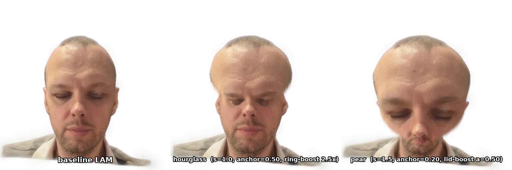
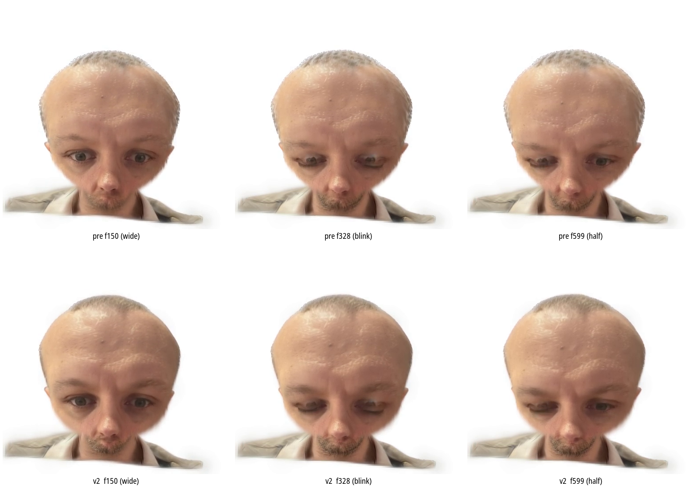

A few weeks ago the only thing we wanted from a "talking-head avatar" was for it to look like the person in the input photo and to blink at roughly the right moments. By this week we wanted to grab the same photo, knead it into a chibi caricature with a fat round head and tiny shoulders, and have *that* blink instead. Same photo in, same iPhone driving the face, but the geometry on screen now disagrees with the geometry the renderer was trained on.

This post is the tour: what we're working with, why "stretch the head" is a deceptively hard ask, and what we learned the hard way about reaching into a neural renderer and overriding one channel of its output.

The video at the top is the deliverable. Three avatars driven by the same ARKit-52 stream, side by side. Left is the baseline LAM render — photoreal, just a head. Middle is the **hourglass** chibi: head widens at the crown and tapers around the eye-band. Right is the **pear** chibi: head balloons out from the chin upward. Both are derived from the same photo as the baseline. Both blink. Both rotate. Both close their eyes when the driver closes their eyes. That last bit is what most of this post is about.

## Gaussian Splatting, briefly

If you've seen the Gaussian Splatting demos from 2023–2024, you can skip this section. If not: a *splat* is a tiny fuzzy ellipsoid in 3D space. Each one has a position, an oriented scale (three sigmas along three axes, given by a rotation quaternion), an opacity, and a colour — usually expressed as low-order spherical harmonics so the colour can vary slightly with view direction. A scene is just a big cloud of these things — often hundreds of thousands. To render an image you project every splat to screen space as a 2D Gaussian, bin the splats into 16×16-pixel tiles, depth-sort the splats within each tile, then alpha-blend them *front-to-back* into pixels, terminating early once accumulated α saturates. (The tile-binning and the per-tile depth sort are why this gets called "tile-based rasterisation" rather than the global depth-sort splatting of the NeRF era.)

The trick that made this matter in 2023 was that the whole projection-and-blend pipeline is differentiable. So given a multi-view dataset of a static scene, you can gradient-descend the splat parameters directly until the rendered images match the photos. No mesh extraction, no UV unwrapping, no baking — the splats *are* the scene. Trained per-scene, but trained fast (minutes to an hour), with great pixel quality and real-time playback. That's why every "3D Gaussian Splatting" paper in 2024 was photorealistic in a way NeRF rarely felt photorealistic.

Now hold that picture in your head: a cloud of fuzzy oriented ellipsoids that you blend into pixels. It has no triangles. No skinning weights. No bones. No texture map you can paint on. There is no obvious place to attach an eye blink.

## LAM: putting the splats on a face

[LAM](https://github.com/aigc3d/LAM) (Linear-time Animatable head Model, SIGGRAPH 2025) is the bridge between "Gaussian Splatting can photorealistically reconstruct a head from photos" and "I'd like that head to talk, please." The trick is that LAM doesn't store the splats freely floating in space — it *binds* each splat to a vertex of a FLAME head mesh.

[FLAME](https://flame.is.tue.mpg.de/) is the standard parametric head model used across academic face research: 5023 vertices, controlled by an identity-shape PCA (β), a 100-dim expression PCA, a few joint angles for neck/jaw/eyes, and an `ARKit-52` blendshape basis if you want the standard iPhone Live Link expression vocabulary. LAM subdivides the mesh once (5023 → 20018 vertices, pytorch3d's midpoint subdivision) and attaches one Gaussian splat per subdivided vertex. So the trained checkpoint produces, given a single input photo:

- A per-vertex Gaussian cloud of 20018 splats.
- For each splat: a position (xyz) offset from its anchor vertex, a 3-axis scale, a rotation quaternion, an opacity, and an SH colour.

Identity-shape β comes from VHAP fitting the FLAME mesh to the input photo. The trained network produces the splat *attributes* (scale, rotation, opacity, colour) conditioned on the photo and the canonical-pose mesh.

Then, at render time, expression and pose move the FLAME mesh deterministically (no neural net), the splats are dragged along with their anchor vertices, and the cloud is rasterised. **The trained network never sees expression.** Identity-only. The Gaussian binding is mesh-relative; the entire animation pipeline downstream of it is closed-form FLAME math.

This is the load-bearing observation for everything that follows.

## What that means concretely

When we say "we have an avatar," what we actually have is a directory like:

```
exp_output/lam_chibi/me/
  me_textured_mesh_display.obj   # static canonical mesh + splat anchors
  me.ply                         # the per-vertex Gaussian cloud
  ...
```

Plus a runtime that takes a 52-float ARKit vector and a head Euler angle each frame, evaluates the FLAME blendshapes to displace the canonical mesh, drags the splats with it, and rasterises. On an RTX 5090 the full renderer (FLAME LBS + Gaussian rasterisation) sustains around 310 fps for this checkpoint, so for live operation latency lives in the iPhone-to-host path, not in pixel work.

So when we want to *edit* this avatar, we have a small, very specific surface to work with:

1. The canonical mesh — 20018 anchor positions in 3D space.
2. The per-splat attributes attached to each anchor.
3. The ARKit-52 blendshape basis — a (52, 5023, 3) tensor of per-vertex displacements that the FLAME math uses each frame.

Override any one of those and you've edited the avatar. The rest of the pipeline runs as usual. Override the *wrong* combination and you've put the renderer into a regime it was never trained for, and it will tell you so by producing artefacts.

## The two-line ARKit patch

The first piece of leverage came almost for free. The released LAM-20K checkpoint, by default, expects a 100-dim FLAME-PCA expression vector and gets it from a VHAP video-fitting pre-pass. VHAP is batch-1 kernel-launch-bound; on a single-view iPhone it starves the GPU. So in March's framing of this problem we wrote off live LAM as "structurally offline" and went to look at other avatar stacks.

We were wrong. Reading the released source: the repo also ships a `flame_arkit.py` module — same `(shape, expression, rotation, neck, jaw, eyes, translation)` forward signature as the PCA variant, but the expression slot is 52-dim ARKit instead of 100-dim PCA. It's been in the codebase since LAM's first public commit. Nobody upstream wired it into the inference path because the demo's tracking front-end was VHAP-based, which emits PCA, not ARKit.

We swapped one import line and flipped a typo'd `!=` to `==` in an assert — the released code's assert read `expr_params != 52`, so the moment you actually passed 52 it tripped — and the same trained checkpoint started accepting ARKit-52 directly. Because the Gaussian net is identity-only, it does not care which basis moves the FLAME mesh — both produce valid FLAME geometry, and the splats follow the geometry. iPhone Live Link Face → UDP packet (52 ARKit blendshape floats plus head/eye pose, in a fixed wire layout) → LAM → splats on screen. A real-time avatar from one photo.

That was the easy edit. The chibi was not.

## The chibi as a demo for editing

A chibi caricature, in our parlance, is a smooth radial-plus-vertical deformation of the canonical FLAME mesh. Two knobs: a vertical-stretch profile and a radial-scale profile, both as splines along a normalised "height" coordinate. A `--y_anchor_frac_baked` parameter sets where the bottom of the deformation lands relative to the actual mesh's y-range. Pick `anchor=0.20` and the deformation starts near the chin and the head balloons out above it — that's the **pear**. Pick `anchor=0.50` and the deformation starts mid-face so the eye-band gets squeezed while the crown widens — that's the **hourglass**.

The point of this problem isn't the chibi as a product. Most viewers don't want their faces to be chibis. The point is that the chibi is the simplest non-trivial edit we can do to the canonical mesh: it touches every vertex, by a smoothly-varying amount, in a way that is grossly off-distribution from anything the splat-attribute network was trained on. If we can get the chibi to behave, we have a recipe for editing anchored 3DGS avatars more generally — horns, oversized anime eyes, a long furry snout, a cartoon-stylised head, eventually a non-human prop.

Mechanically, the chibi recipe boils down to three asset files which our `chibi_make_assets.py` emits for any LAM anchor:

| Env var | Asset | What it does |
|---|---|---|
| `LAM_EDIT_XYZ_OBJ` | `chibi_textured_mesh.obj` | Replace the canonical mesh xyz before LBS so splats anchor to the chibi geometry. |
| `LAM_CHIBI_ARKIT_BS` | `chibi_arkit_bs.npy` | Re-evaluate the ARKit-52 basis on the deformed mesh so blink still closes the (now-larger) eyes. |
| `LAM_CHIBI_SCALE_RATIO` | `chibi_scale_ratio.npy` | Per-vertex correction to the splat scales so they keep tiling the surface after the stretch. |

The first two are obvious in hindsight. The third is the interesting one.

## What broke, and what broke after that

Run LAM with just the first two assets — chibi mesh and chibi-evaluated ARKit basis — and the result is *almost* right. The head is correctly chibi-shaped. The head pose tracks. Open-mouth, smile, eyebrow-raise: all fine. But on every blink the iris reads *through* the closed eyelid. At chibi strength 2.0 (head linearly 1.4× wider in the upper half) the eyeball reads as a small bright marble in an oversized socket, and the lid never visually closes.

This is the artefact we spent the better part of a week chasing. The falsification ladder we walked through is in [`2026-05-14-chibi-splat-scale-fix.md`](../research/2026-05-14-chibi-splat-scale-fix.md), but a compressed version:

- **"Lid vertices have been forgotten by the deformation."** No — every eye-region vertex was confirmed above the deformation anchor and properly displaced.
- **"The ARKit blink basis is wrong on the deformed mesh."** No — re-evaluating the basis on the chibi mesh (asset #2 above) produced the same artefact as the original basis. We made `--blink_rows_identity` and `--blink_z_identity` toggles and confirmed the artefact survived all of them. The basis was never the problem.
- **"Pin the eyeball vertices to their original FLAME positions."** Produced *two pairs of eyes* — the original socket ghosted onto the deformed head, sitting in front of the new oversized socket like a pair of glued-on googly eyes. Visually unmistakable. Decisive against the hypothesis.
- **"The LBS joint transforms need rederiving on the chibi mesh."** Plausible secondary effect but the artefact at frame 599 was geometric and immediate, not pose-dependent.

What was actually wrong was subtler. LAM's trained network predicts a per-vertex splat *scale* at the canonical FLAME vertex density. Those scales are calibrated so that adjacent splats overlap *just enough* to tile the surface without gaps. When we stretch the mesh — anywhere from 1.4× radial in the upper half — the per-vertex anchors move farther apart but the splats themselves stay the same size. Where the splats no longer overlap, the alpha-accumulation along a viewing ray doesn't saturate, and the geometry behind partially leaks through.

The eye region is the worst-case for two reasons. First, the splats that need to occlude the eyeball during a blink form a thin sheet — they have to fully cover the iris with one layer's worth of alpha-mass, because the eyeball is *right behind* the lid with no buffer. Second, the colour disagreement is maximal: a closed lid that lets even 30% of the iris through reads as a "winking" lid rather than a closed one. Everywhere else on the head (cheek, forehead) the splat sheet is multiple layers deep and small gaps don't read.

## The fix, in two versions

The first fix was a sanity check. We added a `LAM_CHIBI_SCALE_BOOST` env var that multiplies every splat's scale by a single constant. (One gotcha here, which cost us a small amount of dignity: LAM's `_gm.scaling` field is the **linear** sigma — already `trunc_exp`'d at construction time. We initially added `log(boost)` to the field, which blew every splat into a screen-spanning oval. Multiplication, not addition. Read your renderer's storage convention before you reach in.)

`LAM_CHIBI_SCALE_BOOST=1.5` closed the blink immediately and confirmed the diagnosis. It also blurred the entire face uniformly, because of course it boosted every splat — including the splats on the cheek that didn't need it.

The proper fix was per-vertex. For each of the 20018 subdivided FLAME vertices, compute the mean length of edges incident to it both on the canonical mesh and on the chibi mesh, take the ratio, and use that ratio as the per-vertex splat scale multiplier:

```python
edges20018 = subdivided_edges(tpl_5023, tpl_faces)
el_orig    = per_vert_edge_mean(baked_verts,    edges20018)
el_chibi   = per_vert_edge_mean(baked_xyz_new,  edges20018)
ratio      = (el_chibi / el_orig).astype(np.float32)   # (20018,)
np.save("chibi_scale_ratio.npy", ratio)
```

At chibi strength 2.0 this ratio has min 0.275, median 1.358, max 2.368 — the median is in the right ballpark for the upper-face radial stretch the chibi field produces at that strength (the radial-scale spline peaks at 1.3× at strength 1.0 and lerps from there). Splats below the deformation anchor actually get *smaller* (ratio < 1) because of how the chibi field tapers near the chin. That's correct: those splats are anchored to a slightly compressed region of mesh and should occupy slightly less surface area.

At runtime, the hook in `modeling_lam.py` is two lines next to the existing override block:

```python
ratio_t = torch.from_numpy(np.load(path)).to(_gm.scaling.device, dtype=_gm.scaling.dtype)
_gm.scaling = _gm.scaling * ratio_t.unsqueeze(-1)
```

The verdict frame is in the three-moment gate below: pre-fix on top, post-fix on bottom, sampled at three diagnostic frames of a single take — peak eye-wide (irises pinned in oversized sockets), peak full-blink (iris leaking through the closed lid), and a hard half-blink on a downward gaze (the canonical chase frame for this artefact).



## Hourglass and pear are the same field, evaluated differently

It's worth slowing down on what's actually going on with the two chibi shapes in the marquee video, because the difference is one parameter and the visual effect is large.

Our chibi field is a separable product: vertical scale `S_Y(t)` and radial scale `S_R(t)`, where `t` is a normalised height coordinate that runs from 0 at the bottom of the deformation to 1 at the top. Both `S_Y` and `S_R` are splines with knots at `t ∈ {0, 0.3, 0.5, 0.75, 1.0}` — they swell smoothly from 1.0 at the bottom, peak somewhere in the middle, and taper back. With `chibi_strength=s` we blend that peak by `s`.

The hourglass and the pear use the *same field*. The only difference is `--y_anchor_frac_baked`, which tells the field where its `t=0` should sit on the actual mesh y-range.

- **Pear** (`anchor=0.20`): the field starts low — near the chin — and the swell happens above it. The head balloons outward from chin to crown. Eyes sit roughly in the middle of the swell, slightly enlarged but not pinched, and the chin and shoulders stay narrow. Strong "infant-proportion" cue.
- **Hourglass** (`anchor=0.50`): the field starts mid-face. The swell happens from the eye-band upward, but the eye-band itself is at low `t` where the radial scale hasn't ramped yet. So the eye region is *pinched* relative to the now-wide crown above it. Visually: forehead bulges, eye band narrows, chin stays normal. Reads like a stylised exaggerated cartoon.

Same vertices. Same field. Same blendshape basis. Different choice of where `t=0` lands. The eye-region artefact looks different in the two cases — milder in the hourglass because the eye-band is less stretched, more pronounced in the pear because the eye-region splats are right in the middle of the radial swell — and it took us a while to realise we were sometimes chasing two different versions of the same problem.

The fact that one numeric knob produces two qualitatively different "edit aesthetics" is, in itself, encouraging. The avatar is responsive to small parameter changes in ways that are visually meaningful, not just numerically meaningful. The same will be true when we start grafting *non-chibi* edits onto this stack — horns, oversized eyes, a furry muzzle. The hard part isn't moving vertices; it's the part downstream of moving them.

## The general lesson

There's a methodology takeaway from this that we wrote up separately in [`2026-05-14-neural-renderer-override-pattern.md`](../research/2026-05-14-neural-renderer-override-pattern.md), and it's the part I think is exportable to other projects. The shape of it:

**When you override one per-vertex output of a neural renderer, every coupled output that the network predicted in lockstep with that output is now silently out of distribution.** It will not crash. It will not warn. It will produce subtly wrong pixels, and you will spend a week chasing red herrings if you don't know to look for it.

In our case the override was `_gm.xyz` — the splat positions. The coupled output was `_gm.scaling` — the splat sizes. The trained network learned them jointly: splat sizes calibrated to the local mesh density that produced the xyz it was emitting. We changed the mesh density and forgot to change the sizes. The fix is a closed-form pull-back: the ratio between local mesh density before and after the override, applied to the coupled channel at the same hook point.

Three things are doing the work here:

1. **An audit.** Before overriding any one output of a neural renderer, list every other output it produces per-element. Each of those is at risk.
2. **A closed-form pull-back.** Whenever possible, derive the correction analytically from the geometry, not from a learned model. A trained correction MLP would have worked too, but a per-vertex edge-ratio scalar is one line of numpy, generalises across anchors with no retraining, and doesn't fail silently when you feed it an out-of-distribution mesh.
3. **A verification gate that doesn't share colours with the artefact.** We initially missed how bad the iris leak was because the iris and the lid are both flesh-coloured and the artefact reads as "subtle softening." Painting the eyeball magenta and re-rendering exposed the leak immediately. Always design your verification render so the artefact you care about is in a colour space your eyes can't ignore.

## What's still open

The recipe described above ships at chibi strengths up to about 2.0 on the radial axis. Beyond that the isotropic per-vertex ratio starts under-correcting along the stretched direction — the splats are *averaged* over an isotropic local edge length, but a 3× radial / 1× vertical stretch is anisotropic and asks for a 2×2 tangent-plane correction. We have a sketch (`LAM_J_PER_VERT_NPY`, a per-vertex 3×3 Jacobian → eigendecompose → rewrite the splat quaternion + 3-axis scale). The math is correct. The visual gain over the isotropic ratio is, at the strengths we care about, currently around zero. We'll revisit if we want to push to extreme anime-eye proportions.

The lash-line residual we're hunting today is a finer version of the same artefact: at chibi strength 2.0, the iris-through-lid leak that the v2 ratio closed almost completely still has a faint upper-lid seam where the lash-line splats sit on the outer α-cliff of the lid sheet. A targeted boost on the ~220 mesh-topology-boundary vertices of the blink-displacement mask — the "lash ring" — appears to close it. That's the open thread on the bench as I write this.

And finally: the chibi is just the first edit. The same three-asset recipe should accept any smooth mesh deformation — horns, snout, oversized eyes, a stylised non-human prop. Our "human → fridge" thought experiment from earlier in the project is on the other end of that axis; the chibi is the first non-identity rung on the ladder.

## Coda

If you've made it this far, the punchline is that we now have a real-time editable Gaussian-Splat avatar driven by an iPhone, where "editable" means we can hand the renderer a different canonical mesh and the splats follow correctly. The chibi was the test fixture. The plumbing it forced us to build — the three asset overrides, the per-vertex scale-ratio pull-back, the magenta-eyeball verification gate — is the thing we keep.

Two photos go in. One is the person. The other is a deformation field. Out comes an avatar in the deformed shape, blinking in real time on the strength of an ARKit-52 stream and a single hooked-in numpy array. Most of the project's interesting questions from here on are about which deformation fields, not about the renderer.
